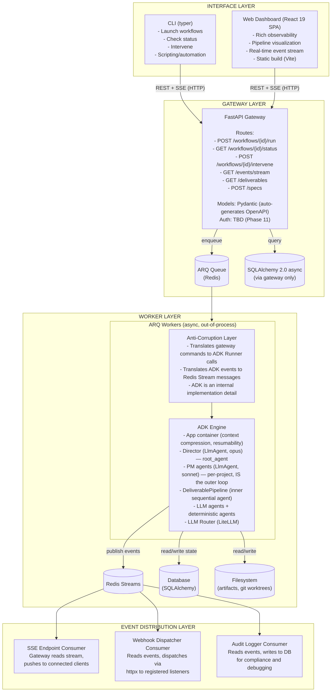
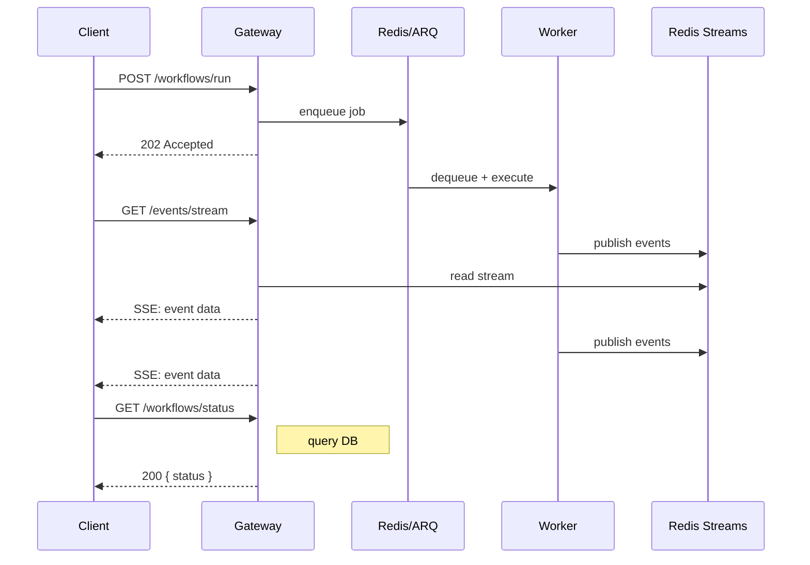
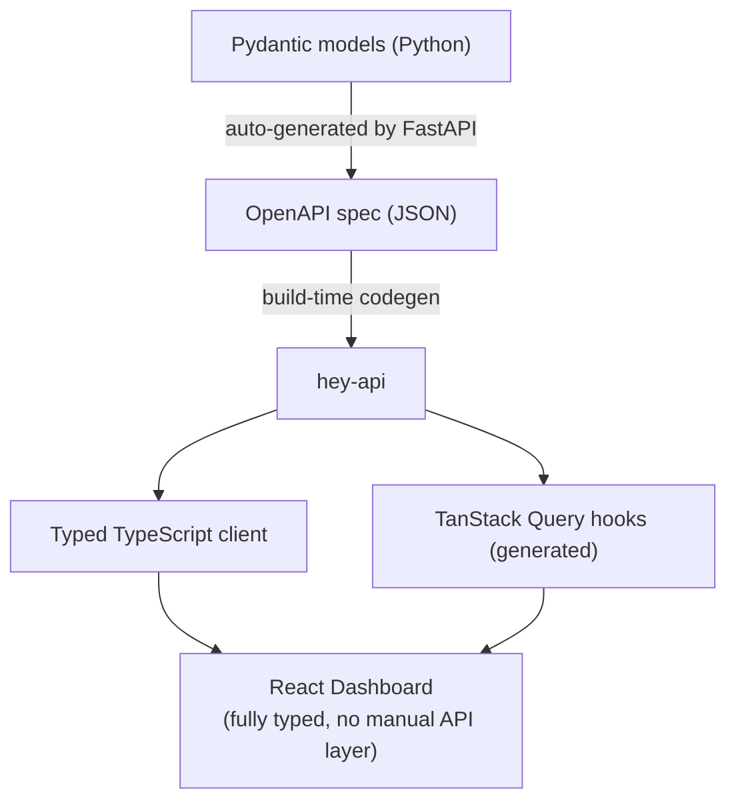
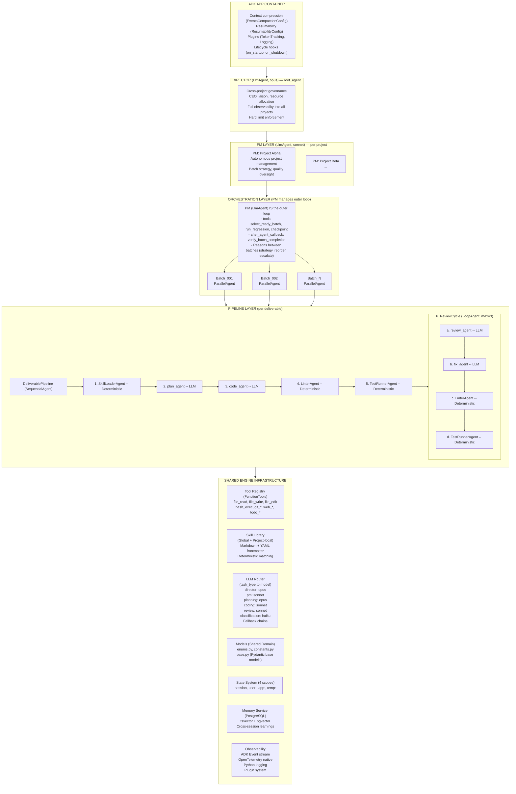
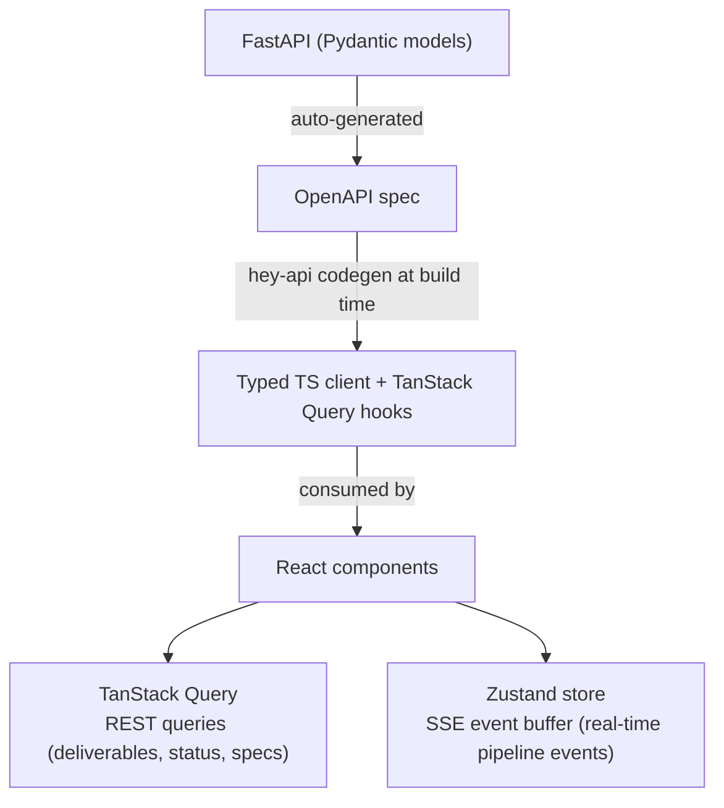

# AutoBuilder Architecture

## 1. System Overview

AutoBuilder is an autonomous agentic workflow system that orchestrates multi-agent teams alongside deterministic tooling in structured, resumable pipelines. The system uses **hierarchical agent supervision** (CEO → Director → PM → Workers) mapped to ADK's native agent tree, providing cross-project governance, per-project autonomous management, and parallel deliverable execution. The system exposes an API-first FastAPI gateway that owns the external contract. Google ADK runs behind an anti-corruption layer as the internal orchestration engine -- clients never interact with ADK directly. Workflow execution is out-of-process: the gateway enqueues work via ARQ, Redis-backed workers execute pipelines, and Redis Streams distribute events to consumers (SSE endpoints, webhook dispatchers, audit loggers).

The architecture is organized around five layers:

1. **Interface layer** -- CLI (typer) and web dashboard (React SPA), both pure API consumers
2. **Gateway layer** -- FastAPI REST + SSE, AutoBuilder-owned routes/models/contract
3. **Worker layer** -- ARQ async workers executing ADK pipelines out-of-process
4. **Engine layer** -- ADK orchestration (batch scheduling, pipelines, agents, tools, state)
5. **Infrastructure layer** -- Redis (queue + events + cache + cron), database (SQLAlchemy + Alembic), filesystem

All agent types -- LLM and deterministic -- participate in the same ADK event stream, state system, and observability infrastructure. While auto-code is the first workflow, the architecture is workflow-agnostic -- pipeline stages, quality gates, and artifact types are defined per workflow, not hardcoded.

---

## 2. System Architecture Diagram



---

## 3. Request Flow



**SSE reconnection**: Clients send `Last-Event-ID` header on reconnect. The SSE endpoint replays missed events from the Redis Stream starting from that ID, then resumes live streaming. No events are lost.

---

## 4. Gateway Layer

### Anti-Corruption Pattern

The gateway owns the external API contract. ADK is an internal implementation detail:

- **Gateway models**: Pydantic models define the API contract (request/response schemas)
- **ADK models**: Internal to workers; never exposed to clients
- **Translation**: The anti-corruption layer in workers translates between gateway commands and ADK Runner/SessionService calls
- **Swappable**: ADK could be replaced with another orchestration engine without changing the client-facing API

`get_fast_api_app()` and `adk web` are local development tools only. They are not part of the production architecture.

### Route Structure

| Method | Path | Purpose |
|--------|------|---------|
| `POST` | `/specs` | Submit a specification for decomposition |
| `POST` | `/workflows/{id}/run` | Enqueue workflow execution |
| `GET` | `/workflows/{id}/status` | Query workflow state |
| `POST` | `/workflows/{id}/intervene` | Human-in-the-loop intervention |
| `GET` | `/deliverables` | Query deliverables (filter by workflow, status) |
| `GET` | `/deliverables/{id}` | Get deliverable detail |
| `GET` | `/events/stream` | SSE endpoint for real-time events |

### Transport

- **REST** for commands and queries (standard request/response)
- **SSE** for real-time event streaming (server-push, reconnectable)
- **No GraphQL** -- REST is sufficient; GraphQL adds complexity without benefit for this use case
- **No gRPC** at gateway layer -- internal service communication is in-process or via Redis
- **WebRTC** reserved for future voice interface

### Type Safety Chain



Build-time type safety from Python models to TypeScript UI without maintaining a separate TS ORM or manual API client.

---

## 5. Worker Architecture

### ARQ Workers

Workers execute workflow pipelines out-of-process. The gateway never runs ADK directly.

| Concern | Implementation |
|---------|---------------|
| Worker framework | **ARQ** (native asyncio, Redis-backed) |
| Why not Celery | Celery is sync-first; ARQ is native asyncio, simpler, fits the stack |
| Execution model | Gateway enqueues a job (workflow ID + params) -> ARQ worker picks up -> runs ADK pipeline -> publishes events to Redis Streams |
| Concurrency | Multiple workers can run in parallel; each worker runs one pipeline at a time |
| Cron jobs | **ARQ cron** for scheduled tasks (cleanup, health checks, scheduled workflows) |
| Idempotency | Workers must handle re-delivery; ADK resume helps with crash recovery |

### Worker Lifecycle

```python
# Simplified worker structure
async def run_workflow(ctx: dict, workflow_id: str, params: dict) -> None:
    """ARQ job function -- runs in worker process."""
    # Anti-corruption layer: translate gateway params -> ADK
    runner = create_adk_runner(workflow_id, params)
    session = await create_or_resume_session(workflow_id)

    async for event in runner.run_async(session):
        # Translate ADK event -> gateway event schema
        gateway_event = translate_event(event)
        # Publish to Redis Streams
        await publish_to_stream(workflow_id, gateway_event)
        # Update database state
        await update_workflow_state(workflow_id, event)
```

---

## 6. Event System

### Redis Streams

Redis Streams serve as the persistent, replayable event bus. All pipeline events flow through streams.

| Feature | Implementation |
|---------|---------------|
| Publish | Workers publish translated ADK events to a per-workflow stream |
| Persistence | Events are stored in Redis with configurable retention |
| Replay | Consumers can read from any point in the stream (by ID) |
| Consumer groups | Multiple independent consumers process the same stream |
| Delivery guarantees | At-least-once via consumer group acknowledgment |

### Consumers

| Consumer | Purpose | Mechanism |
|----------|---------|-----------|
| **SSE endpoint** | Push real-time events to connected clients | Gateway reads stream, pushes via SSE |
| **Webhook dispatcher** | Notify external systems | Reads events, dispatches via httpx to registered listeners (stored in DB) |
| **Audit logger** | Compliance and debugging | Reads events, writes to database |

### SSE Reconnection

```
1. Client connects:   GET /events/stream
2. Server streams:    event: pipeline.step.completed (id: 1707-001)
3. Connection drops
4. Client reconnects: GET /events/stream  (Last-Event-ID: 1707-001)
5. Server replays:    all events after 1707-001 from Redis Stream
6. Server resumes:    live streaming from current position
```

No events are lost. Redis Stream IDs map directly to SSE event IDs.

### Event Listeners (Webhooks)

- Registered hooks stored in database (URL, event filter, secret)
- Redis Stream consumer reads matching events
- Dispatches via httpx with HMAC signature
- Retry with exponential backoff on failure

---

## 7. Data Layer

### Single Database

All persistent data lives in one database, accessed only through the gateway (and workers via shared SQLAlchemy models).

| Concern | Implementation |
|---------|---------------|
| ORM | **SQLAlchemy 2.0 async** (native async sessions, modern 2.0-style queries) |
| Migrations | **Alembic** (version-controlled schema evolution) |
| Driver | `asyncpg` (PostgreSQL) -- all environments |
| Access pattern | Gateway and workers share the same SQLAlchemy models |

No separate dashboard database. No separate session database. One schema, one migration history.

### Key Tables (Conceptual)

| Table | Purpose |
|-------|---------|
| `specifications` | Submitted specs and their decomposition status |
| `workflows` | Workflow execution records (status, params, timestamps) |
| `deliverables` | Individual deliverable records within a workflow |
| `sessions` | ADK session state (persisted via DatabaseSessionService adapter) |
| `events` | Audit log (subset of events written by audit consumer) |
| `webhook_listeners` | Registered webhook endpoints and filters |
| `skills` | Skill index and metadata |

---

## 8. ADK Engine (Internal)

ADK runs inside workers, behind the anti-corruption layer. This section documents the internal orchestration engine.

### ADK Mapping

| ADK Primitive | Role in AutoBuilder |
|---------------|-------------------|
| `App(root_agent=director)` | Top-level container; Director is the permanent root_agent |
| `LlmAgent` (Director) | Cross-project governance, CEO liaison, strategic decisions (opus) |
| `LlmAgent` (PM) | Per-project autonomous management, IS the outer batch loop, quality oversight (sonnet) |
| `LlmAgent` (Worker) | Planning, coding, reviewing -- probabilistic steps requiring LLM judgment |
| `CustomAgent` (BaseAgent) | Linter, test runner, formatter, skill loader -- deterministic pipeline steps |
| `SequentialAgent` | Inner deliverable pipeline (plan, code, lint, test, review) |
| `ParallelAgent` | Concurrent deliverable execution within a batch |
| `LoopAgent` | Review/fix cycles with max iteration bounds |
| `Session State` | Inter-agent communication (4 scopes: session, user, app, temp) |
| `Event Stream` | Unified observability for all agent types (translated to Redis Streams at boundary) |
| `FunctionTool` | Wrap Python functions as LLM-callable tools (auto-schema from type hints) |
| `InstructionProvider` | Dynamic context/knowledge loading per invocation |
| `before_model_callback` | Context injection, token budget monitoring |
| `DatabaseSessionService` | State persistence (adapter bridges to shared database) |
| `transfer_to_agent` / `AgentTool` | Director → PM delegation; PM → Worker delegation |
| `before_agent_callback` / `after_agent_callback` | Supervision hooks; Director monitors PM events |

### Multi-Model via LiteLLM

LiteLLM provides the model abstraction layer. Model strings use the LiteLLM format (e.g., `anthropic/claude-sonnet-4-5-20250929`). The LLM Router selects models per task based on routing configuration.

### Architecture Diagram (Engine Internal)



### Hierarchical Agent Structure

```python
# Director + PM hierarchy -- the supervision layer
director_agent = LlmAgent(
    name="Director",
    model="anthropic/claude-opus-4-6",
    instruction="Cross-project governance agent. Manage PMs, allocate resources, "
                "enforce hard limits, intervene when patterns go wrong.",
    sub_agents=[pm_alpha, pm_beta],  # PMs are Director's sub_agents
)

pm_alpha = LlmAgent(
    name="PM_ProjectAlpha",
    model="anthropic/claude-sonnet-4-5-20250929",
    instruction="Autonomous project manager for Project Alpha. You ARE the outer batch loop. "
                "Use select_ready_batch to pick work, supervise DeliverablePipeline workers, "
                "run regression tests between batches, checkpoint progress, and escalate only "
                "when you cannot resolve an issue.",
    tools=[
        FunctionTool(select_ready_batch),
        FunctionTool(run_regression_tests),
        FunctionTool(checkpoint_project),
    ],
    sub_agents=[],  # DeliverablePipeline instances added dynamically per batch
    after_agent_callback=verify_batch_completion,
)
```

### Inner Pipeline Composition

```python
# Inner deliverable pipeline -- declarative composition (worker-level)
deliverable_pipeline = SequentialAgent(
    name="DeliverablePipeline",
    sub_agents=[
        SkillLoaderAgent(name="LoadSkills"),     # Deterministic
        plan_agent,                                # LLM
        code_agent,                                # LLM
        LinterAgent(name="Lint"),                  # Deterministic
        TestRunnerAgent(name="Test"),               # Deterministic
        LoopAgent(
            name="ReviewCycle",
            max_iterations=3,
            sub_agents=[
                review_agent,                      # LLM
                fix_agent,                         # LLM
                LinterAgent(name="ReLint"),        # Deterministic
                TestRunnerAgent(name="ReTest"),     # Deterministic
            ]
        )
    ]
)
```

```python
# PM-level tools -- the mechanical operations the PM calls as part of its outer loop
def select_ready_batch(project_id: str) -> str:
    """Dependency-aware batch selection via topological sort. Returns the next
    set of deliverables whose prerequisites are satisfied."""
    ...

def run_regression_tests(project_id: str) -> str:
    """Run cross-deliverable regression suite after a batch completes."""
    ...

def checkpoint_project(project_id: str) -> str:
    """Persist current project state for resume."""
    ...

# The PM (LlmAgent) IS the outer loop -- it calls these tools and reasons
# between batches. No separate BatchOrchestrator agent needed.
# Dynamic ParallelAgent batch construction happens within the PM's tool calls.
```

---

## 9. The Autonomous Execution Loop

The execution loop operates at two levels within the hierarchy:

### Director-Level Loop

```
1. Client submits spec via POST /specs
2. Gateway enqueues decomposition job -> ARQ worker decomposes -> deliverables in DB
3. Client triggers POST /workflows/{id}/run
4. Gateway enqueues execution job -> ARQ worker picks up
5. Director (root_agent) receives the workflow:
   a. Assigns project to a PM (creates PM agent if new project)
   b. Sets hard limits (cost, time, concurrency) for the PM
   c. Delegates execution to PM
   d. Monitors PM progress via event stream
   e. Intervenes if cross-project patterns go wrong
   f. Manages multiple concurrent projects in parallel
6. Director publishes completion event when PM reports done
7. Client receives completion via SSE stream (or polls status endpoint)
```

### PM-Level Loop (per project)

```
1. PM receives project delegation from Director
2. PM runs the autonomous execution loop:
   a. Load spec -> resolve dependencies (topological sort)
   b. While incomplete deliverables exist:
      i.   Select next batch (respecting deps + concurrency limits)
      ii.  For each deliverable in batch (parallel):
           - Load relevant skills (deterministic: SkillLoaderAgent)
           - Plan implementation (LLM: plan_agent)
           - Execute plan (LLM: execute_agent)
           - Validate output (deterministic: workflow-specific ValidatorAgent)
           - Verify output (deterministic: workflow-specific VerifyAgent)
           - Review quality (LLM: review_agent)
           - Loop execute-validate-verify-review if review fails (max N)
      iii. Merge completed deliverables
      iv.  Run regression checks
      v.   Publish batch completion event -> Redis Streams
      vi.  Optional: pause for human review (intervention via API)
   c. Handle failures autonomously (retry, reorder, skip blocked deliverables)
   d. Escalate to Director only when PM cannot resolve
3. PM reports project completion to Director
```

Each tier runs autonomously. No human prompting is required between iterations. The Director monitors all PMs and can intervene at any point. Optional human-in-the-loop intervention points can be configured at the batch boundary (step 2b.vi), triggered via the intervention API endpoint.

Note: The specific deterministic agents in validation/verification steps vary by workflow. For auto-code: LinterAgent + TestRunnerAgent. For auto-research: SourceVerifierAgent + CitationCheckerAgent. The *pattern* (deterministic validation is mandatory) is universal; the *implementation* is workflow-specific.

---

## 10. Infrastructure

### Redis Roles

Redis serves four distinct roles from day one. This is fundamental infrastructure, not a Phase 2 optimization.

| Role | Mechanism | Purpose |
|------|-----------|---------|
| **Task queue** | ARQ (Redis lists) | Enqueue and dequeue workflow execution jobs |
| **Event bus** | Redis Streams | Persistent, replayable pipeline event distribution |
| **Cron store** | ARQ cron | Scheduled job definitions and execution tracking |
| **Cache** | Redis key/value | LLM response caching, skill index caching, session state caching |

### Database

| Concern | Choice |
|---------|--------|
| ORM | SQLAlchemy 2.0 async |
| Migrations | Alembic |
| Driver | PostgreSQL (`asyncpg`) -- all environments |
| Access | Gateway + workers (shared models, single schema) |

### Filesystem

| Concern | Purpose |
|---------|---------|
| Git worktrees | Filesystem isolation for parallel code generation |
| Artifacts | Large data (generated code, reports, files) |
| Skills | Markdown + YAML frontmatter files |

---

## 11. CLI Architecture

The CLI is a thin API client built with **typer**. It has no database, no direct ADK access, and no business logic beyond argument parsing and API calls.

| Command | API Call | Purpose |
|---------|----------|---------|
| `autobuilder run <spec>` | `POST /specs` + `POST /workflows/{id}/run` | Submit and launch |
| `autobuilder status <id>` | `GET /workflows/{id}/status` | Check progress |
| `autobuilder intervene <id>` | `POST /workflows/{id}/intervene` | Human-in-the-loop |
| `autobuilder list` | `GET /workflows` | List workflows |
| `autobuilder logs <id>` | `GET /events/stream` (SSE) | Stream events to terminal |

The CLI connects to the gateway via REST + SSE. It can be used for scripting, CI/CD integration, and headless operation.

---

## 12. Dashboard Architecture

The web dashboard is a **React 19 SPA** (static build via Vite). It consumes the gateway API exclusively -- no backend, no database of its own.

### Stack

| Layer | Technology | Purpose |
|-------|-----------|---------|
| Framework | React 19 | UI components |
| Build | Vite | Fast dev server + static production build |
| Server state | TanStack Query | Generated from OpenAPI via hey-api; caching, refetching, optimistic updates |
| Client state | Zustand | SSE event buffer, UI preferences, transient state |
| Styling | Tailwind v4 | CSS-first @theme, fully tokenized design system |
| API client | hey-api generated | Typed client + TanStack Query hooks from OpenAPI spec |

### Data Flow



The dashboard is a static asset. It can be served from any CDN, file server, or embedded in the gateway's static files.

---

## 13. State Architecture

Agents communicate via session state, not direct message passing. All state updates happen through `Event.actions.state_delta`, making every change auditable in the event stream.

| Scope | Prefix | Contents | Persistence |
|-------|--------|----------|-------------|
| **Session** | *(none)* | Current batch, deliverable statuses, loaded skills, validation results, verification results | Per-run (persistent via database) |
| **User** | `user:` | Preferences, model selections, intervention settings | Cross-session per user |
| **App** | `app:` | Project config, global conventions, skill index | Cross-user, cross-session |
| **Temp** | `temp:` | Intermediate LLM outputs, scratch data | Discarded after invocation |
| **Memory** | `MemoryService` | Cross-session learnings, past decisions, discovered patterns | Persistent, searchable archive |

State values are injectable into agent instructions via `{key}` templating. For example: `"Implement the deliverable: {current_deliverable_spec}"` auto-resolves from `session.state['current_deliverable_spec']`. Use `{key?}` for optional keys that may not exist.

### State Scope per Tier

The 6-level memory architecture applies at each tier's scope:

| Level | Director Scope | PM Scope | Worker Scope |
|-------|---------------|----------|--------------|
| Invocation (`temp:`) | Current decision cycle | Current batch management cycle | Current deliverable execution |
| Pipeline (`session`) | Cross-project governance state | Project execution state | Deliverable pipeline state |
| Project (`app:` + Skills) | Global conventions, all project configs | Project conventions, project skills | Deliverable-specific skills |
| User (`user:`) | CEO preferences, global settings | Inherits from Director | Inherits from PM |
| Cross-session (`MemoryService`) | Historical decisions, pattern library | Project history, past batch outcomes | Past deliverable patterns |
| Business (Skills) | Global skills, governance rules | Project skills, workflow skills | Task-specific skills |

Hard limits cascade through the hierarchy: CEO sets globals → Director enforces per-project limits → PM enforces per-worker constraints.

---

## 14. Multi-Agent Communication

Agents communicate via four mechanisms, all operating through session state:

| # | Mechanism | How It Works |
|---|-----------|-------------|
| 1 | `output_key` | Agent writes its result to a named state key |
| 2 | `{key}` templates | Agent reads from state via template injection in instructions |
| 3 | `InstructionProvider` | Dynamic function reads state and constructs context-appropriate instructions at invocation time |
| 4 | `before_model_callback` | Injects additional context (file contents, test results) right before LLM call |

Within a pipeline tier, no agent calls another agent directly. All coordination flows through the shared state system, making data flow explicit and debuggable.

### Hierarchical Communication

Between tiers, agents communicate via ADK's delegation primitives:

| Pattern | Mechanism | Example |
|---------|-----------|---------|
| Director → PM delegation | `transfer_to_agent` or `AgentTool` | Director assigns a project to a PM |
| PM -> Worker orchestration | `sub_agents` tree | PM constructs DeliverablePipeline workers per batch |
| Worker → PM escalation | State write + event | Worker writes failure to state; PM reads and decides |
| PM → Director escalation | State write + event | PM writes unresolvable issue; Director intervenes |
| Director observation | `before_agent_callback` / `after_agent_callback` | Director monitors PM events via supervision hooks |
| Cross-project state | `app:` scope prefix | Visible to Director and all PMs |

---

## 15. Observability

### Phased Approach

| Phase | Tool | Purpose |
|-------|------|---------|
| Phase 1 | **OpenTelemetry** | ADK-native tracing (auto-traces agents, tools, runner) |
| Phase 1 | **Python logging** | Structured logs under `app.*` hierarchy |
| Phase 1 | **Redis Streams** | Pipeline events (also serves as operational observability) |
| Phase 2 | **Langfuse** | LLM-specific tracing (token usage, latency, quality) |
| Phase 3 | **Custom dashboard** | Integrated observability views in the web dashboard |

### Event Stream

Every agent (LLM or deterministic) emits `Event` objects into ADK's unified chronological stream. The anti-corruption layer translates these to gateway events and publishes to Redis Streams. This provides full pipeline visibility from plan to execution to validation to review.

`adk web` remains available as a local development tool for detailed ADK-level debugging, but is not part of the production observability stack.

---

## 16. Context Window Management

ADK's `LlmAgent` automatically receives session event history as part of each LLM prompt. Two built-in mechanisms manage growth:

- **Context compression** -- sliding window summarization of older events (config-driven, interval + overlap)
- **Context caching** -- caches static prompt parts server-side (system instructions, knowledge bases)

**Gap identified**: ADK has no built-in context-window usage metric. Agents cannot reactively respond to "you are at 80% capacity."

**Solution**: A `before_model_callback` that token-counts the assembled `LlmRequest`, writes percentage to state, and downstream logic reacts (trigger summarization, prune skills, checkpoint and restart). Approximately 50 lines of code.

**Implication for pipeline design**: For longer pipelines, agents should not rely on reading raw event history from prior steps. Better to use SkillLoaderAgent + explicit state writes so each agent gets precisely the context it needs, not the full event log.

---

## 17. Dynamic Context & Knowledge Loading

ADK provides injection hooks but no built-in knowledge management system. AutoBuilder's knowledge loading is layered:

| Layer | Mechanism | What It Loads |
|-------|-----------|---------------|
| 1 | Static instruction string | Base agent personality/role |
| 2 | `InstructionProvider` function | Project conventions, patterns, deliverable spec (at invocation time) |
| 3 | `before_model_callback` | File context, codebase analysis, test results (right before LLM call) |
| 4 | `BaseToolset.get_tools()` | Different tools per deliverable type |
| 5 | Artifacts (`save_artifact`/`load_artifact`) | Large data (full file contents, generated code) |
| 6 | Context compression | Sliding window summarization for long autonomous runs |

No built-in RAG or vector store. For AutoBuilder, knowledge is deterministic lookup -- conventions from files, codebase via tools, specs via state, patterns from local directory. `InstructionProvider` + callbacks are sufficient.

---

## 18. App Container Configuration

ADK's `App` class is the top-level container for the agent workflow, instantiated inside workers.

### What App Provides

| Feature | Purpose | AutoBuilder Use |
|---------|---------|----------------|
| `root_agent` | The top-level agent tree | `Director` (LlmAgent, opus) — permanent, not per-execution |
| `events_compaction_config` | Context compression (sliding window summarization) | Keep long autonomous runs within context limits |
| `resumability_config` | Workflow resume after interruption | Pick up where we left off after crash/power loss |
| `plugins` | Global lifecycle hooks (logging, metrics, guardrails) | Token tracking, cost monitoring, security guardrails |
| `context_cache_config` | Cache static prompt parts server-side | Cache system instructions and skill content |
| Lifecycle hooks | `on_startup` / `on_shutdown` | Initialize connections, tool registry, skill library |
| State scope boundary | `app:*` prefix for app-level state | Project config, global conventions, workflow registry |

### App Structure

```python
from google.adk.apps import App, EventsCompactionConfig, ResumabilityConfig
from google.adk.apps.llm_event_summarizer import LlmEventSummarizer

summarizer = LlmEventSummarizer(
    llm=LiteLlm(model="anthropic/claude-haiku-4-5-20251001")
)

# Director is the permanent root_agent -- created at worker startup, not per execution
app = App(
    name="autobuilder",
    root_agent=director_agent,  # LlmAgent (opus) — hierarchical supervision root

    events_compaction_config=EventsCompactionConfig(
        compaction_interval=5,
        overlap_size=1,
        summarizer=summarizer,
    ),

    resumability_config=ResumabilityConfig(
        is_resumable=True,
    ),

    plugins=[
        TokenTrackingPlugin(),
        LoggingPlugin(),
    ],
)
```

### Resumability for CustomAgents

ADK's Resume feature (v1.16+) tracks workflow execution and allows picking up after unexpected interruption:

- Resume is not automatic for CustomAgents -- we must implement `BaseAgentState` subclass and define checkpoint steps (PM uses `checkpoint_project` tool)
- Tools may run more than once on resume -- git, file write, and bash tools must be idempotent or include duplicate-run protection
- The system reinstates results from successfully completed tools and re-runs from the point of failure

---

*Document Version: 2.2*
*Last Updated: 2026-02-16*
