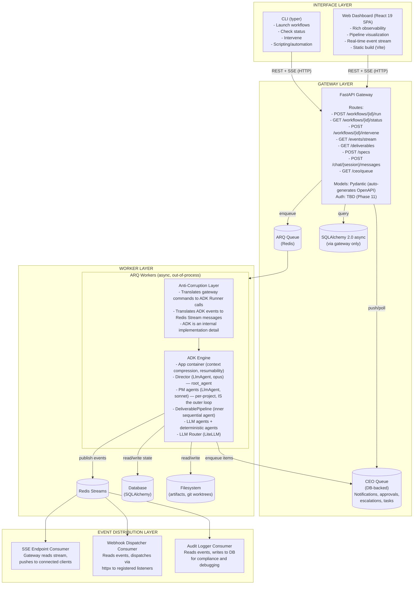
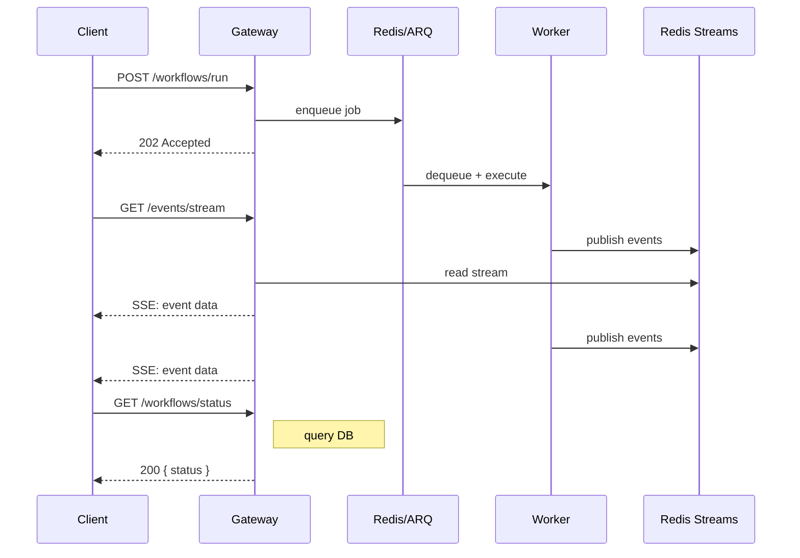

# AutoBuilder Architecture

## 1. System Overview

AutoBuilder is an autonomous agentic workflow system that orchestrates multi-agent teams alongside deterministic tooling in structured, resumable pipelines. The system uses **hierarchical agent supervision** (CEO → Director → PM → Workers) mapped to ADK's native agent tree, providing cross-project governance, per-project autonomous management, and parallel deliverable execution. Agents are **stateless config objects** recreated per invocation -- all continuity lives in database-backed ADK sessions. The Director operates via a **multi-session architecture**: chat sessions for CEO interaction, work sessions per project for background autonomous oversight. A **unified CEO queue** (DB-backed) aggregates notifications, approvals, escalations, and tasks across all projects. The system exposes an API-first FastAPI gateway that owns the external contract. Google ADK runs behind an anti-corruption layer as the internal orchestration engine -- clients never interact with ADK directly. Workflow execution is out-of-process: the gateway enqueues work via ARQ, Redis-backed workers execute pipelines, and Redis Streams distribute events to consumers (SSE endpoints, webhook dispatchers, audit loggers).

The architecture is organized around five layers:

1. **Interface layer** -- CLI (typer) and web dashboard (React SPA), both pure API consumers
2. **Gateway layer** -- FastAPI REST + SSE, AutoBuilder-owned routes/models/contract
3. **Worker layer** -- ARQ async workers executing ADK pipelines out-of-process
4. **Engine layer** -- ADK orchestration (batch scheduling, pipelines, agents, tools, state)
5. **Infrastructure layer** -- Redis (queue + events + cache + cron), database (SQLAlchemy + Alembic), filesystem

All agent types -- LLM and deterministic -- participate in the same ADK event stream, state system, and observability infrastructure. While auto-code is the first workflow, the architecture is workflow-agnostic -- pipeline stages, quality gates, and artifact types are defined per workflow, not hardcoded.

---

## 2. System Architecture Diagram

---

## 3. Request Flow

**Two invocation models**: Chat sessions use per-message invocation -- the gateway calls `runner.run_async` for each user message, returning the response synchronously. Work sessions are long-running ARQ jobs that execute autonomously, publishing events to Redis Streams.

**SSE reconnection**: Clients send `Last-Event-ID` header on reconnect. The SSE endpoint replays missed events from the Redis Stream starting from that ID, then resumes live streaming. No events are lost.

---

## 4. Architecture Reference

Detailed architecture documentation is organized by domain in the `architecture/` subdirectory. Each file covers one architectural concern.

### System Layers

| Domain | File | Summary |
|--------|------|---------|
| Gateway | [gateway.md](./architecture/gateway.md) | Anti-corruption pattern, route structure, transport, type safety chain |
| Workers | [workers.md](./architecture/workers.md) | ARQ workers, lifecycle, concurrency, idempotency |
| Events | [events.md](./architecture/events.md) | Redis Streams event bus, consumer groups, CEO queue |
| Data & Infrastructure | [data.md](./architecture/data.md) | Database layer, Redis infrastructure, filesystem, deployment |
| Clients | [clients.md](./architecture/clients.md) | CLI (typer) and Dashboard (React 19 SPA) architecture |

### Engine & Orchestration

| Domain | File | Summary |
|--------|------|---------|
| ADK Engine | [engine.md](./architecture/engine.md) | App container, ADK primitive mapping, LLM routing via LiteLLM |
| Agents | [agents.md](./architecture/agents.md) | Agent hierarchy (Director → PM → Workers), types, composition, communication |
| Execution | [execution.md](./architecture/execution.md) | Autonomous execution loop, multi-session model, session lifecycle |
| State & Memory | [state.md](./architecture/state.md) | ADK 4-scope state, multi-level memory, cross-session persistence |
| Tools | [tools.md](./architecture/tools.md) | FunctionTool wrappers, GlobalToolset, tool authorization |

### Knowledge & Workflows

| Domain | File | Summary |
|--------|------|---------|
| Skills | [skills.md](./architecture/skills.md) | Skill-based knowledge injection, progressive disclosure, trigger matching |
| Workflows | [workflows.md](./architecture/workflows.md) | Pluggable workflow system, manifests, registry, composition |
| Observability | [observability.md](./architecture/observability.md) | OpenTelemetry + Langfuse, context window management, dynamic context |

---

## 5. Key Architectural Decisions

| # | Decision | Rationale | Details |
|---|----------|-----------|---------|
| — | API-first gateway | ADK is an internal engine; clients interact only with gateway API | [gateway.md](./architecture/gateway.md) |
| — | Out-of-process execution | Gateway enqueues, workers execute; no ADK in gateway process | [workers.md](./architecture/workers.md) |
| — | Hierarchical supervision | CEO → Director → PM → Workers; each tier autonomous | [agents.md](./architecture/agents.md) |
| — | Stateless agents | Agents are config objects recreated per invocation; state in DB | [execution.md](./architecture/execution.md) |
| — | Event-driven distribution | Redis Streams for all event flow (SSE, webhooks, audit) | [events.md](./architecture/events.md) |
| — | Workflow-agnostic | Pipeline stages, quality gates, artifact types per workflow | [workflows.md](./architecture/workflows.md) |
| — | Deterministic + probabilistic | CustomAgent for known outcomes, LlmAgent for judgment | [agents.md](./architecture/agents.md) |
| — | Multi-session model | Chat sessions (interactive) + work sessions (autonomous) | [execution.md](./architecture/execution.md) |

---

*Document Version: 2.0*
*Last Updated: 2026-02-17*
