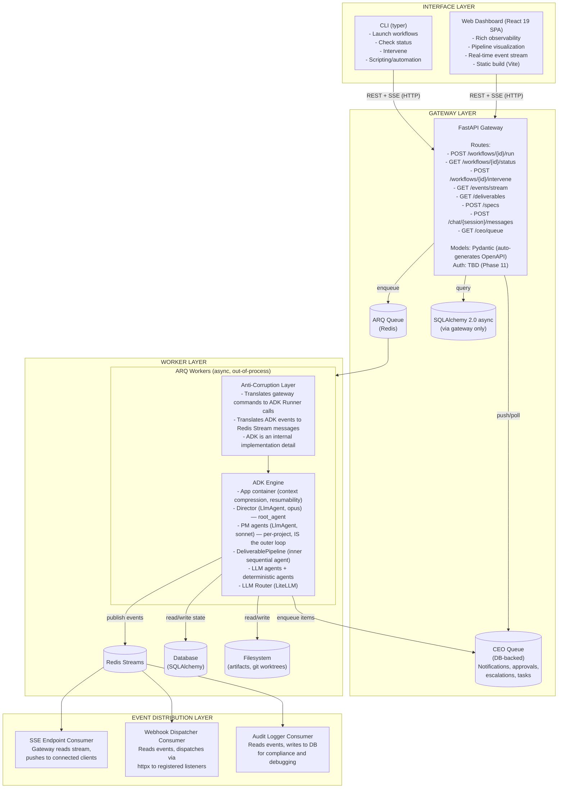
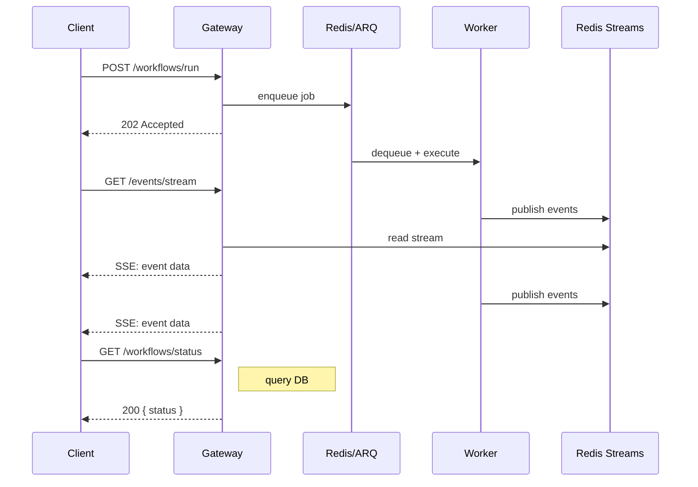

# AutoBuilder Architecture

## 1. System Overview

AutoBuilder is an autonomous agentic workflow system that orchestrates multi-agent teams alongside deterministic tooling in structured, resumable pipelines. The system uses **hierarchical agent supervision** (CEO → Director → PM → Workers) mapped to ADK's native agent tree, providing cross-project governance, per-project autonomous management, and parallel deliverable execution. Agents are **stateless config objects** recreated per invocation -- all continuity lives in database-backed ADK sessions. The Director operates via a **multi-session architecture**: chat sessions for CEO interaction, work sessions per project for background autonomous oversight. A **unified CEO queue** (DB-backed) aggregates notifications, approvals, escalations, and tasks across all projects. The system exposes an API-first FastAPI gateway that owns the external contract. Google ADK runs behind an anti-corruption layer as the internal orchestration engine -- clients never interact with ADK directly. Workflow execution is out-of-process: the gateway enqueues work via ARQ, Redis-backed workers execute pipelines, and Redis Streams distribute events to consumers (SSE endpoints, webhook dispatchers, audit loggers).

The architecture is organized around five layers:

1. **Interface layer** -- CLI (typer) and web dashboard (React SPA), both pure API consumers
2. **Gateway layer** -- FastAPI REST + SSE, AutoBuilder-owned routes/models/contract
3. **Worker layer** -- ARQ async workers executing ADK pipelines out-of-process
4. **Engine layer** -- ADK orchestration (batch scheduling, pipelines, agents, tools, state)
5. **Infrastructure layer** -- Redis (queue + events + cache + cron), database (SQLAlchemy + Alembic), filesystem

All agent types -- LLM and deterministic -- participate in the same ADK event stream, state system, and observability infrastructure. While auto-code is the first workflow, the architecture is workflow-agnostic -- pipeline stages, quality gates, and artifact types are defined per workflow, not hardcoded.

---

## 2. System Architecture Diagram

---

## 3. Request Flow

**Two invocation models**: Chat sessions use per-message invocation -- the gateway calls `runner.run_async` for each user message, returning the response synchronously. Work sessions are long-running ARQ jobs that execute autonomously, publishing events to Redis Streams.

**SSE reconnection**: Clients send `Last-Event-ID` header on reconnect. The SSE endpoint replays missed events from the Redis Stream starting from that ID, then resumes live streaming. No events are lost.

---

## 4. Architecture Reference

Detailed architecture documentation is organized by domain in the `architecture/` subdirectory. Each file covers one architectural concern.

### System Layers

| Domain | File | Summary |
|--------|------|---------|
| Gateway | [gateway.md](./architecture/gateway.md) | Anti-corruption pattern, route structure, transport, type safety chain |
| Workers | [workers.md](./architecture/workers.md) | ARQ workers, lifecycle, concurrency, idempotency |
| Events | [events.md](./architecture/events.md) | Redis Streams event bus, consumer groups, CEO queue |
| Data & Infrastructure | [data.md](./architecture/data.md) | Database layer, Redis infrastructure, filesystem, deployment |
| Clients | [clients.md](./architecture/clients.md) | CLI (typer) and Dashboard (React 19 SPA) architecture |

### Engine & Orchestration

| Domain | File | Summary |
|--------|------|---------|
| ADK Engine | [engine.md](./architecture/engine.md) | App container, ADK primitive mapping, LLM routing via LiteLLM |
| Agents | [agents.md](./architecture/agents.md) | Agent hierarchy (Director → PM → Workers), types, composition, communication |
| Execution | [execution.md](./architecture/execution.md) | Autonomous execution loop, multi-session model, session lifecycle |
| State & Memory | [state.md](./architecture/state.md) | ADK 4-scope state, multi-level memory, cross-session persistence |
| Tools | [tools.md](./architecture/tools.md) | FunctionTool wrappers, GlobalToolset, tool authorization |

### Knowledge & Workflows

| Domain | File | Summary |
|--------|------|---------|
| Context | [context.md](./architecture/context.md) | Context assembly lifecycle, budgeting, recreation, knowledge loading |
| Skills | [skills.md](./architecture/skills.md) | Skill-based knowledge injection, three-layer deterministic loading, trigger matching, supervision-tier resolution |
| Workflows | [workflows.md](./architecture/workflows.md) | Pluggable workflow system, manifest, stage schema, node-based pipeline schema, quality gates, Director authoring |
| Observability | [observability.md](./architecture/observability.md) | OpenTelemetry + Langfuse, tracing, logging, event stream |

---

## 5. PRD → Architecture Traceability

Every PRD requirement maps to at least one architecture domain. Gaps in this table indicate architecture coverage issues.

### Functional Requirements

| PRD ID | Requirement (short) | Architecture Domain(s) |
|--------|---------------------|------------------------|
| PR-1 | Brief definition & validation | [agents.md](./architecture/agents.md) §Director Agent, [execution.md](./architecture/execution.md) §Director Execution Turn |
| PR-2 | Project status tracking | [data.md](./architecture/data.md) §1, [gateway.md](./architecture/gateway.md) §Route Structure |
| PR-3 | Pause / resume / abort | [execution.md](./architecture/execution.md) §PM-Level Loop, [state.md](./architecture/state.md) §1 |
| PR-4 | Workflows are plugins | [workflows.md](./architecture/workflows.md) §Workflow Manifest, §Stage Schema |
| PR-5 | Stage agent configuration | [agents.md](./architecture/agents.md) §PM Agent, [workflows.md](./architecture/workflows.md) §Stage Schema |
| PR-5a | Composable agent instructions | [agents.md](./architecture/agents.md) §Agent Definitions, [context.md](./architecture/context.md) §InstructionAssembler Pipeline |
| PR-5b | Declarative agent definition files | [agents.md](./architecture/agents.md) §Agent Definition Files, §AgentRegistry |
| PR-5c | 3-scope agent definition cascade | [agents.md](./architecture/agents.md) §Definition Cascade |
| PR-6 | Default workflow plugins | [workflows.md](./architecture/workflows.md) §Standard Workflows |
| PR-7 | Project conventions override | [workflows.md](./architecture/workflows.md) §Workflow Manifest, [state.md](./architecture/state.md) §1.2 |
| PR-8 | Resource pre-flight validation | [execution.md](./architecture/execution.md) §Director Execution Turn, [workflows.md](./architecture/workflows.md) §Workflow Manifest (resources) |
| PR-9 | Observable async work queues | [workers.md](./architecture/workers.md) §ARQ Workers, [events.md](./architecture/events.md) §Redis Streams |
| PR-10 | PM execution loop | [execution.md](./architecture/execution.md) §PM-Level Loop, [agents.md](./architecture/agents.md) §PM Agent |
| PR-11 | Quality gate pipeline | [workflows.md](./architecture/workflows.md) §Quality Gates |
| PR-12 | Failed deliverable escalation | [agents.md](./architecture/agents.md) §PM Agent, [events.md](./architecture/events.md) §Unified CEO Queue |
| PR-13 | Director as executive partner | [agents.md](./architecture/agents.md) §Director Agent, [execution.md](./architecture/execution.md) §Multi-Session |
| PR-14 | Dedicated PM per project | [agents.md](./architecture/agents.md) §PM Agent, [engine.md](./architecture/engine.md) §5 |
| PR-15 | Bounded authority (budgets) | [agents.md](./architecture/agents.md) §PM Agent, [state.md](./architecture/state.md) §1.2 |
| PR-15a | Context recreation | [agents.md](./architecture/agents.md) §Context Management, [context.md](./architecture/context.md) §Context Recreation |
| PR-15b | Deterministic memory loading | [agents.md](./architecture/agents.md) §Worker-Tier Custom Agents, [state.md](./architecture/state.md) §5 |
| PR-16 | Consecutive batch failure → suspend | [agents.md](./architecture/agents.md) §PM Agent, [events.md](./architecture/events.md) §Unified CEO Queue |
| PR-17 | CEO queue | [events.md](./architecture/events.md) §Unified CEO Queue, [gateway.md](./architecture/gateway.md) §Route Structure |
| PR-18 | Director queue | [events.md](./architecture/events.md) §Director Queue, [agents.md](./architecture/agents.md) §PM Agent |
| PR-19 | CEO queue item structure | [events.md](./architecture/events.md) §Unified CEO Queue |
| PR-20 | Resume on CEO resolve | [events.md](./architecture/events.md) §Unified CEO Queue, [execution.md](./architecture/execution.md) §PM-Level Loop |
| PR-21 | Notification channels | [events.md](./architecture/events.md) §Event Listeners (Webhooks) |
| PR-22 | Three-layer completion reports | [execution.md](./architecture/execution.md) §PM-Level Loop, [agents.md](./architecture/agents.md) §PM Agent, [workflows.md](./architecture/workflows.md) §Completion Criteria & Reports |
| PR-23 | TaskGroup close conditions | [execution.md](./architecture/execution.md) §PM-Level Loop, [workflows.md](./architecture/workflows.md) §Completion Criteria & Reports |
| PR-24 | Report contents (cost, decisions) | [execution.md](./architecture/execution.md) §PM-Level Loop, [observability.md](./architecture/observability.md) §1 |
| PR-25 | Remediation (re-execute failed only) | [execution.md](./architecture/execution.md) §PM-Level Loop |
| PR-26 | Memory as platform infrastructure | [state.md](./architecture/state.md) §5 |
| PR-27 | Global memory scope | [state.md](./architecture/state.md) §5 |
| PR-28 | Workflow memory scope | [state.md](./architecture/state.md) §5 |
| PR-29 | Project memory scope | [state.md](./architecture/state.md) §5 |
| PR-30 | Session memory scope | [state.md](./architecture/state.md) §1.2 |
| PR-31 | Skills (Agent Skills standard) | [skills.md](./architecture/skills.md) §Skill File Format |
| PR-32 | Skill activation (trigger matching) | [skills.md](./architecture/skills.md) §Trigger Matching |
| PR-33 | Third-party skill install | [skills.md](./architecture/skills.md) §Two-Tier Library |
| PR-33a | Autonomous skill creation | [skills.md](./architecture/skills.md) §Two-Tier Library |
| PR-34 | Persistent replayable event stream | [events.md](./architecture/events.md) §Redis Streams, [gateway.md](./architecture/gateway.md) §Route Structure |
| PR-35 | Token/cost tracking | [observability.md](./architecture/observability.md) §1, [engine.md](./architecture/engine.md) §5 |
| PR-35a | Agent definition resolution audit | [agents.md](./architecture/agents.md) §AgentRegistry, [observability.md](./architecture/observability.md) §1 |
| PR-36 | CLI full operational surface | [clients.md](./architecture/clients.md) §CLI Architecture |
| PR-37 | Dashboard CEO command center | [clients.md](./architecture/clients.md) §Dashboard Architecture |

### Non-Functional Requirements

| PRD ID | Requirement (short) | Architecture Domain(s) |
|--------|---------------------|------------------------|
| NFR-1 | API response / SSE latency | [gateway.md](./architecture/gateway.md) §Route Structure, [events.md](./architecture/events.md) §Redis Streams |
| NFR-2 | Stage completion time | [execution.md](./architecture/execution.md) §PM-Level Loop |
| NFR-3 | Crash recovery / LLM reliability | [engine.md](./architecture/engine.md) §5, [state.md](./architecture/state.md) §1, [workers.md](./architecture/workers.md) §ARQ Workers |
| NFR-4 | Security (validation, credentials, isolation) | [gateway.md](./architecture/gateway.md) §Anti-Corruption Pattern, [tools.md](./architecture/tools.md) §7.3, [engine.md](./architecture/engine.md) §5 |
| NFR-4a | Constitutional SAFETY fragment | [agents.md](./architecture/agents.md) §Instruction Composition |
| NFR-4b | Project-scope agent restrictions | [agents.md](./architecture/agents.md) §Project-Scope Restrictions |
| NFR-4c | State key authorization | [agents.md](./architecture/agents.md) §Agent Communication via Session State, [events.md](./architecture/events.md) §Redis Streams |
| NFR-5 | Extensibility (plugins, codegen, API contract) | [workflows.md](./architecture/workflows.md) §WorkflowRegistry, [skills.md](./architecture/skills.md) §Two-Tier Library, [gateway.md](./architecture/gateway.md) §Type Safety Chain |
| NFR-6 | Local deployment, env var config | [data.md](./architecture/data.md) §Infrastructure |

---

## 6. Key Architectural Decisions

| # | Decision | Rationale | Details |
|---|----------|-----------|---------|
| — | API-first gateway | ADK is an internal engine; clients interact only with gateway API | [gateway.md](./architecture/gateway.md) |
| — | Out-of-process execution | Gateway enqueues, workers execute; no ADK in gateway process | [workers.md](./architecture/workers.md) |
| — | Hierarchical supervision | CEO → Director → PM → Workers; each tier autonomous | [agents.md](./architecture/agents.md) |
| — | Stateless agents | Agents are config objects recreated per invocation; state in DB | [execution.md](./architecture/execution.md) |
| — | Event-driven distribution | Redis Streams for all event flow (SSE, webhooks, audit) | [events.md](./architecture/events.md) |
| — | Workflow-agnostic | Pipeline stages, quality gates, artifact types per workflow | [workflows.md](./architecture/workflows.md) |
| — | Deterministic + probabilistic | CustomAgent for known outcomes, LlmAgent for judgment | [agents.md](./architecture/agents.md) |
| — | Multi-session model | Chat sessions (interactive) + work sessions (autonomous) | [execution.md](./architecture/execution.md) |
| — | Fragment-based instruction assembly | Typed fragments replace ad-hoc prompts; Director governs via state, not prompt rewriting | [agents.md](./architecture/agents.md) |
| — | Declarative agent definition files | Markdown + YAML frontmatter with 3-scope cascade; AgentRegistry scans files | [agents.md](./architecture/agents.md) |
| — | Context recreation over compaction | Lossless session reconstruction from durable state replaces lossy summarization | [agents.md](./architecture/agents.md), [context.md](./architecture/context.md) |
| — | System reminders | Ephemeral governance nudges via `before_model_callback`, not hard prompt rewriting | [agents.md](./architecture/agents.md) |
| — | Constitutional SAFETY fragment | Non-overridable safety constraints hardcoded in InstructionAssembler; distinct from overridable GOVERNANCE | [agents.md](./architecture/agents.md) |
| — | Hybrid CustomAgent model | CustomAgents span deterministic to hybrid (internal LiteLLM calls); `type` is always `llm` or `custom` | [agents.md](./architecture/agents.md) |
| — | Agent security model | Project-scope restricted to `type: llm` + tool_role ceiling; state key authorization via tier prefixes | [agents.md](./architecture/agents.md) |
| — | Deterministic skill loading | Three-layer model: role-bound (always trigger), context-matched (deliverable triggers), explicit override. No LLM in matching. Applies to all tiers — Director/PM at build time, workers at pipeline runtime. | [skills.md](./architecture/skills.md) |
| — | Manifest progressive disclosure | 2-field minimum scales to full operating manual; stages, gates, completion reports | [workflows.md](./architecture/workflows.md) |
| — | Stage schema | Organizational groupings (not execution contexts); PM-driven transitions; AND-composed completion | [workflows.md](./architecture/workflows.md) |
| — | Workflow override model | User-level workflows override built-in by name; two-tier (not three-scope like agents/skills) | [workflows.md](./architecture/workflows.md) |
| — | Director workflow authoring | 6-phase lifecycle; staging gate; CEO approval; Phase 7b | [workflows.md](./architecture/workflows.md) |

---

*Document Version: 2.6*
*Last Updated: 2026-03-12*
