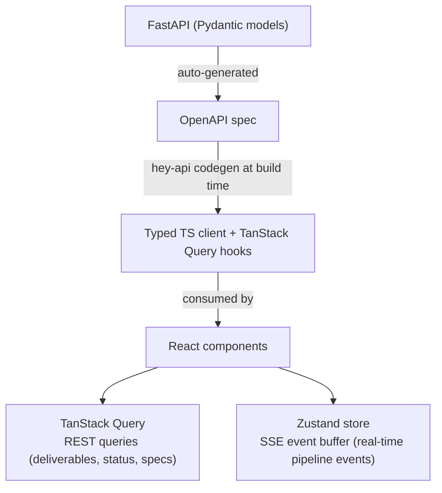

[← Architecture Overview](../02-ARCHITECTURE.md)

# Client Architecture

## CLI Architecture

The CLI is a thin API client built with **typer**. It has no database, no direct ADK access, and no business logic beyond argument parsing and API calls.

| Command | API Call | Purpose |
|---------|----------|---------|
| `autobuilder run <spec>` | `POST /specs` + `POST /workflows/{id}/run` | Submit and launch |
| `autobuilder status <id>` | `GET /workflows/{id}/status` | Check progress |
| `autobuilder intervene <id>` | `POST /workflows/{id}/intervene` | Human-in-the-loop |
| `autobuilder list` | `GET /workflows` | List workflows |
| `autobuilder logs <id>` | `GET /events/stream` (SSE) | Stream events to terminal |

The CLI connects to the gateway via REST + SSE. It can be used for scripting, CI/CD integration, and headless operation.

### Chat Interface (Conversational Model)

Both CLI and dashboard interact with the Director via the `/chat` endpoints — a session-oriented conversational model distinct from the fire-and-forget work queue (`/workflows`).

| Operation | API Call | Purpose |
|-----------|----------|---------|
| Start conversation | `POST /chat` | Create a new chat session |
| List conversations | `GET /chat` | Browse active/archived chats |
| View conversation | `GET /chat/{session_id}` | Get chat detail |
| Send message | `POST /chat/{session_id}/messages` | User message → Director turn |
| Read history | `GET /chat/{session_id}/messages` | Full message history |
| Stream response | `GET /chat/{session_id}/stream` | SSE for real-time Director output |

---

## Dashboard Architecture

The web dashboard is a **React 19 SPA** (static build via Vite). It consumes the gateway API exclusively -- no backend, no database of its own.

### Stack

| Layer | Technology | Purpose |
|-------|-----------|---------|
| Framework | React 19 | UI components |
| Build | Vite | Fast dev server + static production build |
| Server state | TanStack Query | Generated from OpenAPI via hey-api; caching, refetching, optimistic updates |
| Client state | Zustand | SSE event buffer, UI preferences, transient state |
| Styling | Tailwind v4 | CSS-first @theme, fully tokenized design system |
| API client | hey-api generated | Typed client + TanStack Query hooks from OpenAPI spec |

### Data Flow

The dashboard is a static asset. It can be served from any CDN, file server, or embedded in the gateway's static files.

---

## See Also

- [Gateway](./gateway.md) -- API contract consumed by both CLI and dashboard
- [Workers](./workers.md) -- out-of-process execution (clients never interact directly)
- [Events](./events.md) -- SSE event streaming consumed by both clients

---

*Document Version: 1.1*
*Last Updated: 2026-02-28*
*Extracted from [02-ARCHITECTURE.md](../02-ARCHITECTURE.md) v2.9*
