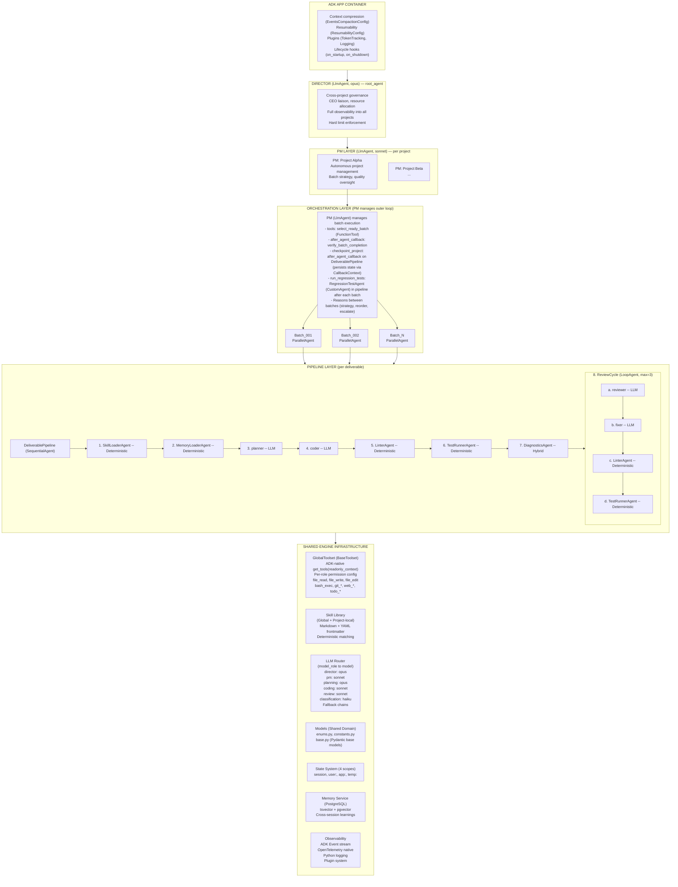

[← Architecture Overview](../02-ARCHITECTURE.md)

# ADK Engine

## 1. ADK Engine Overview

ADK runs inside workers, behind the anti-corruption layer. This section documents the internal orchestration engine.

## 2. ADK Mapping

| ADK Primitive | Role in AutoBuilder |
|---------------|-------------------|
| `App(root_agent=director)` | Top-level container; Director (rebuilt per invocation) is root_agent |
| `LlmAgent` (Director) | **Stateless config object**, recreated per invocation. Cross-project governance, CEO liaison, strategic decisions (opus). Personality in `user:` scope. |
| `LlmAgent` (PM) | **Stateless config object**, recreated per invocation. Per-project autonomous management, IS the outer batch loop, quality oversight (sonnet). |
| `LlmAgent` (Worker) | Planning, coding, reviewing -- probabilistic steps requiring LLM judgment |
| `CustomAgent` (BaseAgent) | Linter, test runner, formatter, skill loader -- deterministic pipeline steps |
| `SequentialAgent` | Inner deliverable pipeline (plan, code, lint, test, review) |
| `ParallelAgent` | Concurrent deliverable execution within a batch |
| `LoopAgent` | Review/fix cycles with max iteration bounds |
| `Session` (chat) | Per-CEO-conversation session; "Main" is the permanent project chat. Per-message `runner.run_async` invocation. |
| `Session` (work) | Per-project background execution session; long-running ARQ job. Same Director agent definition, different session ID. |
| `Session State` | Inter-agent communication (4 scopes: session, user, app, temp). Cross-session bridge via `app:`/`user:` state + `MemoryService` + Redis Streams. |
| `Event Stream` | Unified observability for all agent types (translated to Redis Streams at boundary) |
| `FunctionTool` | Wrap Python functions as LLM-callable tools (auto-schema from type hints) |
| `InstructionAssembler` | Fragment-based instruction composition (safety, identity, governance, project, task, skill) per invocation (Decisions #50, #55); base instruction content sourced from agent definition files (Decision #54) |
| `before_model_callback` | Context injection, token budget monitoring |
| `DatabaseSessionService` | State persistence (adapter bridges to shared database). All agent continuity lives here. |
| `transfer_to_agent` / `sub_agents` | Director → PM delegation via `sub_agents` + `transfer_to_agent`; PM → Worker delegation |
| `before_agent_callback` / `after_agent_callback` | Supervision hooks; Director monitors PM events |
| Tool Registry | `GlobalToolset(BaseToolset)` — ADK-native per-role tool vending via `get_tools(readonly_context)`. Tools organized by function type in `app/tools/`. Cascading permission config. See Tool Registry subsection below. |

## 3. Multi-Model via LiteLLM

LiteLLM provides the model abstraction layer. Model strings use the LiteLLM format (e.g., `anthropic/claude-sonnet-4-6`). The LLM Router selects models per task based on routing configuration.

## 4. Architecture Diagram (Engine Internal)



## 5. App Container Configuration

ADK's `App` class is the top-level container for the agent workflow, instantiated inside workers.

### What App Provides

| Feature | Purpose | AutoBuilder Use |
|---------|---------|----------------|
| `root_agent` | The top-level agent tree | `Director` (LlmAgent, opus) — **recreated per invocation** from config; session carries continuity |
| `events_compaction_config` | Context compression (sliding window summarization) | Fallback safety net; primary strategy is context recreation (Decision #52) |
| `resumability_config` | Workflow resume after interruption | Pick up where we left off after crash/power loss |
| `plugins` | Global lifecycle hooks (logging, metrics, guardrails) | Token tracking, cost monitoring, security guardrails |
| `context_cache_config` | Cache static prompt parts server-side | Cache system instructions and skill content |
| Lifecycle hooks | `on_startup` / `on_shutdown` | Initialize connections, toolset, skill library |
| State scope boundary | `app:*` prefix for app-level state | Skill index, workflow registry, runtime agent coordination (project config is a **DB entity**, not `app:` state) |

### App Structure

```python
from google.adk.apps import App, EventsCompactionConfig, ResumabilityConfig
from google.adk.apps.llm_event_summarizer import LlmEventSummarizer

summarizer = LlmEventSummarizer(
    llm=LiteLlm(model="anthropic/claude-haiku-4-5-20251001")
)

# Director is recreated per invocation (stateless config); session carries continuity
# AgentRegistry (Decisions #51, #54) scans agent definition files; replaces hardcoded factories
director_agent = registry.build("director", ctx)  # LlmAgent (opus)
app = App(
    name="autobuilder",
    root_agent=director_agent,  # rebuilt from agent definition file each invocation (Decision #54)

    events_compaction_config=EventsCompactionConfig(
        compaction_interval=5,
        overlap_size=1,
        summarizer=summarizer,
    ),

    resumability_config=ResumabilityConfig(
        is_resumable=True,
    ),

    plugins=[
        TokenTrackingPlugin(),
        LoggingPlugin(),
    ],
)
```

### Resumability for CustomAgents

ADK's Resume feature (v1.16+) tracks workflow execution and allows picking up after unexpected interruption:

- Resume is not automatic for CustomAgents -- we must implement `BaseAgentState` subclass and define checkpoint steps (exact mechanism TBD, Phase 5 prototype)
- Tools may run more than once on resume -- git, file write, and bash tools must be idempotent or include duplicate-run protection
- The system reinstates results from successfully completed tools and re-runs from the point of failure

---

## See Also

- [Architecture Overview](../02-ARCHITECTURE.md) -- full system architecture
- [Agents](./agents.md) -- hierarchical agent structure and pipeline composition
- [Tools](./tools.md) -- tool registry and permission model
- [Context](./context.md) -- context assembly, budgeting, knowledge loading, recreation
- [Observability](./observability.md) -- tracing, logging, event stream
- [Data](./data.md) -- database, Redis, and filesystem infrastructure

---

*Document Version: 3.1*
*Extracted from 02-ARCHITECTURE.md v2.9*
*Last Updated: 2026-03-10*
