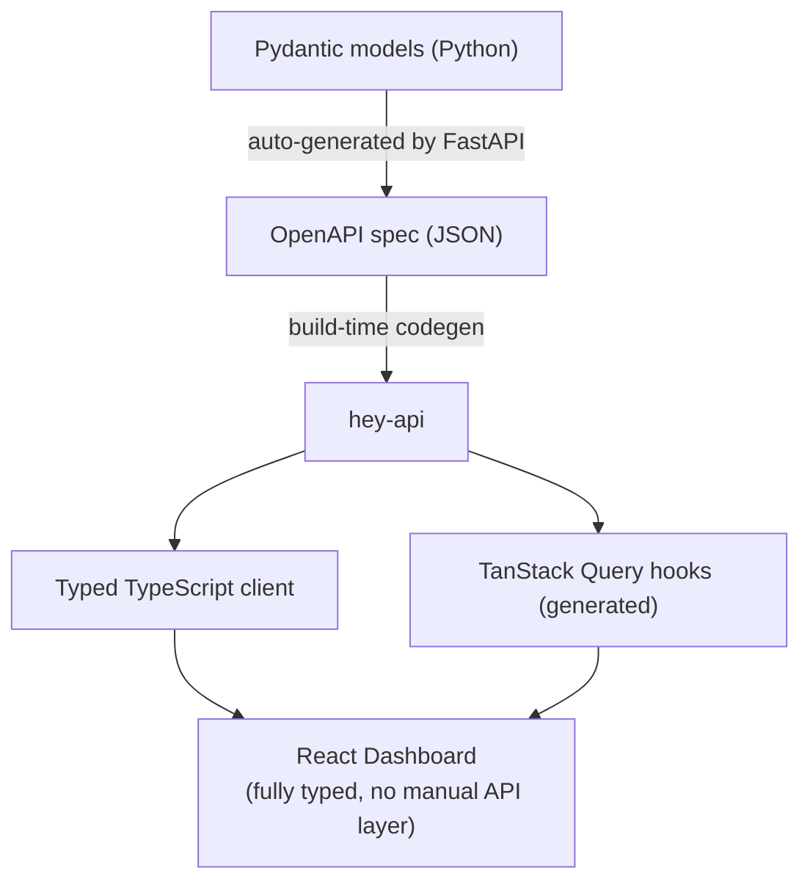

[← Architecture Overview](../02-ARCHITECTURE.md)

# Gateway Layer

### Anti-Corruption Pattern

The gateway owns the external API contract. ADK is an internal implementation detail:

- **Gateway models**: Pydantic models define the API contract (request/response schemas)
- **ADK models**: Internal to workers; never exposed to clients
- **Translation**: The anti-corruption layer in workers translates between gateway commands and ADK Runner/SessionService calls
- **Swappable**: ADK could be replaced with another orchestration engine without changing the client-facing API

`get_fast_api_app()` and `adk web` are local development tools only. They are not part of the production architecture.

### Route Structure

| Method | Path | Purpose |
|--------|------|---------|
| `POST` | `/specs` | Submit a specification for decomposition |
| `POST` | `/workflows/{id}/run` | Enqueue workflow execution |
| `GET` | `/workflows/{id}/status` | Query workflow state |
| `POST` | `/workflows/{id}/intervene` | Human-in-the-loop intervention |
| `GET` | `/deliverables` | Query deliverables (filter by workflow, status) |
| `GET` | `/deliverables/{id}` | Get deliverable detail |
| `GET` | `/events/stream` | SSE endpoint for real-time events |
| `POST` | `/chat` | Create a new chat session |
| `GET` | `/chat` | List chat sessions (filter by type, status) |
| `GET` | `/chat/{session_id}` | Get chat session detail |
| `POST` | `/chat/{session_id}/messages` | Send message to Director chat session |
| `GET` | `/chat/{session_id}/messages` | Retrieve chat history |
| `GET` | `/chat/{session_id}/stream` | SSE stream for Director responses |
| `GET` | `/ceo/queue` | List CEO queue items (filter by type, priority, status) |
| `PATCH` | `/ceo/queue/{id}` | Resolve/dismiss a queue item |
| `GET` | `/ceo/queue/stream` | SSE push for new queue items |

### Transport

- **REST** for commands and queries (standard request/response)
- **SSE** for real-time event streaming (server-push, reconnectable)
- **No GraphQL** -- REST is sufficient; GraphQL adds complexity without benefit for this use case
- **No gRPC** at gateway layer -- internal service communication is in-process or via Redis
- **WebRTC** reserved for future voice interface

### Type Safety Chain

Build-time type safety from Python models to TypeScript UI without maintaining a separate TS ORM or manual API client.

---

## See Also

- [Workers](./workers.md) -- out-of-process execution via ARQ
- [Events](./events.md) -- Redis Streams event distribution
- [Clients](./clients.md) -- CLI and dashboard (pure API consumers)

---

*Document Version: 1.1*
*Last Updated: 2026-02-28*
*Extracted from [02-ARCHITECTURE.md](../02-ARCHITECTURE.md) v2.9*
