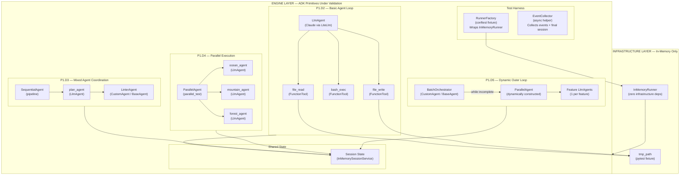
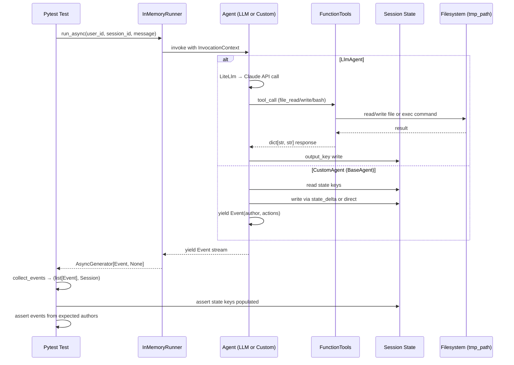
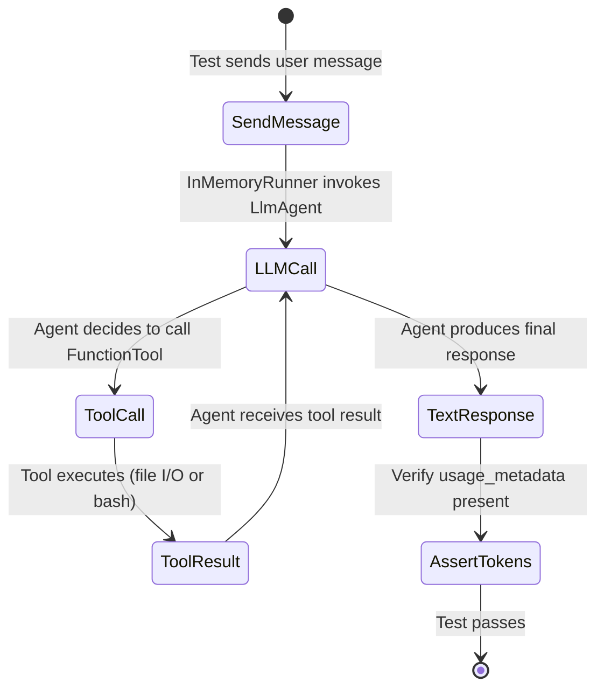
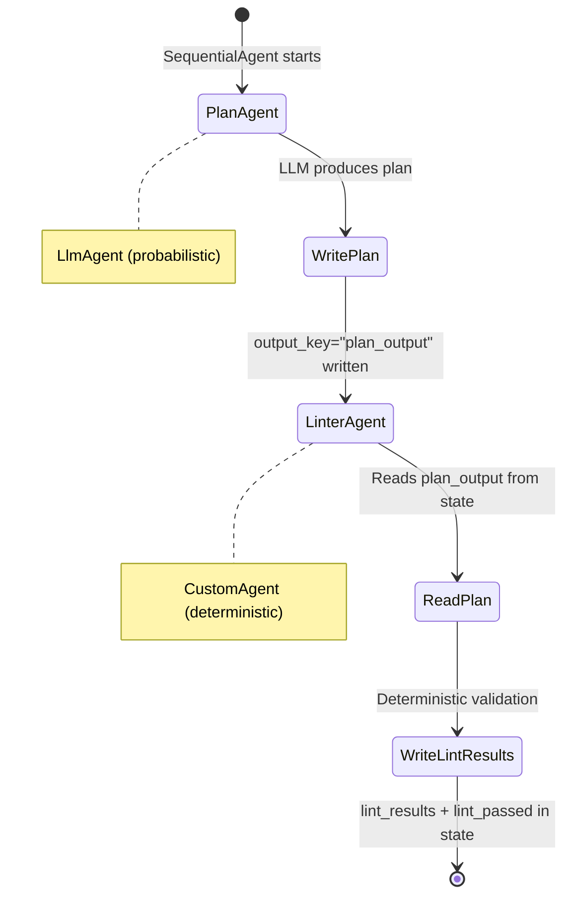
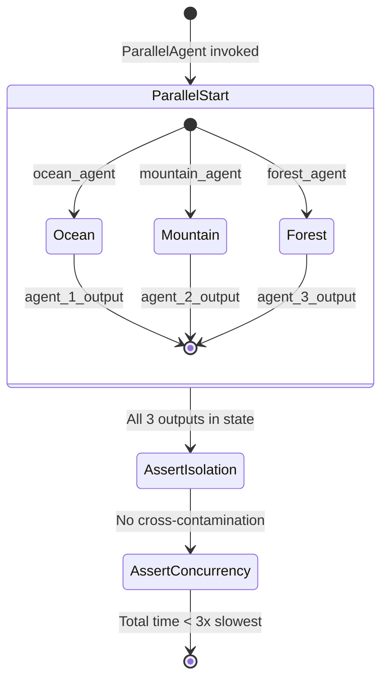
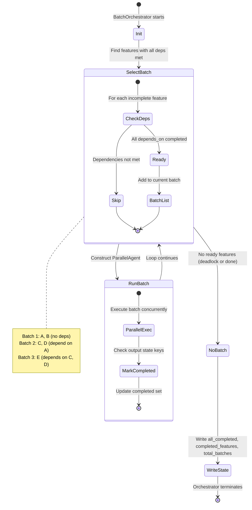
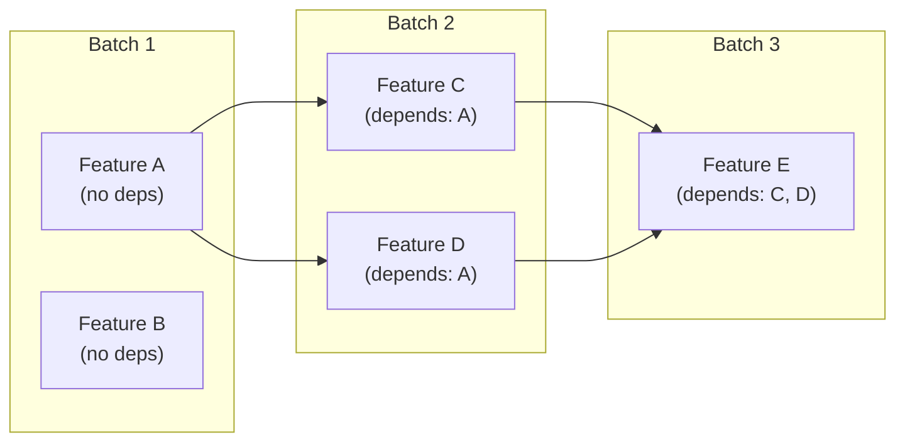

# Phase 1 Model: ADK Prototype Validation
*Generated: 2026-02-13*

## Component Diagram



## Major Interfaces

Phase 1 validates ADK's built-in interfaces rather than defining production contracts. The following patterns are the interfaces being proven — they establish the contract that all future phases will depend on.

### FunctionTool Signature Pattern

```python
def file_read(path: str) -> dict[str, str]:
    """Read file contents from workspace.

    ADK auto-generates tool schema from type hints + docstring.
    Return type must be JSON-serializable dict.
    """
    ...

def file_write(path: str, content: str) -> dict[str, str]:
    """Write file to workspace."""
    ...

def bash_exec(command: str) -> dict[str, str]:
    """Execute shell command with timeout."""
    ...
```

### CustomAgent Pattern (BaseAgent subclass)

```python
class CustomAgentBase(BaseAgent):
    """Base pattern for all deterministic agents.

    - Inherits BaseAgent (Pydantic v2 model)
    - Custom attributes are model fields, not __init__ params
    - Reads from ctx.session.state
    - Writes results via Event(actions=EventActions(state_delta={...}))
    - Yields Event objects into the unified stream
    """

    async def _run_async_impl(
        self, ctx: InvocationContext
    ) -> AsyncGenerator[Event, None]:
        ...
```

### BatchOrchestrator Pattern (Dynamic Composition)

```python
class BatchOrchestrator(BaseAgent):
    """Outer loop that dynamically constructs ParallelAgent batches.

    - Pydantic v2 model fields for configuration (e.g., features list)
    - Reads dependency graph from model fields
    - Constructs ParallelAgent per batch at runtime
    - Yields events from inner agents
    - Writes completion state to session
    """

    features: list[Feature] = Field(default_factory=list)

    async def _run_async_impl(
        self, ctx: InvocationContext
    ) -> AsyncGenerator[Event, None]:
        ...
```

### Test Harness Interfaces

```python
class RunnerFactory(Protocol):
    """Creates InMemoryRunner instances for test agents."""

    def __call__(self, agent: BaseAgent) -> InMemoryRunner:
        ...


async def collect_events(
    runner: InMemoryRunner,
    user_id: str,
    session_id: str,
    message: str,
) -> tuple[list[Event], Session]:
    """Run agent via InMemoryRunner and collect all events."""
    ...
```

## Key Type Definitions

### Feature Model (P1.D5)

```python
class Feature(BaseModel):
    """Synthetic feature for outer loop validation."""

    name: str                                    # Unique feature identifier
    depends_on: list[str] = Field(default_factory=list)  # Feature names this depends on
    prompt: str                                  # LLM instruction for this feature
```

### Existing Enums (Phase 0 — referenced, not modified)

```python
class WorkflowStatus(str, enum.Enum):
    """Workflow execution lifecycle."""

    PENDING = "PENDING"
    RUNNING = "RUNNING"
    COMPLETED = "COMPLETED"
    FAILED = "FAILED"
    CANCELLED = "CANCELLED"


class DeliverableStatus(str, enum.Enum):
    """Individual deliverable lifecycle."""

    PENDING = "PENDING"
    IN_PROGRESS = "IN_PROGRESS"
    COMPLETED = "COMPLETED"
    FAILED = "FAILED"
    BLOCKED = "BLOCKED"


class AgentRole(str, enum.Enum):
    """Agent role classification."""

    PLANNER = "PLANNER"
    CODER = "CODER"
    REVIEWER = "REVIEWER"
    FIXER = "FIXER"
```

### State Keys Written by Prototypes

| Prototype | State Key | Type | Written By |
|-----------|-----------|------|------------|
| P1.D2 | *(no state writes — validates tool execution)* | — | — |
| P1.D3 | `plan_output` | `str` | `plan_agent` via `output_key` |
| P1.D3 | `lint_results` | `str` | `LinterAgent` via `state_delta` |
| P1.D3 | `lint_passed` | `bool` | `LinterAgent` via `state_delta` |
| P1.D4 | `agent_1_output` | `str` | `ocean_agent` via `output_key` |
| P1.D4 | `agent_2_output` | `str` | `mountain_agent` via `output_key` |
| P1.D4 | `agent_3_output` | `str` | `forest_agent` via `output_key` |
| P1.D5 | `feature_{name}_output` | `str` | Per-feature `LlmAgent` via `output_key` |
| P1.D5 | `all_completed` | `bool` | `BatchOrchestrator` direct write |
| P1.D5 | `completed_features` | `list[str]` | `BatchOrchestrator` direct write |
| P1.D5 | `total_batches` | `int` | `BatchOrchestrator` direct write |

## Data Flow



### Type Transformation Chain (Phase 1 scope)

```
User message (str)
  → types.Content(parts=[types.Part(text=...)])     # genai types
    → InMemoryRunner.run_async()                     # ADK runner
      → LlmAgent / BaseAgent._run_async_impl(ctx)   # ADK agent
        → FunctionTool(func) auto-schema             # ADK tool
          → dict[str, str] return value               # Python dict
            → Event (author, actions, usage_metadata)  # ADK event
              → list[Event] (test assertion target)    # Python list
```

## Logic / Process Flow

### P1.D2 — Basic Agent Loop



### P1.D3 — Sequential Pipeline (LLM + Custom)



### P1.D4 — Parallel Execution



### P1.D5 — Dynamic Outer Loop (BatchOrchestrator)



### Feature Dependency DAG



## Integration Points

### Existing System

| Component | Interface | How This Phase Uses It |
|-----------|-----------|----------------------|
| `app.models.enums` | Python imports | Phase 0 enums referenced conceptually (not directly used in prototype tests) |
| `app.models.base.BaseModel` | Pydantic base class | `Feature` model inherits from Pydantic `BaseModel` |
| `app.config.settings.Settings` | Pydantic Settings | Not directly used — prototypes use `InMemoryRunner` (no infra) |
| `google.adk.agents.BaseAgent` | `_run_async_impl(ctx)` | `LinterAgent` and `BatchOrchestrator` subclass this |
| `google.adk.agents.LlmAgent` | ADK constructor (model, instruction, tools, output_key) | All LLM agents in P1.D2–D5 |
| `google.adk.agents.SequentialAgent` | ADK constructor (sub_agents) | P1.D3 pipeline |
| `google.adk.agents.ParallelAgent` | ADK constructor (sub_agents) | P1.D4 static, P1.D5 dynamic |
| `google.adk.models.lite_llm.LiteLlm` | ADK model wrapper | All LLM agents use `LiteLlm(model="anthropic/...")` |
| `google.adk.runners.InMemoryRunner` | `run_async()` / `run_debug()` | All prototypes use this as the execution harness |
| `google.adk.tools.FunctionTool` | ADK tool wrapper | P1.D2 wraps `file_read`, `file_write`, `bash_exec` |
| `google.adk.events.Event` | ADK event model | CustomAgents yield events; tests collect and assert |
| `google.adk.events.EventActions` | `state_delta` dict | CustomAgents write state via event actions |
| `google.genai.types.Content` / `Part` | Message construction | `run_async()` requires `types.Content` wrapping |

### Future Phase Extensions

| Extension Point | Future Phase | Preparation |
|----------------|-------------|-------------|
| FunctionTool pattern (file_read, file_write, bash_exec) | Phase 4 (Production Tools) | Phase 1 validates the `FunctionTool` wrapping pattern; Phase 4 adds sandboxing, security, and full tool suite |
| CustomAgent `_run_async_impl` pattern | Phase 3+ (Custom Agents) | Phase 1 proves `LinterAgent` pattern; production agents (SkillLoader, TestRunner, Formatter) follow same contract |
| `BatchOrchestrator` dynamic composition | Phase 5+ (Orchestrator) | Phase 1 validates dynamic `ParallelAgent` batch construction; production adds checkpointing, regression tests, event-sourced state |
| `SequentialAgent` pipeline composition | Phase 3+ (DeliverablePipeline) | Phase 1 proves LLM → Deterministic sequencing; production pipeline adds LoopAgent review cycles |
| `output_key` state communication | Phase 3+ (Agent Communication) | Phase 1 validates `output_key` → `{key}` template reading; production adds `InstructionProvider` and `before_model_callback` |
| Token usage tracking (`usage_metadata`) | Phase 2+ (Observability) | Phase 1 validates token counts are reported; production adds ContextBudgetAgent and cost tracking |
| State delta pattern (event-sourced) | Phase 3+ (Production Agents) | Phase 1 uses direct state writes (D9 decision); production agents MUST use `state_delta` for auditability |
| `InMemoryRunner` → `DatabaseSessionService` | Phase 2 (Infrastructure) | Phase 1 uses in-memory; production uses `DatabaseSessionService` with PostgreSQL persistence |

## Notes

- **Design Decision D9**: Phase 1 prototypes use direct `ctx.session.state[key] = value` writes for simplicity. Production agents (Phase 3+) MUST use `Event(actions=EventActions(state_delta={...}))` for event-sourced auditability. This is a known deviation documented in the spec.

- **BaseAgent is a Pydantic v2 model**: Custom attributes on `BaseAgent` subclasses must be declared as Pydantic model fields (`features: list[Feature] = Field(default_factory=list)`), not as `__init__` parameters. This is an ADK constraint discovered during prototype design and applies to all future `CustomAgent` implementations.

- **Model cost strategy**: P1/P2 use Sonnet (higher quality, foundational validation). P3/P4 use Haiku (3+ concurrent LLM calls, cost optimization). This routing pattern foreshadows the LLM Router (Phase 2+).

- **No infrastructure dependencies**: All prototypes use `InMemoryRunner` + `tmp_path`. No Redis, PostgreSQL, or Docker required. This keeps Phase 1 fast and self-contained — infrastructure wiring begins in Phase 2.

- **Go/no-go gate (P1.D6)**: If P1 (Claude reliability) or P4 (CustomAgent outer loop) fail, the project re-evaluates Pydantic AI as the orchestration engine. This is the architectural commitment gate.
