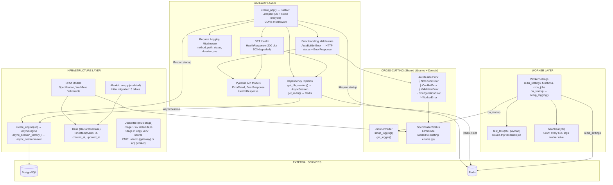
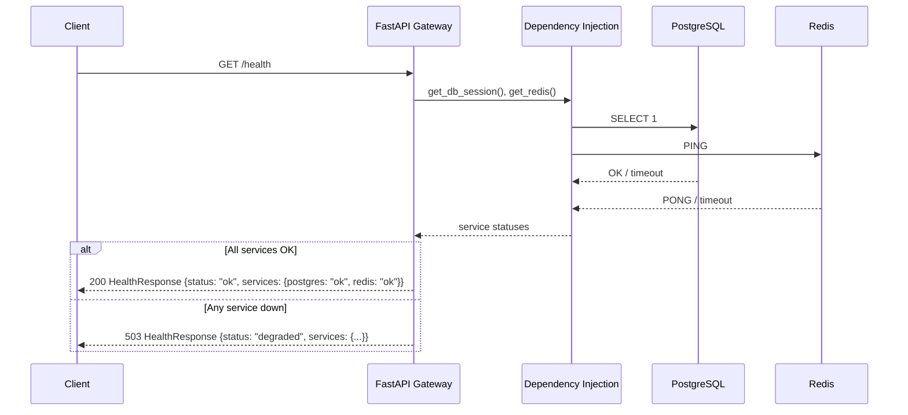
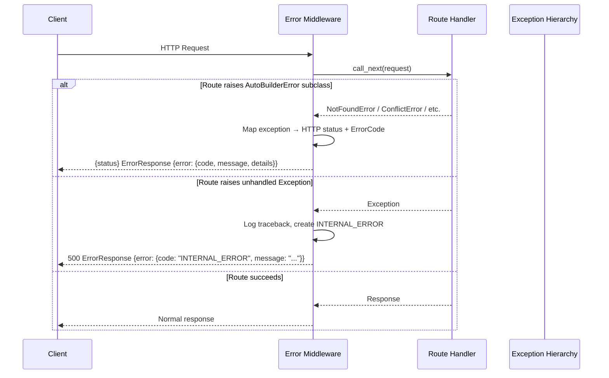
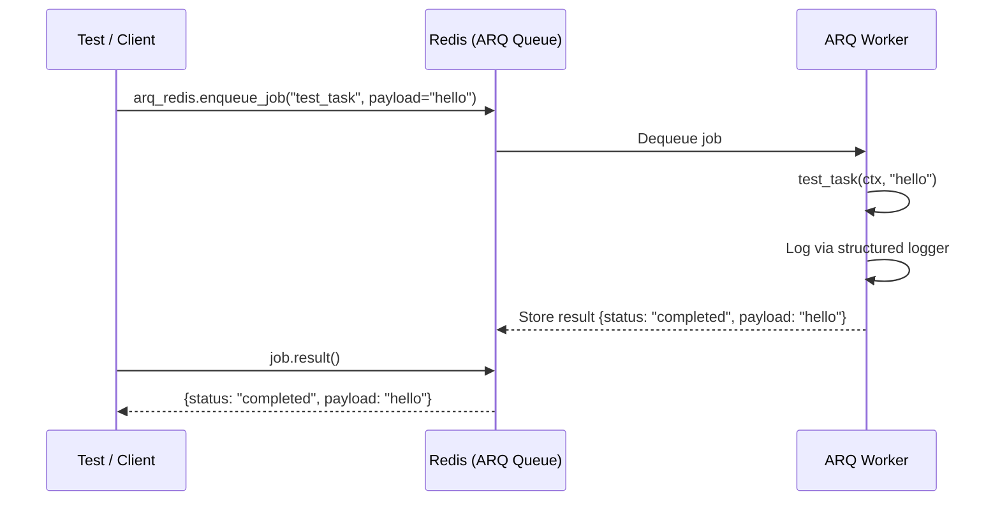
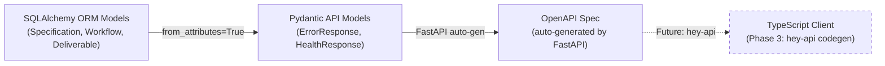
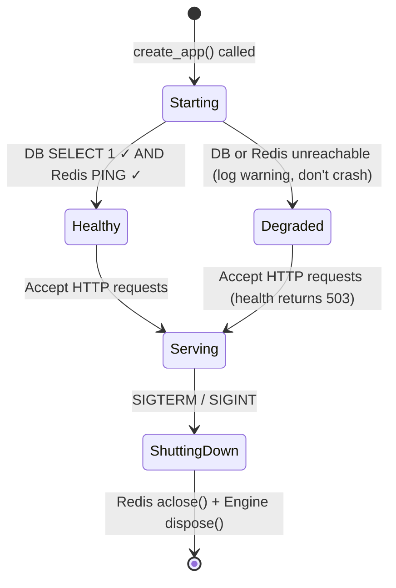
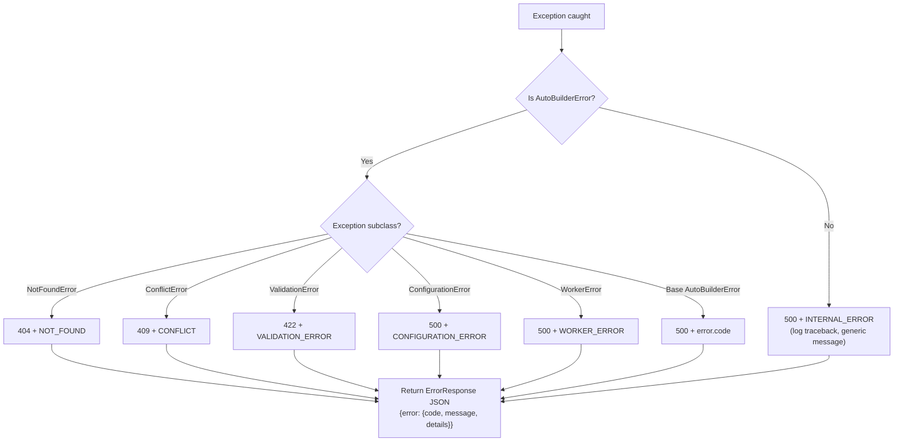
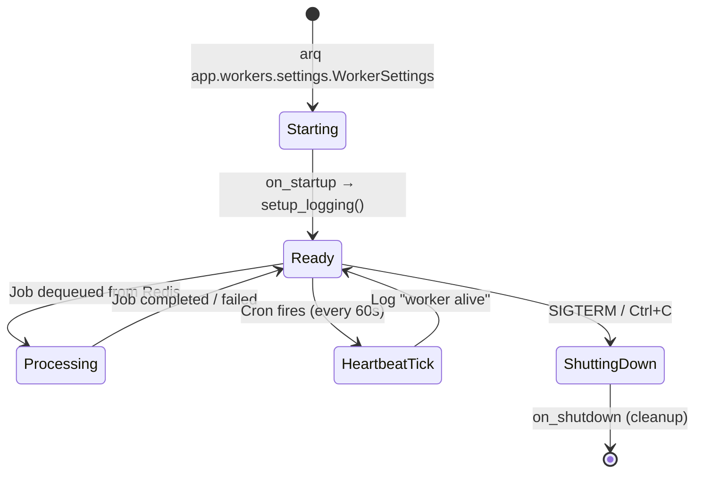

# Phase 2 Model: Gateway + Infrastructure
*Generated: 2026-02-14*

## Component Diagram



## Deliverable-to-Component Traceability

| Deliverable | Components |
|---|---|
| P2.D1 | `JsonFormatter`, `setup_logging()`, `get_logger()`, `AutoBuilderError` + 5 subclasses |
| P2.D2 | `SpecificationStatus`, `ErrorCode` enums |
| P2.D3 | `create_engine()`, `async_session_factory()`, `Base`, `Specification`, `Workflow`, `Deliverable` |
| P2.D4 | Alembic `env.py` update, initial migration file |
| P2.D5 | `WorkerSettings`, `test_task()`, `heartbeat()` |
| P2.D6 | `ErrorDetail`, `ErrorResponse`, `HealthResponse` |
| P2.D7 | `create_app()`, lifespan, `get_db_session()`, `get_redis()`, health route, error middleware, logging middleware, CORS |
| P2.D8 | Multi-stage `Dockerfile` |
| P2.D9 | Test fixtures + unit/integration tests for all above |

## Major Interfaces

### Database Access

```python
# app/db/engine.py — concrete functions, not protocols
# (Phase 2 has one DB implementation; Protocol deferred until a second backend exists)

from sqlalchemy.ext.asyncio import AsyncEngine, AsyncSession, async_sessionmaker

def create_engine(url: str) -> AsyncEngine:
    """Create an async SQLAlchemy engine for PostgreSQL."""
    ...

def async_session_factory(engine: AsyncEngine) -> async_sessionmaker[AsyncSession]:
    """Create a session factory bound to the given engine."""
    ...
```

### Gateway Dependencies

```python
# app/gateway/deps.py — FastAPI dependency injection functions

from collections.abc import AsyncIterator
from redis.asyncio import Redis
from sqlalchemy.ext.asyncio import AsyncSession

async def get_db_session() -> AsyncIterator[AsyncSession]:
    """Yield an AsyncSession from the app's session factory. Auto-closes on exit."""
    ...

def get_redis() -> Redis:  # type: ignore[type-arg]
    """Return the Redis client from app.state."""
    ...
```

### Error Middleware Contract

```python
# app/gateway/middleware/errors.py

from starlette.requests import Request
from starlette.responses import JSONResponse

# Exception type → HTTP status code mapping (internal, not a Protocol)
# NotFoundError      → 404
# ConflictError      → 409
# ValidationError    → 422
# ConfigurationError → 500
# WorkerError        → 500
# Unhandled          → 500 (generic INTERNAL_ERROR, no stack trace)

async def error_handling_middleware(request: Request, call_next: object) -> JSONResponse:
    """Catch AutoBuilderError subclasses and return structured ErrorResponse JSON."""
    ...
```

### Worker Entry Points

```python
# app/workers/tasks.py

async def test_task(ctx: dict[str, object], payload: str) -> dict[str, str]:
    """Minimal ARQ job for gateway→worker round-trip validation."""
    ...

async def heartbeat(ctx: dict[str, object]) -> None:
    """Cron job: logs 'worker alive' every 60 seconds."""
    ...
```

### Logging Interface

```python
# app/lib/logging.py

import logging

def setup_logging(level: str = "INFO") -> None:
    """Configure the root `app` logger with JsonFormatter at the given level."""
    ...

def get_logger(name: str) -> logging.Logger:
    """Return a logger under the `app.*` hierarchy. e.g., get_logger('gateway') → app.gateway."""
    ...

class JsonFormatter(logging.Formatter):
    """Outputs one JSON object per log line: {timestamp, level, logger, message, ...extras}."""

    def format(self, record: logging.LogRecord) -> str: ...
```

### Exception Hierarchy

```python
# app/lib/exceptions.py

from app.models.enums import ErrorCode

class AutoBuilderError(Exception):
    """Base exception for all AutoBuilder errors."""
    code: ErrorCode
    message: str
    details: dict[str, object]

    def __init__(
        self,
        message: str,
        code: ErrorCode = ErrorCode.INTERNAL_ERROR,
        details: dict[str, object] | None = None,
    ) -> None: ...

class NotFoundError(AutoBuilderError):
    """Resource lookup failure (maps to HTTP 404)."""
    def __init__(self, message: str, details: dict[str, object] | None = None) -> None: ...

class ConflictError(AutoBuilderError):
    """State conflict: duplicate, already running (maps to HTTP 409)."""
    def __init__(self, message: str, details: dict[str, object] | None = None) -> None: ...

class ValidationError(AutoBuilderError):
    """Business logic validation failure (maps to HTTP 422)."""
    def __init__(self, message: str, details: dict[str, object] | None = None) -> None: ...

class ConfigurationError(AutoBuilderError):
    """Missing or invalid configuration at startup (maps to HTTP 500)."""
    def __init__(self, message: str, details: dict[str, object] | None = None) -> None: ...

class WorkerError(AutoBuilderError):
    """Worker-side execution failure (maps to HTTP 500)."""
    def __init__(self, message: str, details: dict[str, object] | None = None) -> None: ...
```

### Lifespan Resource Management

```python
# app/gateway/main.py

from contextlib import asynccontextmanager
from collections.abc import AsyncIterator
from fastapi import FastAPI

@asynccontextmanager
async def lifespan(app: FastAPI) -> AsyncIterator[None]:
    """Manage startup/shutdown of DB engine, Redis client, and health verification."""
    # Startup: create engine, create redis, verify connectivity, store on app.state
    # Shutdown: aclose redis, dispose engine
    ...

def create_app() -> FastAPI:
    """App factory: lifespan, middleware (errors, logging, CORS), routes."""
    ...
```

## Key Type Definitions

### Enums (additions to `app/models/enums.py`)

```python
import enum

class SpecificationStatus(enum.StrEnum):
    """Status of a specification through its lifecycle."""
    PENDING = "PENDING"          # Submitted, awaiting decomposition
    PROCESSING = "PROCESSING"    # Decomposition in progress
    COMPLETED = "COMPLETED"      # Successfully decomposed into deliverables
    FAILED = "FAILED"            # Decomposition failed

class ErrorCode(enum.StrEnum):
    """Machine-readable error codes for API error responses."""
    NOT_FOUND = "NOT_FOUND"                      # Resource lookup failure
    CONFLICT = "CONFLICT"                        # State conflict (duplicate, already running)
    VALIDATION_ERROR = "VALIDATION_ERROR"        # Business logic validation failure
    CONFIGURATION_ERROR = "CONFIGURATION_ERROR"  # Missing/invalid config
    WORKER_ERROR = "WORKER_ERROR"                # Worker-side execution failure
    INTERNAL_ERROR = "INTERNAL_ERROR"            # Catch-all for unhandled errors
```

### Gateway Pydantic Models (`app/gateway/models/`)

```python
# app/gateway/models/common.py
from app.models.base import BaseModel
from app.models.enums import ErrorCode

class ErrorDetail(BaseModel):
    """Inner envelope for structured error responses."""
    code: ErrorCode       # Machine-readable error code
    message: str          # Human-readable description
    details: dict[str, object]  # Optional context (default: {})

class ErrorResponse(BaseModel):
    """Standard error response envelope. All errors follow this shape."""
    error: ErrorDetail
```

```python
# app/gateway/models/health.py
from app.models.base import BaseModel

class HealthResponse(BaseModel):
    """Health check response with per-service status."""
    status: str                   # "ok" or "degraded"
    version: str                  # App version string
    services: dict[str, str]      # {"postgres": "ok", "redis": "ok"} or "unavailable"
```

### ORM Models (`app/db/models.py`)

```python
import uuid
from datetime import datetime

from sqlalchemy import String, Text, ForeignKey, func
from sqlalchemy.dialects.postgresql import JSONB
from sqlalchemy.orm import DeclarativeBase, Mapped, mapped_column, relationship

from app.models.enums import DeliverableStatus, SpecificationStatus, WorkflowStatus

class Base(DeclarativeBase):
    """Declarative base with common columns for all ORM models."""
    pass

class TimestampMixin:
    """Mixin providing id (UUID PK) and UTC timestamp columns."""
    id: Mapped[uuid.UUID]            # PK, default uuid4
    created_at: Mapped[datetime]     # Server-side UTC default
    updated_at: Mapped[datetime]     # Server-side UTC default, auto-updates

class Specification(TimestampMixin, Base):
    __tablename__ = "specifications"
    name: Mapped[str]                        # Spec name
    content: Mapped[str]                     # Full spec text
    status: Mapped[SpecificationStatus]      # PENDING → PROCESSING → COMPLETED | FAILED

class Workflow(TimestampMixin, Base):
    __tablename__ = "workflows"
    specification_id: Mapped[uuid.UUID | None]  # FK → specifications.id (nullable)
    workflow_type: Mapped[str]                   # e.g., "auto-code"
    status: Mapped[WorkflowStatus]               # PENDING → RUNNING → COMPLETED | FAILED | CANCELLED
    params: Mapped[dict[str, object] | None]     # JSONB, workflow configuration
    started_at: Mapped[datetime | None]          # Set when execution begins
    completed_at: Mapped[datetime | None]        # Set on completion/failure

class Deliverable(TimestampMixin, Base):
    __tablename__ = "deliverables"
    workflow_id: Mapped[uuid.UUID]               # FK → workflows.id (required)
    name: Mapped[str]                            # Deliverable name
    description: Mapped[str | None]              # Optional description
    status: Mapped[DeliverableStatus]            # PENDING → IN_PROGRESS → COMPLETED | FAILED | BLOCKED
    depends_on: Mapped[list[str]]                # JSONB array of UUID strings, default []
    result: Mapped[dict[str, object] | None]     # JSONB, execution result
```

### Exception → HTTP Mapping (constant, not a type)

| Exception Class | HTTP Status | Default ErrorCode |
|---|---|---|
| `NotFoundError` | 404 | `NOT_FOUND` |
| `ConflictError` | 409 | `CONFLICT` |
| `ValidationError` | 422 | `VALIDATION_ERROR` |
| `ConfigurationError` | 500 | `CONFIGURATION_ERROR` |
| `WorkerError` | 500 | `WORKER_ERROR` |
| Unhandled `Exception` | 500 | `INTERNAL_ERROR` |

## Data Flow

### Health Check Flow



### Error Handling Flow



### Worker Round-Trip Flow



### Type Safety Chain (Phase 2 establishes first two links)



## Logic / Process Flow

### Gateway Lifespan State Machine



### Error Middleware Decision Tree



### ARQ Worker Lifecycle



## Integration Points

### Existing System

| Component | Interface | How This Phase Uses It |
|---|---|---|
| `app.config.Settings` | `get_settings() → Settings` | Read `db_url`, `redis_url`, `log_level` for engine creation, Redis connection, log configuration |
| `app.models.enums` | `WorkflowStatus`, `DeliverableStatus`, `AgentRole` StrEnums | Referenced by ORM model column types; extended with `SpecificationStatus`, `ErrorCode` |
| `app.models.base.BaseModel` | Pydantic base with `from_attributes=True`, `strict=True` | All gateway Pydantic models inherit from this |
| `app.models.constants.APP_NAME` | `str` constant | Used in health response version/identification |
| `alembic.ini` + `env.py` | Alembic async migration env | Updated to import `Base.metadata` for autogenerate |
| `docker-compose.yml` | PostgreSQL + Redis containers | Phase 2 code connects to these services; no changes to compose file |

### Future Phase Extensions

| Extension Point | Future Phase | Preparation |
|---|---|---|
| ORM `Base` class | Phase 3+ (sessions, events, webhooks, skills tables) | All future ORM models inherit from `Base` with `TimestampMixin` |
| `create_app()` router registration | Phase 3+ (workflow routes, spec routes, SSE, deliverable routes) | Phase 2 registers only health router; future phases add `app.include_router()` calls |
| `deps.py` dependency functions | Phase 3+ (ARQ pool for enqueue, services) | Pattern established for `get_db_session()`, `get_redis()`; future deps follow same pattern |
| Error middleware + exception hierarchy | Phase 3+ (new error types as needed) | New `AutoBuilderError` subclasses auto-handled by middleware; just add class + status mapping |
| `ErrorCode` enum | Phase 3+ (new error codes) | New members added as needed; all flow through existing `ErrorResponse` envelope |
| `WorkerSettings.functions` list | Phase 3 (ADK pipeline jobs) | Phase 2 proves the round-trip; Phase 3 adds `run_workflow` and real pipeline tasks |
| `WorkerSettings.cron_jobs` | Phase 4+ (cleanup, scheduled workflows) | Heartbeat proves cron works; future phases add cleanup, health checks, scheduled jobs |
| Gateway Pydantic models | Phase 3+ (workflow, spec, deliverable request/response models) | `ErrorResponse` and `HealthResponse` establish the pattern; all future models inherit `BaseModel` |
| Structured logging (`get_logger()`) | All future phases | Every module calls `get_logger(__name__)` for consistent JSON logging |
| Dockerfile | All future phases | Single image for gateway + worker; future phases only change code, not image structure |
| Alembic migrations | All future phases | Each schema change generates a new migration; `Base.metadata` autogenerate established |

## Notes

- **No ADK imports**: Phase 2 code must not import anything from `google.adk`. ADK integration arrives in Phase 3 on top of this infrastructure.
- **Enum values = names**: All `StrEnum` members follow `MEMBER = "MEMBER"`. OpenAPI serializes values directly; mismatches break the type safety chain.
- **`from_attributes=True`**: The existing `BaseModel` config enables Pydantic model creation directly from SQLAlchemy ORM instances (`Model.model_validate(orm_obj)`). This is why gateway Pydantic models inherit from `app.models.base.BaseModel`.
- **Lifespan doesn't crash on service failure**: DB or Redis being unreachable at startup logs a warning but the gateway still starts. The health endpoint reports degraded status. This allows the gateway to come up before infrastructure services are fully ready (container orchestration ordering).
- **Test database isolation**: Tests use `autobuilder_test` database with `Base.metadata.create_all()` / `drop_all()` directly — no Alembic in tests. Fast and isolated from migration state.
- **CORS origins**: Localhost only (`localhost:*`, `127.0.0.1:*`). Production CORS configuration deferred to deployment phase.
- **Worker `ctx` type**: ARQ passes `ctx: dict` with string keys. Typed as `dict[str, object]` per project standards (no `Any`).
