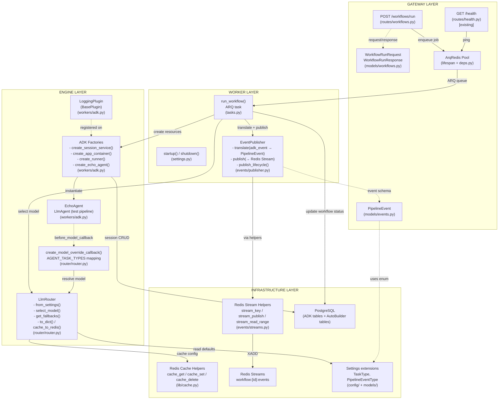
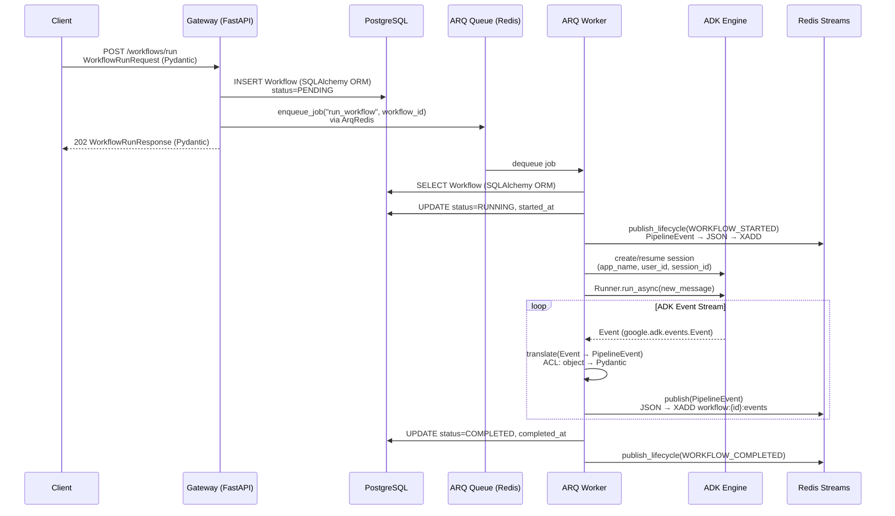
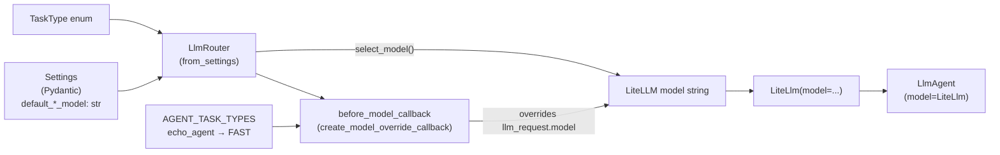
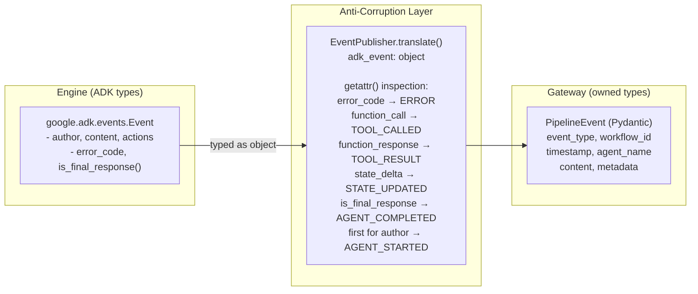
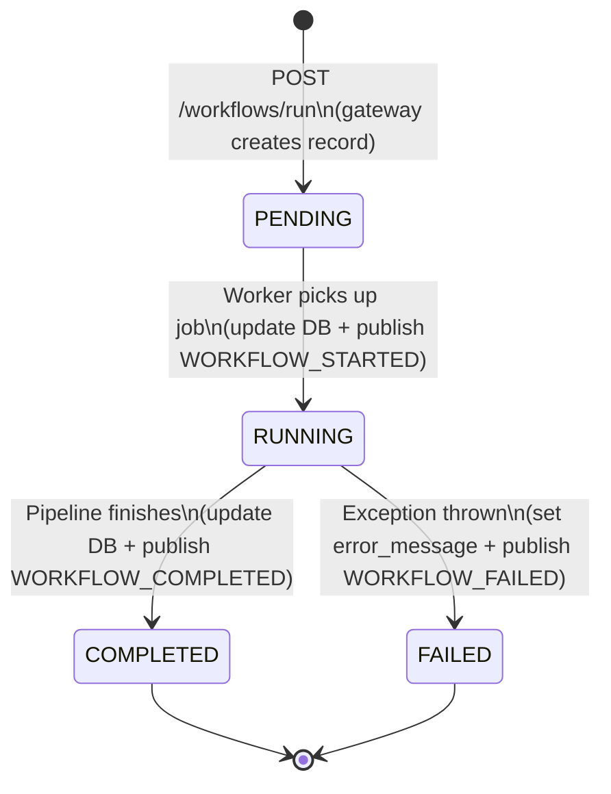
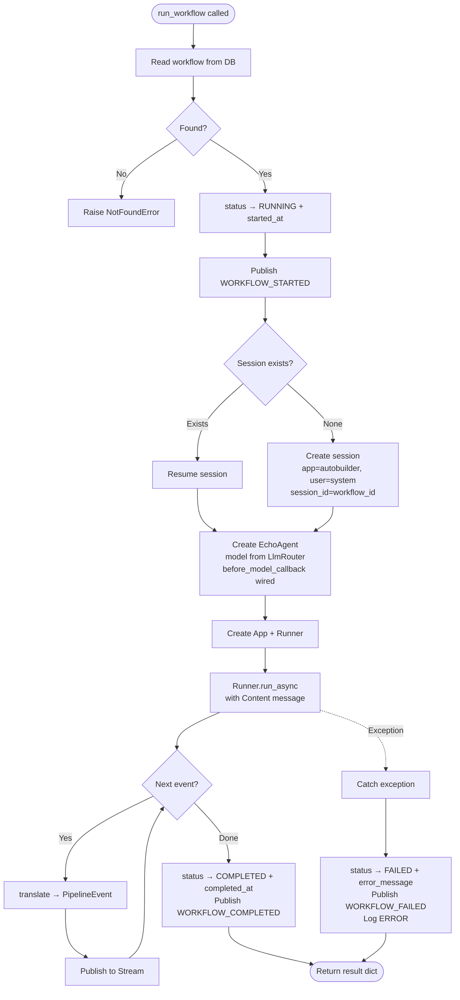

# Phase 3 Model: ADK Engine Integration
*Generated: 2026-02-17*

## Component Diagram



## Deliverable-to-Component Traceability

| Deliverable | Components |
|---|---|
| **P3.D1** Config + Domain Enums | `Settings` (4 model fields), `TaskType` enum, `PipelineEventType` enum, `app.models.__init__` re-exports |
| **P3.D2** LLM Router + Model Override Callback | `LlmRouter` class, `FALLBACK_CHAINS` dict, `from_settings()`, `to_dict()`, `cache_to_redis()`, `create_model_override_callback()`, `AGENT_TASK_TYPES` dict |
| **P3.D3** Redis Cache + Stream Helpers | `cache_get()`, `cache_set()`, `cache_delete()` in `lib/cache.py`; `stream_key()`, `stream_publish()`, `stream_read_range()` in `events/streams.py` |
| **P3.D4** Gateway Event Schema + Event Translation | `PipelineEvent` model, `EventPublisher` class (`translate`, `publish`, `publish_lifecycle`) |
| **P3.D5** ADK Engine Setup | `create_session_service()`, `create_app_container()`, `create_runner()`, `create_echo_agent()`, `LoggingPlugin` class |
| **P3.D6** Worker Pipeline Bridge | `run_workflow()` task, `startup()`/`shutdown()` extensions, `create_or_resume_session()`, `update_workflow_state()`, Alembic migration (`error_message`), `app:` scope init |
| **P3.D7** Gateway Workflow Route | `WorkflowRunRequest`/`WorkflowRunResponse` models, `POST /workflows/run` handler, ArqRedis pool in lifespan, `get_arq_pool()` dep, `get_redis()` update |
| **P3.D8** Test Suite | Router tests, callback tests, cache tests, stream tests, publisher tests, ADK engine tests, worker task tests, gateway route tests, session persistence tests, 4-scope state tests, app scope init tests |

## Major Interfaces

### LlmRouter — Static Model Routing (Engine)

```python
class LlmRouter:
    """Maps TaskType to LiteLLM model strings with fallback chain resolution."""

    @classmethod
    def from_settings(cls, settings: Settings) -> LlmRouter:
        """Create router from application settings defaults."""
        ...

    def select_model(
        self, task_type: TaskType, user_override: str | None = None
    ) -> str:
        """Resolve model: user_override → default for task_type."""
        ...

    def get_fallbacks(self, model: str) -> list[str]:
        """Ordered fallback list for a model string. [] for unknown."""
        ...

    def to_dict(self) -> dict[str, object]:
        """Serialize routing table for caching."""
        ...

    async def cache_to_redis(self, redis: Redis) -> None:
        """Store routing config in Redis with 1-hour TTL via cache_set."""
        ...
```

### Model Override Callback Factory (Engine)

```python
AGENT_TASK_TYPES: dict[str, TaskType]
"""Module-level mapping: agent name → TaskType. Initially: echo_agent → FAST."""

def create_model_override_callback(
    router: LlmRouter,
) -> Callable[[CallbackContext, LlmRequest], LlmResponse | None]:
    """Return a before_model_callback that overrides llm_request.model via router.

    Reads agent name from callback_context.agent_name, maps to TaskType
    via AGENT_TASK_TYPES, calls router.select_model() with optional
    user:model_override from state. Returns None (proceed normally).
    """
    ...
```

### Redis Cache Helpers (Infrastructure)

```python
async def cache_get(redis: Redis, key: str) -> str | None:
    """Retrieve cached value. None on miss."""
    ...

async def cache_set(redis: Redis, key: str, value: str, ttl: int = 3600) -> None:
    """Store value with TTL in seconds."""
    ...

async def cache_delete(redis: Redis, key: str) -> None:
    """Remove cached value."""
    ...
```

### Redis Stream Helpers (Infrastructure)

```python
def stream_key(workflow_id: str) -> str:
    """Return 'workflow:{workflow_id}:events' — enforced naming convention."""
    ...

async def stream_publish(redis: Redis, workflow_id: str, data: str) -> str:
    """XADD to workflow stream. Returns stream entry ID."""
    ...

async def stream_read_range(
    redis: Redis,
    workflow_id: str,
    start: str = "-",
    end: str = "+",
    count: int | None = None,
) -> list[tuple[str, dict[str, str]]]:
    """XRANGE on workflow stream."""
    ...
```

### EventPublisher — ADK Event Translation + Redis Stream Publication (Worker)

```python
class EventPublisher:
    """Translates ADK events to gateway PipelineEvents and publishes to Redis Streams.

    Zero google.adk imports — uses getattr() for field inspection (ACL boundary).
    """

    def __init__(self, redis: Redis) -> None: ...

    def translate(self, adk_event: object, workflow_id: str) -> PipelineEvent | None:
        """Convert ADK Event to PipelineEvent. None for unclassified (skipped).

        adk_event typed as object — ADK types never in gateway signatures.
        Inspects fields per DD-6 mapping (error_code → ERROR, function_call → TOOL_CALLED, etc.).
        """
        ...

    async def publish(self, event: PipelineEvent) -> None:
        """Publish to Redis Stream workflow:{event.workflow_id}:events via stream_publish()."""
        ...

    async def publish_lifecycle(
        self, workflow_id: str, event_type: PipelineEventType
    ) -> None:
        """Publish synthetic lifecycle events (STARTED, COMPLETED, FAILED)."""
        ...
```

### ADK Factory Functions (Engine — `app/workers/adk.py`)

```python
def create_session_service(db_url: str) -> DatabaseSessionService:
    """Create ADK DatabaseSessionService connected to PostgreSQL.

    ADK creates its own tables lazily (sessions, events, app_states, user_states,
    adk_internal_metadata). No Alembic migration needed.
    """
    ...

def create_app_container(
    root_agent: BaseAgent,
    plugins: list[BasePlugin] | None = None,
) -> App:
    """Create ADK App (name='autobuilder') with:
    - EventsCompactionConfig(interval=5, overlap=1, summarizer=LlmEventSummarizer(haiku))
    - ResumabilityConfig(is_resumable=True)
    - ContextCacheConfig(min_tokens=1000, ttl_seconds=300, cache_intervals=5)
    - Default plugins: [LoggingPlugin()] if none provided
    """
    ...

def create_runner(app: App, session_service: DatabaseSessionService) -> Runner:
    """Create ADK Runner with auto_create_session=False (sessions managed explicitly)."""
    ...

def create_echo_agent(
    model: str,
    before_model_callback: Callable[[CallbackContext, LlmRequest], LlmResponse | None] | None = None,
) -> LlmAgent:
    """Create test LlmAgent: name='echo_agent', output_key='agent_response'.

    Uses LiteLlm(model=model). Optional before_model_callback for router integration.
    """
    ...
```

### LoggingPlugin (Engine — `app/workers/adk.py`)

```python
class LoggingPlugin(BasePlugin):
    """Emits structured logs for agent + tool lifecycle via get_logger('engine.plugins').

    ~50 LOC. Agent and tool callbacks only.
    """

    async def before_agent_callback(
        self, callback_context: CallbackContext, *args: object
    ) -> None:
        """Log agent start."""
        ...

    async def after_agent_callback(
        self, callback_context: CallbackContext, *args: object
    ) -> None:
        """Log agent completion."""
        ...

    async def before_tool_callback(
        self, callback_context: CallbackContext, *args: object
    ) -> None:
        """Log tool_called."""
        ...

    async def after_tool_callback(
        self, callback_context: CallbackContext, *args: object
    ) -> None:
        """Log tool_result."""
        ...
```

### run_workflow — ARQ Task (Worker)

```python
async def run_workflow(
    ctx: dict[str, object], workflow_id: str
) -> dict[str, str]:
    """Execute workflow pipeline via ADK.

    Lifecycle: read workflow → RUNNING → create/resume session →
    create EchoAgent + App + Runner → iterate ADK event stream →
    translate + publish events → COMPLETED/FAILED.
    Raises NotFoundError if workflow not found.
    """
    ...
```

### Worker Lifecycle (Worker — `app/workers/settings.py`)

```python
async def startup(ctx: dict[str, object]) -> None:
    """Initialize: DatabaseSessionService, LlmRouter, cache routing config (M22),
    app: scope state (E14: skill_index={}, workflow_registry={})."""
    ...

async def shutdown(ctx: dict[str, object]) -> None:
    """Dispose session service resources."""
    ...
```

### Gateway Dependencies (Gateway — `app/gateway/deps.py`)

```python
def get_arq_pool(request: Request) -> ArqRedis:
    """Return ArqRedis pool from app.state for job enqueueing + Redis ops."""
    ...

def get_redis(request: Request) -> Redis:
    """Return Redis client from app.state (backed by ArqRedis — type-compatible)."""
    ...
```

## Key Type Definitions

### Enums (`app/models/enums.py`)

```python
class TaskType(enum.StrEnum):
    """LLM task categories for model routing."""
    CODE = "CODE"          # Code generation and modification
    PLAN = "PLAN"          # Planning and decomposition
    REVIEW = "REVIEW"      # Code review and quality assessment
    FAST = "FAST"          # Quick classification, summarization

class PipelineEventType(enum.StrEnum):
    """Gateway-native event types — ADK-agnostic."""
    WORKFLOW_STARTED = "WORKFLOW_STARTED"       # Synthetic: worker publishes before execution
    WORKFLOW_COMPLETED = "WORKFLOW_COMPLETED"   # Synthetic: worker publishes on success
    WORKFLOW_FAILED = "WORKFLOW_FAILED"         # Synthetic: worker publishes on error
    AGENT_STARTED = "AGENT_STARTED"            # First event for an agent author
    AGENT_COMPLETED = "AGENT_COMPLETED"        # event.is_final_response() for agent
    TOOL_CALLED = "TOOL_CALLED"                # function_call in content
    TOOL_RESULT = "TOOL_RESULT"                # function_response in content
    STATE_UPDATED = "STATE_UPDATED"            # state_delta present in actions
    ERROR = "ERROR"                            # error_code present on event
```

### Gateway Event Model (`app/gateway/models/events.py`)

```python
class PipelineEvent(BaseModel):
    """Gateway-native pipeline event — published to Redis Streams, consumed by SSE/webhooks."""
    event_type: PipelineEventType               # Classified event type
    workflow_id: str                             # Owning workflow UUID
    timestamp: datetime                          # Event timestamp (UTC)
    agent_name: str | None = None                # ADK agent that produced this event
    content: str | None = None                   # Text content or tool name
    metadata: dict[str, object] = Field(default_factory=dict)  # Extra context
```

### Gateway Workflow Models (`app/gateway/models/workflows.py`)

```python
class WorkflowRunRequest(BaseModel):
    """Request body for POST /workflows/run."""
    workflow_type: str                            # Workflow type identifier (e.g. "echo")
    params: dict[str, object] | None = None       # Optional workflow parameters

class WorkflowRunResponse(BaseModel):
    """Response body for POST /workflows/run (202 Accepted)."""
    workflow_id: str                              # UUID of the created workflow record
    status: WorkflowStatus                        # Initial status (PENDING)
```

### Settings Extensions (`app/config/settings.py`)

```python
class Settings(BaseSettings):
    """Extended with LLM model defaults per task type."""
    # ... existing fields ...
    default_code_model: str = "anthropic/claude-sonnet-4-5-20250929"
    default_plan_model: str = "anthropic/claude-opus-4-6"
    default_review_model: str = "anthropic/claude-sonnet-4-5-20250929"
    default_fast_model: str = "anthropic/claude-haiku-4-5-20251001"
```

### DB Model Extension (`app/db/models.py`)

```python
class Workflow(Base):
    """Extended with error_message for job failure tracking (D11)."""
    # ... existing columns ...
    error_message: Mapped[str | None]  # Last error message (set on FAILED status)
```

## Data Flow

### Workflow Execution — Full Type Chain



### Model Selection — Type Chain



### ACL Boundary — Event Translation



## Logic / Process Flow

### Workflow Execution State Machine



### run_workflow Task — Decision Flow



### ADK Event → PipelineEventType Translation Logic

Priority order (first match wins):

1. `error_code` present → `ERROR`
2. `content.parts[].function_call` → `TOOL_CALLED`
3. `content.parts[].function_response` → `TOOL_RESULT`
4. `actions.state_delta` non-empty → `STATE_UPDATED`
5. `is_final_response()` → `AGENT_COMPLETED`
6. First event for this `author` → `AGENT_STARTED`
7. None of the above → skip (return `None`)

### Worker Startup Sequence

1. `setup_logging()` — configure structured logging
2. `DatabaseSessionService(db_url)` → `ctx["session_service"]`
3. `LlmRouter.from_settings()` → `ctx["llm_router"]`
4. `router.cache_to_redis(redis)` — cache routing config (M22)
5. Initialize `app:` scope state (idempotent):
   - `app:skill_index` = `{}` (if not present)
   - `app:workflow_registry` = `{}` (if not present)

## Integration Points

### Existing System

| Component | Interface | How This Phase Uses It |
|-----------|-----------|----------------------|
| `Settings` (config) | `get_settings()` singleton | Extended with 4 LLM model fields; consumed by `LlmRouter.from_settings()` |
| `WorkflowStatus` enum | Direct member comparison | Worker updates status (PENDING → RUNNING → COMPLETED/FAILED) |
| `NotFoundError` | `NotFoundError(message=...)` | Worker raises for missing workflows |
| `Workflow` ORM model | SQLAlchemy mapped class | Worker reads/updates; gateway creates on POST; extended with `error_message` |
| `async_session_factory` | `async with session_factory() as session` | Worker DB sessions for workflow CRUD |
| `get_logger()` | `logging.Logger` | All new modules: `engine.plugins`, `workers.tasks`, `router`, `events` |
| `get_db_session` dep | FastAPI `Depends()` | Workflow route uses existing DB session injection |
| `get_redis` dep | FastAPI `Depends()` | Updated to return ArqRedis (type-compatible) |
| Health route | `GET /health` | Continues via updated `get_redis()` |
| Error middleware | ASGI chain | Catches `AutoBuilderError` → structured JSON |
| `BaseModel` (Pydantic) | Inheritance | `PipelineEvent`, `WorkflowRunRequest`, `WorkflowRunResponse` |
| Test fixtures | `conftest.py` | Extended with `require_llm` marker, ArqRedis fixtures |

### Future Phase Extensions

| Extension Point | Future Phase | Preparation |
|----------------|-------------|-------------|
| `create_app_container(root_agent)` | Phase 5 (Agents) | Accepts any `BaseAgent`; Phase 5 passes Director (opus) instead of EchoAgent |
| `LlmRouter.select_model()` | Phase 5 (Agents) | Real agents use CODE/PLAN/REVIEW task types |
| `AGENT_TASK_TYPES` mapping | Phase 5 (Agents) | Extended with real agent names → task types |
| `before_model_callback` | Phase 5 (Agents) | Wired per-agent in Phase 3; becomes App-level plugin in Phase 5 |
| `LlmRouter.get_fallbacks()` | Phase 11 (Adaptive) | Fallback chains defined now; consumed by LiteLLM retry logic |
| `PipelineEvent` schema | Phase 10 (SSE) | SSE endpoint reads from Streams and pushes PipelineEvent JSON |
| `EventPublisher.translate()` | Phase 5+ | New agent types produce events that map through existing classification |
| Stream key pattern | Phase 10 (SSE + Webhooks) | `workflow:{id}:events` is the shared bus; consumers read from it |
| `run_workflow` task | Phase 5 (Director) | EchoAgent replaced with Director; factory pattern supports this |
| `DatabaseSessionService` | Phase 5+ (State/Memory) | Multi-session: chat (per-message) + work (long-running ARQ); 4-scope state operational |
| `WorkflowRunRequest.params` | Phase 5+ | Optional params passed to worker; future phases define per-workflow schemas |
| Worker context pattern | Phase 5+ | `ctx["session_service"]`, `ctx["llm_router"]` extensible |
| `cache_get`/`cache_set` | Phase 6 (Skills), 7 (Workflows) | Skill index cache, workflow registry cache use same helpers |
| `app:skill_index` / `app:workflow_registry` | Phase 6, 7 | Placeholder dicts initialized; populated with real data later |
| `LoggingPlugin` | Phase 11 (Observability) | Plugin pattern established; `TokenTrackingPlugin` follows same pattern |
| ArqRedis pool | Phase 10 (SSE) | Gateway SSE reads streams via same pool |

## Notes

- **ADK table coexistence**: ADK's `DatabaseSessionService` creates its own tables (`sessions`, `events`, `app_states`, `user_states`, `adk_internal_metadata`) lazily via `metadata.create_all()`. These coexist with AutoBuilder's Alembic-managed tables. No migration conflict — separate metadata objects.

- **ArqRedis replaces Redis client**: Per DD-8, `app.state.arq_pool` replaces `app.state.redis`. `ArqRedis` extends `redis.asyncio.Redis` — all existing code (health checks, `get_redis()`) works without changes beyond lifespan swap.

- **ADK event typing at ACL boundary**: `EventPublisher.translate()` accepts `object`, not the ADK `Event` type. Uses `getattr()`/`hasattr()` for field inspection. Zero `google.adk.*` imports in `app/events/publisher.py`.

- **EchoAgent is temporary**: Defined in `app/workers/adk.py` as test infrastructure. Phase 5 replaces with real agent pipelines. Factory pattern makes this a clean swap.

- **Fallback chains are code-defined**: They change rarely (provider degradation paths), benefit from type safety, and would be overly complex as env vars. `get_fallbacks()` is the public interface.

- **Worker context casting**: ARQ provides `ctx` as `dict[str, object]`. Worker code uses `cast()` for typed access. Accepted `Any`-adjacent pattern per common-errors exceptions (ARQ framework constraint).

- **`app:` scope init is idempotent**: Worker startup writes placeholder values only if keys don't exist. Multiple workers starting concurrently don't conflict.
