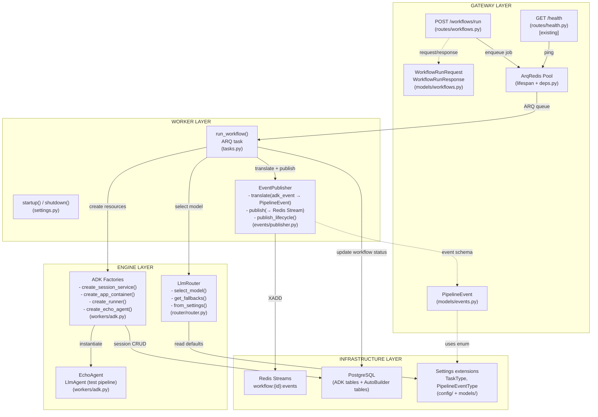
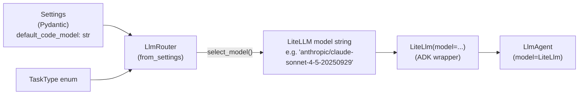
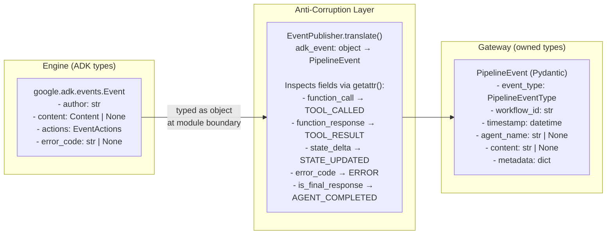
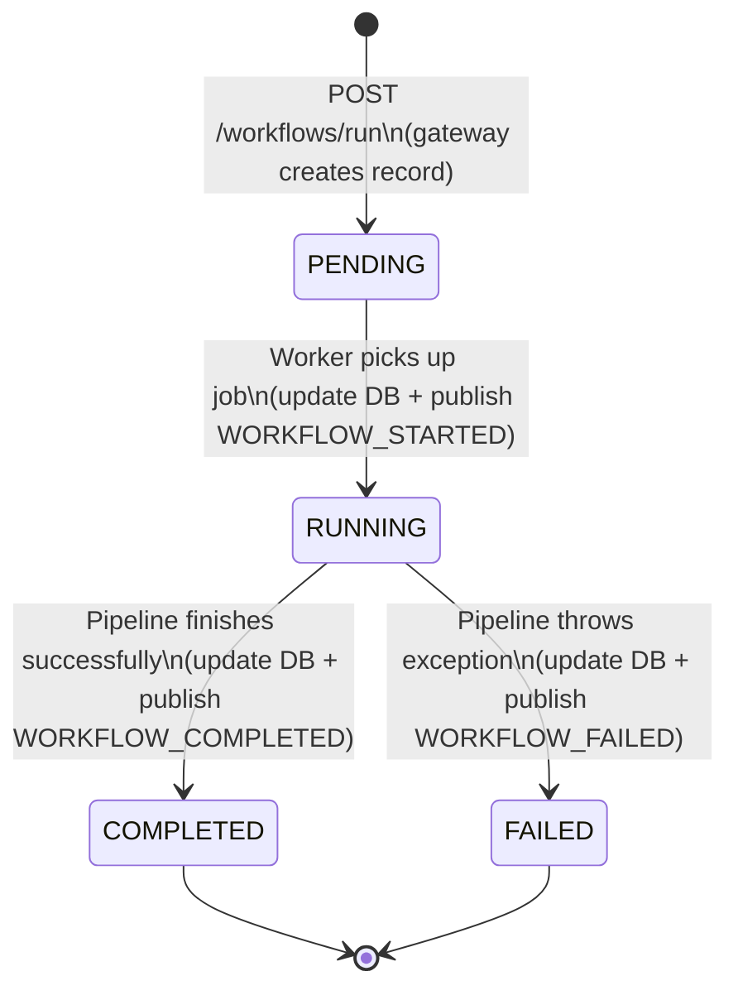
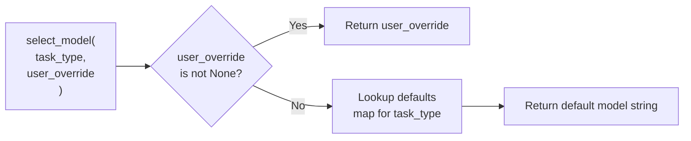

# Phase 3 Model: ADK Engine Integration
*Generated: 2026-02-14*

## Component Diagram



## Major Interfaces

### LlmRouter — Static Model Routing (Engine)

```python
class LlmRouter:
    """Maps TaskType to LiteLLM model strings with fallback chain resolution."""

    @classmethod
    def from_settings(cls, settings: Settings) -> LlmRouter:
        """Create router from application settings defaults."""
        ...

    def select_model(
        self, task_type: TaskType, user_override: str | None = None
    ) -> str:
        """Resolve model string: user_override → default for task_type."""
        ...

    def get_fallbacks(self, model: str) -> list[str]:
        """Return ordered fallback list for a model string. [] for unknown."""
        ...
```

### EventPublisher — ADK Event Translation + Redis Stream Publication (Worker)

```python
class EventPublisher:
    """Translates ADK events to gateway PipelineEvents and publishes to Redis Streams."""

    def __init__(self, redis: Redis) -> None:  # type: ignore[type-arg]
        ...

    def translate(self, adk_event: object, workflow_id: str) -> PipelineEvent | None:
        """Convert an ADK Event to a gateway-native PipelineEvent.

        Returns ``None`` for unclassified events (skipped, not published).
        ADK event typed as ``object`` — ADK types never appear in gateway signatures.
        Inspects event fields to determine PipelineEventType per DD-6 mapping.
        """
        ...

    async def publish(self, event: PipelineEvent) -> None:
        """Publish event to Redis Stream ``workflow:{event.workflow_id}:events`` via XADD."""
        ...

    async def publish_lifecycle(
        self, workflow_id: str, event_type: PipelineEventType
    ) -> None:
        """Publish synthetic lifecycle events (STARTED, COMPLETED, FAILED)."""
        ...
```

### ADK Factory Functions (Engine — `app/workers/adk.py`)

```python
def create_session_service(db_url: str) -> DatabaseSessionService:
    """Create ADK DatabaseSessionService connected to PostgreSQL."""
    ...

def create_app_container(root_agent: BaseAgent) -> App:
    """Create ADK App (name='autobuilder') with compaction (interval=5, overlap=1) and resumability."""
    ...

def create_runner(app: App, session_service: DatabaseSessionService) -> Runner:
    """Create ADK Runner from App container and session service."""
    ...

def create_echo_agent(model: str) -> LlmAgent:
    """Create minimal test LlmAgent (name='echo_agent') with output_key='agent_response'."""
    ...
```

### run_workflow — ARQ Task (Worker)

```python
async def run_workflow(
    ctx: dict[str, object], workflow_id: str
) -> dict[str, str]:
    """Execute a workflow pipeline via ADK.

    Lifecycle: read workflow → RUNNING → create/resume session →
    run ADK pipeline → translate + publish events → COMPLETED/FAILED.
    Raises NotFoundError if workflow not found.
    """
    ...
```

### Worker Lifecycle (Worker — `app/workers/settings.py`)

```python
async def startup(ctx: dict[str, object]) -> None:
    """Initialize shared resources: DatabaseSessionService, LlmRouter, logging."""
    ...

async def shutdown(ctx: dict[str, object]) -> None:
    """Dispose session service resources."""
    ...
```

### Gateway Dependencies (Gateway — `app/gateway/deps.py`)

```python
def get_arq_pool(request: Request) -> ArqRedis:
    """Return ArqRedis pool from app.state for job enqueueing + Redis ops."""
    ...

def get_redis(request: Request) -> Redis:  # type: ignore[type-arg]
    """Return Redis client from app.state (now backed by ArqRedis)."""
    ...
```

## Key Type Definitions

### Enums (`app/models/enums.py`)

```python
class TaskType(enum.StrEnum):
    """LLM task categories for model routing."""
    CODE = "CODE"          # Code generation and modification
    PLAN = "PLAN"          # Planning and decomposition
    REVIEW = "REVIEW"      # Code review and quality assessment
    FAST = "FAST"          # Quick classification, summarization

class PipelineEventType(enum.StrEnum):
    """Gateway-native event types — ADK-agnostic."""
    WORKFLOW_STARTED = "WORKFLOW_STARTED"       # Synthetic: worker publishes before execution
    WORKFLOW_COMPLETED = "WORKFLOW_COMPLETED"   # Synthetic: worker publishes on success
    WORKFLOW_FAILED = "WORKFLOW_FAILED"         # Synthetic: worker publishes on error
    AGENT_STARTED = "AGENT_STARTED"            # First event for an agent author
    AGENT_COMPLETED = "AGENT_COMPLETED"        # event.is_final_response() for agent
    TOOL_CALLED = "TOOL_CALLED"                # function_call in content
    TOOL_RESULT = "TOOL_RESULT"                # function_response in content
    STATE_UPDATED = "STATE_UPDATED"            # state_delta present in actions
    ERROR = "ERROR"                            # error_code present on event
```

### Gateway Event Model (`app/gateway/models/events.py`)

```python
class PipelineEvent(BaseModel):
    """Gateway-native pipeline event — published to Redis Streams, consumed by SSE/webhooks."""
    event_type: PipelineEventType               # Classified event type
    workflow_id: str                             # Owning workflow UUID
    timestamp: datetime                          # Event timestamp (UTC)
    agent_name: str | None = None                # ADK agent that produced this event
    content: str | None = None                   # Text content or tool name
    metadata: dict[str, object] = Field(default_factory=dict)  # Extra context (error msg, state keys, etc.)
```

### Gateway Workflow Models (`app/gateway/models/workflows.py`)

```python
class WorkflowRunRequest(BaseModel):
    """Request body for POST /workflows/run."""
    workflow_type: str                            # Workflow type identifier (e.g. "echo")
    params: dict[str, object] | None = None       # Optional workflow parameters

class WorkflowRunResponse(BaseModel):
    """Response body for POST /workflows/run (202 Accepted)."""
    workflow_id: str                              # UUID of the created workflow record
    status: WorkflowStatus                        # Initial status (PENDING)
```

### Settings Extensions (`app/config/settings.py`)

```python
class Settings(BaseSettings):
    """Extended with LLM model defaults per task type."""
    # ... existing fields ...
    default_code_model: str = "anthropic/claude-sonnet-4-5-20250929"
    default_plan_model: str = "anthropic/claude-opus-4-6"
    default_review_model: str = "anthropic/claude-sonnet-4-5-20250929"
    default_fast_model: str = "anthropic/claude-haiku-4-5-20251001"
```

## Data Flow

### Workflow Execution — Full Type Chain


### Model Selection — Type Chain



### ACL Boundary — Event Translation



## Logic / Process Flow

### Workflow Execution State Machine



### run_workflow Task — Decision Flow

```mermaid
flowchart TB
    Start([run_workflow called])
    ReadWf[Read workflow from DB]
    Found{Workflow found?}
    RaiseNotFound[Raise NotFoundError]
    SetRunning[Update status → RUNNING\nSet started_at]
    PubStarted[Publish WORKFLOW_STARTED]
    GetSession{Session exists?}
    ResumeSession[Resume existing session]
    CreateSession[Create new session\napp=autobuilder, user=system\nsession_id=workflow_id]
    CreateAgent[Create EchoAgent\nmodel from LlmRouter]
    CreateApp[Create App container\n+ Runner]
    RunPipeline[Runner.run_async\nwith Content message]
    EventLoop{Next ADK event?}
    TranslateEvent[Translate → PipelineEvent]
    PublishEvent[Publish to Redis Stream]
    SetCompleted[Update status → COMPLETED\nSet completed_at]
    PubCompleted[Publish WORKFLOW_COMPLETED]
    CatchError[Catch exception]
    SetFailed[Update status → FAILED]
    PubFailed[Publish WORKFLOW_FAILED\nerror in metadata]
    LogError[Log error at ERROR level]
    Done([Return result dict])

    Start --> ReadWf
    ReadWf --> Found
    Found -->|No| RaiseNotFound
    Found -->|Yes| SetRunning
    SetRunning --> PubStarted
    PubStarted --> GetSession
    GetSession -->|Exists| ResumeSession
    GetSession -->|None| CreateSession
    ResumeSession --> CreateAgent
    CreateSession --> CreateAgent
    CreateAgent --> CreateApp
    CreateApp --> RunPipeline

    RunPipeline --> EventLoop
    EventLoop -->|Yes| TranslateEvent
    TranslateEvent --> PublishEvent
    PublishEvent --> EventLoop
    EventLoop -->|No (stream ended)| SetCompleted
    SetCompleted --> PubCompleted
    PubCompleted --> Done

    RunPipeline -.->|Exception| CatchError
    CatchError --> SetFailed
    SetFailed --> PubFailed
    PubFailed --> LogError
    LogError --> Done
```

### ADK Event → PipelineEventType Translation Logic

```mermaid
flowchart TB
    Event([ADK Event received])
    HasError{error_code present?}
    TypeError[→ ERROR]
    HasFC{content has\nfunction_call?}
    TypeTC[→ TOOL_CALLED]
    HasFR{content has\nfunction_response?}
    TypeTR[→ TOOL_RESULT]
    HasSD{actions has\nstate_delta?}
    TypeSU[→ STATE_UPDATED]
    IsFinal{is_final_response()?}
    TypeAC[→ AGENT_COMPLETED]
    NewAuthor{First event\nfor this author?}
    TypeAS[→ AGENT_STARTED]
    Skip[→ Skip event\n(no publish)]

    Event --> HasError
    HasError -->|Yes| TypeError
    HasError -->|No| HasFC
    HasFC -->|Yes| TypeTC
    HasFC -->|No| HasFR
    HasFR -->|Yes| TypeTR
    HasFR -->|No| HasSD
    HasSD -->|Yes| TypeSU
    HasSD -->|No| IsFinal
    IsFinal -->|Yes| TypeAC
    IsFinal -->|No| NewAuthor
    NewAuthor -->|Yes| TypeAS
    NewAuthor -->|No| Skip
```

### LLM Router Resolution Chain



## Integration Points

### Existing System

| Component | Interface | How This Phase Uses It |
|-----------|-----------|----------------------|
| `Settings` (config) | `get_settings()` singleton | Extended with 4 LLM model fields; consumed by `LlmRouter.from_settings()` |
| `WorkflowStatus` enum | Direct member comparison | Worker updates workflow status via DB writes (PENDING → RUNNING → COMPLETED/FAILED) |
| `NotFoundError` | `NotFoundError(message=...)` | Worker raises typed errors for missing workflows |
| `Workflow` ORM model | SQLAlchemy mapped class | Worker reads/updates workflow records; gateway creates records on POST |
| `async_session_factory` | `async with session_factory() as session` | Worker creates DB sessions to read/write workflow records |
| `AutoBuilderError` hierarchy | Exception subclasses | `WorkerError` raised on task failures; middleware converts to JSON |
| `get_logger()` | `logging.Logger` | All new modules log under `app.*` hierarchy |
| `create_engine()` | SQLAlchemy `AsyncEngine` | Worker needs engine for DB session creation |
| `get_db_session` dep | FastAPI `Depends()` | Workflow route uses existing DB session injection |
| `get_redis` dep | FastAPI `Depends()` | Updated to return ArqRedis (type-compatible with Redis) |
| Health route | `GET /health` | Continues using Redis ping via updated `get_redis()` dependency |
| Error middleware | ASGI middleware chain | Catches `AutoBuilderError` subclasses from route handlers → structured JSON |
| `BaseModel` (Pydantic) | Inheritance | `PipelineEvent`, `WorkflowRunRequest`, `WorkflowRunResponse` inherit from it |
| Test fixtures | `conftest.py` | Extended with ArqRedis mock and workflow factory fixtures |

### Future Phase Extensions

| Extension Point | Future Phase | Preparation |
|----------------|-------------|-------------|
| `LlmRouter.select_model()` | Phase 5 (Agents) | Real agents call `select_model(TaskType.CODE)` etc.; Phase 3 validates the interface with EchoAgent |
| `LlmRouter.get_fallbacks()` | Phase 11 (Adaptive routing) | Fallback chains defined now; consumed by LiteLLM retry logic later |
| `before_model_callback` integration | Phase 5 | Router method signature ready; callback wiring deferred until real agents exist |
| `PipelineEvent` schema | Phase 10 (SSE) | SSE endpoint reads from Redis Streams and pushes `PipelineEvent` JSON to clients |
| `EventPublisher.translate()` mapping | Phase 5+ | Translation handles all ADK event types; new agent types produce events that map through existing classification |
| Redis Stream key pattern | Phase 10 (SSE + Webhooks) | `workflow:{id}:events` stream is the shared event bus; SSE and webhook consumers read from it |
| `run_workflow` task | Phase 5 (Director + Agents) | EchoAgent replaced with Director (stateless config object, recreated per invocation) with PM sub-agents via `sub_agents` + `transfer_to_agent`; each PM IS the outer loop for its project, managing batches via tools; factory pattern in `create_app_container()` supports this |
| `create_app_container()` | Phase 5 (Director) | Accepts any `BaseAgent` as root; Phase 5 passes Director agent (stateless, recreated per invocation) |
| `DatabaseSessionService` | Phase 5+ (State/Memory) | Session state persistence operational; multi-session architecture: chat sessions for CEO interaction, work sessions per project; existing 4 ADK scopes sufficient: `app:` = global, `user:` = CEO prefs + Director personality, session = per-session, `temp:` = scratch |
| `WorkflowRunRequest.params` | Phase 5+ | Optional params dict passed through to worker; future phases define workflow-specific param schemas |
| Worker context pattern | Phase 5+ | `ctx["session_service"]` and `ctx["llm_router"]` pattern extensible for new shared resources |
| ArqRedis pool | Phase 10 (SSE) | Gateway SSE endpoint reads streams via the same ArqRedis pool |

## Deliverable → Component Traceability

| Deliverable | Components |
|-------------|-----------|
| **P3.D1** Config + Enums | `Settings` (4 new fields), `TaskType` enum, `PipelineEventType` enum, `app.models.__init__` re-exports |
| **P3.D2** LLM Router | `LlmRouter` class, `FALLBACK_CHAINS` constant, `from_settings()` factory |
| **P3.D3** Event Schema + Publisher | `PipelineEvent` model, `EventPublisher` class (translate, publish, publish_lifecycle) |
| **P3.D4** ADK Engine Setup | `create_session_service()`, `create_app_container()`, `create_runner()`, `create_echo_agent()`, EchoAgent instance |
| **P3.D5** Worker Pipeline Bridge | `run_workflow()` task, `startup()` extensions, `shutdown()` extensions, `WorkerSettings.functions` update |
| **P3.D6** Gateway Workflow Route | `WorkflowRunRequest`/`WorkflowRunResponse` models, `POST /workflows/run` handler, ArqRedis pool in lifespan, `get_arq_pool()` dep, `get_redis()` update |
| **P3.D7** Test Suite | Router tests, event publisher tests, worker task tests, gateway route tests, ADK engine tests, session persistence test |

## Notes

- **ADK table coexistence**: ADK's `DatabaseSessionService` creates its own tables (`sessions`, `events`, `app_states`, `user_states`, `adk_internal_metadata`) lazily via `metadata.create_all()`. These coexist with AutoBuilder's Alembic-managed tables in the same PostgreSQL database. No migration conflict — different metadata objects.

- **ArqRedis replaces Redis client**: Per DD-8, `app.state.redis` is replaced by `app.state.arq_pool`. Since `ArqRedis` extends `redis.asyncio.Redis`, all existing code (health checks, `get_redis()` dep) continues to work without changes beyond the lifespan swap.

- **ADK event typing at ACL boundary**: `EventPublisher.translate()` accepts `adk_event: object` — not the ADK `Event` type. The implementation uses `getattr()` / `hasattr()` for field inspection without importing any `google.adk.*` types. This keeps `app/events/publisher.py` fully ADK-agnostic at both the API and module level — no ADK imports anywhere in the file.

- **EchoAgent is temporary**: Defined in `app/workers/adk.py` as test infrastructure. Phase 5 replaces it with real agent pipelines. The factory pattern (`create_app_container(root_agent)`) makes this a clean swap.

- **Fallback chains are code-defined, not config-defined**: They change rarely (provider degradation paths), benefit from type safety, and would be overly complex as env vars. The `get_fallbacks()` method is the public interface — internals can be reconfigured later.

- **Worker context casting**: ARQ provides `ctx` as `dict[str, object]`. Worker code uses `cast()` to recover typed references (`cast(DatabaseSessionService, ctx["session_service"])`). This is an accepted `Any`-adjacent pattern per the common-errors exceptions list (ARQ framework constraint).

- **Hierarchical supervision**: Phase 3 uses EchoAgent as root_agent for infrastructure validation. The production architecture (Phase 5+) uses Director (LlmAgent, opus) as root_agent -- a stateless config object recreated per invocation, with personality in `user:` scope. Director delegates to PM sub-agents via `sub_agents` + `transfer_to_agent`. PM (LlmAgent, sonnet) per project, also a stateless config object. Each PM IS the outer loop via tools (`select_ready_batch`), `after_agent_callback` (`verify_batch_completion`), `checkpoint_project` (`after_agent_callback` on DeliverablePipeline, persists state via `CallbackContext`), and `run_regression_tests` (`RegressionTestAgent` CustomAgent in pipeline after each batch, reads PM regression policy from session state). Multi-session architecture: chat sessions for CEO interaction, work sessions per project. Project config is a DB entity, no new ADK scope. `AutoBuilderToolset(BaseToolset)` for per-role tool vending with cascading permission config. Workers (LlmAgent + CustomAgent) execute beneath PMs. The `create_app_container(root_agent: BaseAgent)` factory supports this transition with zero API changes -- only the root_agent argument changes. See `.discussion/260214_hierarchical-supervision.md`, `.discussion/260216_terminology-skills-pm.md`.
