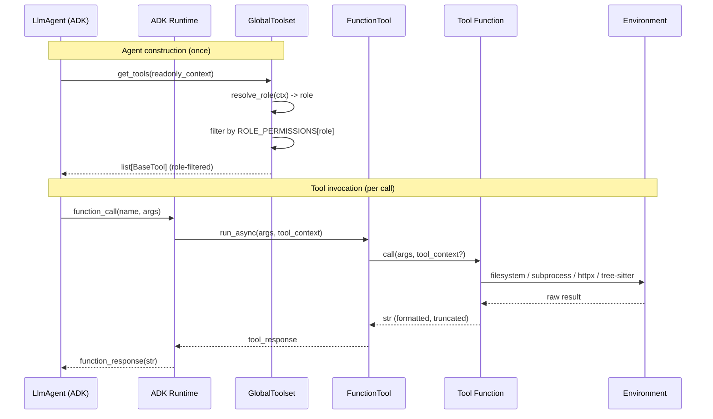
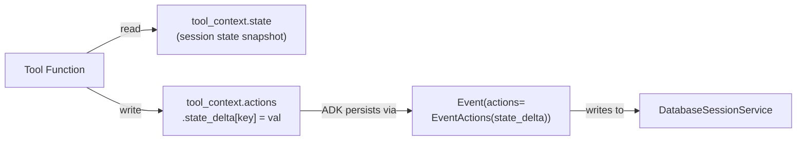
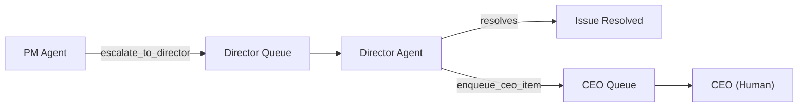

# Phase 4 Model: Core Toolset
*Generated: 2026-02-17*
*Updated: 2026-02-18*

## Component Diagram

```mermaid
flowchart TB
    subgraph ENGINE["ENGINE LAYER (ADK orchestration — runs in workers)"]
        direction TB

        subgraph TOOLSET["GlobalToolset (app/tools/_toolset.py)"]
            ABT["GlobalToolset\n(BaseToolset)\n42 tools"]
            RR["resolve_role()"]
            RP["ROLE_PERMISSIONS\nROLE: set[tool_name]\n7 roles"]
            ARM["AGENT_ROLE_MAP\nagent_name → role"]
            ABT --> RR --> ARM
            ABT --> RP
        end

        subgraph TOOLS["Tool Modules (app/tools/)"]
            FS["filesystem.py (10)\nfile_read, file_write, file_edit,\nfile_insert, file_multi_edit,\nfile_glob, file_grep, file_move,\nfile_delete, directory_list"]
            CD["code.py (2)\ncode_symbols,\nrun_diagnostics"]
            EX["execution.py (2)\nbash_exec, http_request"]
            GI["git.py (8)\ngit_status, git_commit, git_branch,\ngit_diff, git_log, git_show,\ngit_worktree, git_apply"]
            WB["web.py (2)\nweb_search, web_fetch"]
            TK["task.py (6)\ntodo_read, todo_write, todo_list,\ntask_create, task_update, task_query"]
            MG["management.py (12)\nPM: select_ready_batch,\nescalate_to_director, update_deliverable,\nquery_deliverables, reorder_deliverables,\nmanage_dependencies\nDirector: enqueue_ceo_item,\nlist_projects, query_project_status,\noverride_pm, get_project_context,\nquery_dependency_graph"]
        end

        ABT -->|wraps as FunctionTool| FS & CD & EX & GI & WB & TK & MG
    end

    subgraph INFRA["INFRASTRUCTURE LAYER"]
        SET["Settings\n(app/config/settings.py)\nsearch_provider"]
        FSSYS["Filesystem\n(os, pathlib, glob)"]
        PROC["Subprocess\n(asyncio.create_subprocess_shell)"]
        GIT["Git CLI\n(subprocess)"]
        HTTP["httpx + beautifulsoup4\n(external web)"]
        SEARCH["Tavily / Brave API\n(search providers)"]
        TS_LIB["tree-sitter\n(code intelligence)"]
    end

    subgraph ADK["ADK FRAMEWORK (google.adk)"]
        FT["FunctionTool"]
        BTS["BaseToolset"]
        BT["BaseTool"]
        TC["ToolContext"]
        RC["ReadonlyContext"]
    end

    FS --> FSSYS
    CD --> TS_LIB & PROC
    EX --> PROC & HTTP
    GI --> GIT
    WB --> HTTP & SEARCH
    TK -->|state via| TC
    EX -->|idempotency via| TC
    ABT -->|extends| BTS
    ABT -->|creates| FT
    ABT -->|returns| BT
    RR -->|reads| RC

    subgraph AGENTS["CONSUMER: LlmAgent (Phase 5)"]
        LA["LlmAgent\ntools=[toolset]"]
    end

    LA -->|get_tools(ctx)| ABT
```

## Deliverable-to-Component Traceability

| Deliverable | Components |
|---|---|
| P4.D1 | `filesystem.py`: `file_read`, `file_write`, `file_edit`, `file_insert`, `file_multi_edit`, `file_glob`, `file_grep`, `file_move`, `file_delete`, `directory_list`, path validation helper |
| P4.D2 | `execution.py`: `bash_exec`, `http_request`, idempotency guard (`temp:tool_runs:{key}` check/store) |
| P4.D3 | `git.py`: `git_status`, `git_commit`, `git_branch`, `git_diff`, `git_log`, `git_show`, `git_worktree`, `git_apply`, git repo validation helper |
| P4.D4 | `web.py`: `web_fetch`, `web_search`, Tavily/Brave provider dispatch; `Settings` extension (`search_provider`) |
| P4.D5 | `task.py`: `todo_read`, `todo_write`, `todo_list`, `task_create`, `task_update`, `task_query` |
| P4.D6 | `management.py`: PM tools (`select_ready_batch`, `escalate_to_director`, `update_deliverable`, `query_deliverables`, `reorder_deliverables`, `manage_dependencies`), Director tools (`enqueue_ceo_item`, `list_projects`, `query_project_status`, `override_pm`, `get_project_context`, `query_dependency_graph`), validation constants |
| P4.D6b | `code.py`: `code_symbols`, `run_diagnostics` |
| P4.D7 | `_toolset.py`: `GlobalToolset`, `resolve_role`, `ROLE_PERMISSIONS`, `AGENT_ROLE_MAP` |
| P4.D8 | `tests/tools/`: test modules for all above + schema generation tests + conftest fixtures |

## Major Interfaces

### GlobalToolset — ADK-native tool vending

```python
from google.adk.tools.base_toolset import BaseToolset
from google.adk.tools.base_tool import BaseTool
from google.adk.agents.readonly_context import ReadonlyContext

class GlobalToolset(BaseToolset):
    """Vends per-role tool subsets based on cascading permission config."""

    def __init__(
        self,
        *,
        excluded_tools: set[str] | None = None,
    ) -> None:
        """Creates FunctionTool instances for all 42 tool functions.
        excluded_tools removes tools from any role's allowed set."""
        ...

    async def get_tools(
        self,
        readonly_context: ReadonlyContext | None = None,
    ) -> list[BaseTool]:
        """Returns filtered tools for the requesting agent's role.
        Returns all tools when readonly_context is None."""
        ...
```

### Role Resolution

```python
def resolve_role(readonly_context: ReadonlyContext) -> str:
    """Maps agent name to role string via AGENT_ROLE_MAP.
    PM agents matched via prefix (startswith 'pm_').
    Unknown agents -> 'default' (read-only)."""
    ...
```

### Tool Function Signatures — Filesystem (10 tools)

```python
# All return str. ADK auto-generates schema from type hints + docstring.

def file_read(path: str, offset: int | None = None, limit: int | None = None) -> str:
    """Read file contents with optional line offset and limit.""" ...

def file_write(path: str, content: str) -> str:
    """Write or create a file with the given content.""" ...

def file_edit(path: str, old: str, new: str, replace_all: bool = False) -> str:
    """Targeted string replacement within a file.""" ...

def file_insert(path: str, line: int, content: str) -> str:
    """Insert content at a specific line number, shifting existing lines down.""" ...

def file_multi_edit(path: str, edits: list[dict[str, str]]) -> str:
    """Apply multiple non-overlapping edits atomically in a single pass.""" ...

def file_glob(pattern: str, path: str | None = None) -> str:
    """Find files by name pattern (glob syntax). Returns matching paths.""" ...

def file_grep(pattern: str, path: str | None = None, glob: str | None = None, context: int | None = None) -> str:
    """Search file contents by regex pattern with optional file filtering and context lines.""" ...

def file_move(src: str, dst: str) -> str:
    """Move or rename a file.""" ...

def file_delete(path: str) -> str:
    """Delete a file.""" ...

def directory_list(path: str, depth: int | None = None) -> str:
    """List directory contents as a tree with optional depth control.""" ...
```

### Tool Function Signatures — Code Intelligence (2 tools)

```python
def code_symbols(path: str, language: str | None = None) -> str:
    """Extract symbols (classes, functions, imports) via tree-sitter.
    Language auto-detected from extension.""" ...

def run_diagnostics(path: str, tool: str | None = None) -> str:
    """Run lint or type-check on a file. Tool selection configurable per project.""" ...
```

### Tool Function Signatures — Execution (2 tools)

```python
from google.adk.tools import ToolContext

async def bash_exec(
    command: str,
    cwd: str | None = None,
    timeout: int = 120,
    idempotency_key: str | None = None,
    tool_context: ToolContext | None = None,
) -> str:
    """Run a shell command with timeout and output capture.
    idempotency_key enables dedup via session state on ADK Resume."""
    ...

async def http_request(
    method: str,
    url: str,
    headers: dict[str, str] | None = None,
    body: str | None = None,
) -> str:
    """Structured HTTP call for API testing, webhooks, and external service interaction."""
    ...
```

### Tool Function Signatures — Git (8 tools)

```python
async def git_status(path: str) -> str: ...
async def git_commit(path: str, message: str, files: list[str] | None = None) -> str: ...
async def git_branch(path: str, name: str, action: GitBranchAction) -> str: ...
async def git_diff(path: str, ref: str | None = None) -> str: ...
async def git_log(path: str, count: int | None = None, ref: str | None = None) -> str: ...
async def git_show(path: str, ref: str) -> str: ...
async def git_worktree(path: str, action: str, branch: str | None = None) -> str: ...
async def git_apply(path: str, patch: str) -> str: ...
```

### Tool Function Signatures — Web (2 tools)

```python
async def web_fetch(url: str) -> str:
    """Fetch URL content via httpx. Extracts text from HTML.""" ...

async def web_search(query: str, num_results: int = 5) -> str:
    """Search the web via configured provider (Tavily primary, Brave fallback).""" ...
```

### Tool Function Signatures — Task Management (6 tools)

```python
from google.adk.tools import ToolContext

def todo_read(task_id: str, tool_context: ToolContext) -> str: ...

def todo_write(
    action: TodoAction,
    task_id: str,
    content: str,
    tool_context: ToolContext,
) -> str: ...

def todo_list(
    status_filter: TodoStatus | None = None,
    tool_context: ToolContext,
) -> str: ...

def task_create(
    title: str,
    description: str,
    assignee: str | None = None,
    tags: list[str] | None = None,
) -> str:
    """Create a cross-session task visible to all agents in the project.""" ...

def task_update(
    task_id: str,
    status: str | None = None,
    notes: str | None = None,
) -> str:
    """Update a shared task's status or add notes.""" ...

def task_query(
    filter: str | None = None,
    assignee: str | None = None,
) -> str:
    """Query shared tasks with optional status filter and assignee.""" ...
```

### Tool Function Signatures — Management (12 tools)

```python
# PM tools (6)
def select_ready_batch(project_id: str) -> str:
    """Placeholder — returns 'no deliverables' until Phase 8.""" ...

def escalate_to_director(priority: str, context: str, request_type: str) -> str:
    """Escalate an issue from PM to the Director queue for resolution.
    PM uses this instead of enqueue_ceo_item.""" ...

def update_deliverable(deliverable_id: str, status: str, notes: str | None = None) -> str:
    """Update a deliverable's lifecycle status. Placeholder until Phase 5.""" ...

def query_deliverables(project_id: str, status: str | None = None) -> str:
    """Query deliverable state. Placeholder until Phase 5.""" ...

def reorder_deliverables(project_id: str, order: list[str]) -> str:
    """Change execution priority by reordering deliverables. Placeholder until Phase 5.""" ...

def manage_dependencies(action: str, source_id: str, target_id: str | None = None) -> str:
    """Add, remove, or query deliverable dependency relationships. Placeholder until Phase 8.""" ...

# Director tools (6)
def enqueue_ceo_item(
    item_type: str, priority: str, message: str, metadata: str,
) -> str:
    """Director-only. Validates item_type/priority, logs, returns placeholder ID.
    Real DB backend in Phase 5.""" ...

def list_projects(status: str | None = None) -> str:
    """List all projects. Placeholder until Phase 5.""" ...

def query_project_status(project_id: str) -> str:
    """Query detailed project status. Placeholder until Phase 5.""" ...

def override_pm(project_id: str, action: str, reason: str) -> str:
    """Direct PM intervention: pause, resume, reorder, or correct. Placeholder until Phase 5.""" ...

def get_project_context(path: str | None = None) -> str:
    """Detect project type, technology stack, and conventions from the codebase.
    Functional in Phase 4 (reads filesystem).""" ...

def query_dependency_graph(project_id: str, deliverable_id: str | None = None) -> str:
    """Query the deliverable dependency graph. Placeholder until Phase 8.""" ...
```

## Key Type Definitions

### Permission Configuration (module-level constants in _toolset.py)

```python
# Agent name -> role mapping
AGENT_ROLE_MAP: dict[str, str] = {
    "plan_agent": "planner",
    "code_agent": "coder",
    "review_agent": "reviewer",
    "fix_agent": "fix_agent",
    "director": "director",
    # PM agents: matched via name.startswith("pm_")
}

# Role -> allowed tool names
ROLE_PERMISSIONS: dict[str, set[str]] = {
    "default":  {"file_read", "file_glob", "file_grep", "directory_list",
                 "git_status", "git_diff"},
    "planner":  {"file_read", "file_glob", "file_grep", "directory_list",
                 "code_symbols", "run_diagnostics",
                 "git_status", "git_diff", "git_log", "git_show",
                 "web_fetch", "web_search",
                 "todo_read", "todo_write", "todo_list"},
    "coder":    {"file_read", "file_write", "file_edit", "file_insert", "file_multi_edit",
                 "file_glob", "file_grep", "file_move", "file_delete", "directory_list",
                 "code_symbols", "run_diagnostics",
                 "bash_exec", "http_request",
                 "git_status", "git_commit", "git_branch", "git_diff",
                 "git_log", "git_show", "git_worktree", "git_apply",
                 "web_fetch", "web_search",
                 "todo_read", "todo_write", "todo_list"},
    "reviewer": {"file_read", "file_glob", "file_grep", "directory_list",
                 "code_symbols", "run_diagnostics",
                 "git_status", "git_diff", "git_log", "git_show",
                 "web_fetch", "web_search",
                 "todo_read", "todo_write", "todo_list"},
    "fix_agent":{"file_read", "file_write", "file_edit", "file_insert", "file_multi_edit",
                 "file_glob", "file_grep", "file_move", "file_delete", "directory_list",
                 "code_symbols", "run_diagnostics",
                 "bash_exec",
                 "git_status", "git_diff", "git_log", "git_show",
                 "web_fetch", "web_search",
                 "todo_read", "todo_write", "todo_list"},
    "pm":       {"select_ready_batch", "escalate_to_director", "update_deliverable",
                 "query_deliverables", "reorder_deliverables", "manage_dependencies",
                 "task_create", "task_update", "task_query",
                 "todo_read", "todo_write", "todo_list"},
    "director": {"enqueue_ceo_item", "list_projects", "query_project_status",
                 "override_pm", "get_project_context", "query_dependency_graph",
                 "task_create", "task_update", "task_query",
                 "todo_read", "todo_write", "todo_list"},
}
```

### CEO Queue Validation Constants (management.py — strings until Phase 5 enums)

```python
VALID_CEO_ITEM_TYPES: set[str] = {"NOTIFICATION", "APPROVAL", "ESCALATION", "TASK"}
VALID_PRIORITIES: set[str] = {"LOW", "NORMAL", "HIGH", "CRITICAL"}
```

### Director Queue Validation Constants (management.py — strings until Phase 5 enums)

```python
VALID_DIRECTOR_REQUEST_TYPES: set[str] = {"ESCALATION", "STATUS_REPORT", "RESOURCE_REQUEST", "PATTERN_ALERT"}
VALID_PM_OVERRIDE_ACTIONS: set[str] = {"PAUSE", "RESUME", "REORDER", "CORRECT"}
VALID_DEPENDENCY_ACTIONS: set[str] = {"ADD", "REMOVE", "QUERY"}
```

### Tool Parameter Enums (app/models/enums.py)

```python
import enum

class GitBranchAction(str, enum.Enum):
    CREATE = "CREATE"
    SWITCH = "SWITCH"
    DELETE = "DELETE"

class TodoAction(str, enum.Enum):
    ADD = "ADD"
    UPDATE = "UPDATE"
    COMPLETE = "COMPLETE"
    REMOVE = "REMOVE"

class TodoStatus(str, enum.Enum):
    PENDING = "PENDING"
    DONE = "DONE"
```

### Role Type (internal to _toolset.py)

```python
from typing import Literal

RoleName = Literal["default", "planner", "coder", "reviewer", "fix_agent", "pm", "director"]
```

### Task State Schema (stored in session state under key "tasks")

```python
from typing import TypedDict

class TaskItem(TypedDict):
    id: str              # UUID
    content: str         # Task description
    status: TodoStatus   # PENDING or DONE
```

### Settings Extension (app/config/settings.py)

```python
# Added field (Pydantic Settings, env prefix AUTOBUILDER_)
search_provider: str = "tavily"     # AUTOBUILDER_SEARCH_PROVIDER

# API keys read from env directly (not AUTOBUILDER_ prefixed):
# TAVILY_API_KEY — Tavily search (primary)
# BRAVE_API_KEY — Brave search (fallback)
```

### Output Truncation Constant

```python
MAX_OUTPUT_LENGTH: int = 10_000  # Characters. Shared across bash_exec, git_diff, web_fetch, http_request.
```

## Data Flow

### Tool Invocation Flow (LLM -> Tool -> LLM)



### State Access Flow (ToolContext)



### Escalation Flow (PM -> Director -> CEO)



## Logic / Process Flow

### bash_exec Idempotency Guard

```mermaid
flowchart TD
    START([bash_exec called]) --> HAS_KEY{idempotency_key\nprovided?}
    HAS_KEY -->|No| EXEC[Execute command]
    HAS_KEY -->|Yes| CHECK{"temp:tool_runs:{key}\nin state?"}
    CHECK -->|Yes| CACHED[Return cached result]
    CHECK -->|No| EXEC
    EXEC --> TIMEOUT{Timed out?}
    TIMEOUT -->|Yes| KILL[Kill process] --> ERR_TIMEOUT[Return timeout error]
    TIMEOUT -->|No| EXIT{Exit code?}
    EXIT -->|0| SUCCESS[Return stdout+stderr]
    EXIT -->|≠0| ERR_EXIT[Return "Exit code: N\n" + output]
    SUCCESS --> TRUNC{Length > 10000?}
    ERR_EXIT --> TRUNC
    TRUNC -->|Yes| TRUNCATE[Truncate + notice]
    TRUNC -->|No| STORE
    TRUNCATE --> STORE{Has idempotency_key?}
    STORE -->|Yes| SAVE["state_delta[\ntemp:tool_runs:{key}] = result"] --> DONE([Return result])
    STORE -->|No| DONE
```

### file_edit Idempotency

```
1. Read file content
2. If `old` found in content -> replace with `new`, write file -> "Edited successfully"
3. If `old` NOT found but `new` IS found -> "Already edited" (idempotent)
4. If neither found -> "Error: old text not found in file"
```

### Role Resolution

```
1. Look up readonly_context.agent_name in AGENT_ROLE_MAP -> return role
2. If not found, check name.startswith("pm_") -> return "pm"
3. Otherwise -> return "default"
```

### GlobalToolset.get_tools() Logic

```
1. If readonly_context is None -> return all 42 tools (minus excluded_tools)
2. role = resolve_role(readonly_context)
3. allowed = ROLE_PERMISSIONS[role] - excluded_tools
4. Return [tool for tool in self._tools if tool.name in allowed]
```

## Integration Points

### Existing System

| Component | Interface | How This Phase Uses It |
|-----------|-----------|----------------------|
| `Settings` (`app/config/settings.py`) | `get_settings()` | Extended with `search_provider` field; API keys via `TAVILY_API_KEY`, `BRAVE_API_KEY` |
| `get_logger()` (`app/lib/logging`) | `get_logger("tools.{category}")` | All tool modules use structured logging |
| `AutoBuilderError` hierarchy (`app/lib/exceptions`) | `ValidationError`, `NotFoundError` | Tool internal errors (path validation, git repo check) — caught and returned as `str` to LLM |
| ADK `FunctionTool` (`google.adk.tools.function_tool`) | `FunctionTool(func)` | Wraps all 42 tool functions for schema auto-generation |
| ADK `BaseToolset` (`google.adk.tools.base_toolset`) | `get_tools(readonly_context)` | `GlobalToolset` extends this for role-based vending |
| ADK `ToolContext` (`google.adk.tools`) | `tool_context.state`, `tool_context.actions.state_delta` | `todo_*` tools and `bash_exec` idempotency |
| ADK `ReadonlyContext` (`google.adk.agents.readonly_context`) | `readonly_context.agent_name` | `resolve_role()` reads agent name for role mapping |

### Future Phase Extensions

| Extension Point | Future Phase | Preparation |
|----------------|-------------|-------------|
| `enqueue_ceo_item` backend | Phase 5 | Correct signature + validation in place; replace log with `INSERT INTO ceo_queue` |
| `escalate_to_director` backend | Phase 5 | Correct signature + validation in place; replace log with `INSERT INTO director_queue` |
| `select_ready_batch` backend | Phase 8 | Correct signature in place; replace placeholder with topological sort over deliverables |
| `update_deliverable` backend | Phase 5 | Correct signature in place; replace placeholder with DB update |
| `query_deliverables` backend | Phase 5 | Correct signature in place; replace placeholder with DB query |
| `reorder_deliverables` backend | Phase 5 | Correct signature in place; replace placeholder with DB reorder |
| `manage_dependencies` backend | Phase 8 | Correct signature in place; replace placeholder with dependency graph ops |
| `list_projects` backend | Phase 5 | Correct signature in place; replace placeholder with DB query |
| `query_project_status` backend | Phase 5 | Correct signature in place; replace placeholder with DB + event query |
| `override_pm` backend | Phase 5 | Correct signature in place; replace placeholder with PM agent control |
| `query_dependency_graph` backend | Phase 8 | Correct signature in place; replace placeholder with graph query |
| `task_create/update/query` backend | Phase 5 | Correct signatures in place; replace placeholder with shared task DB |
| `AGENT_ROLE_MAP` | Phase 5+ | New agent names added to map as agents are defined beyond Phase 4 defaults |
| `ROLE_PERMISSIONS` | Phase 5+ | New tool names added to role sets as new tools are created |
| `excluded_tools` cascading | Phase 5 | Director/PM pass `excluded_tools` when constructing subordinate agents' toolsets |
| `require_confirmation` | Phase 11 | `FunctionTool(bash_exec, require_confirmation=True)` for human-in-the-loop |
| Tool authoring by Director | Phase 13+ | Director writes new tool functions; CEO approval gate before activation |
| `web_search` providers | Phase 4+ | Add `elif provider == "new_provider":` branch for new search providers |
| `agent-browser` integration | Phase 7/13 | Vercel `agent-browser` CLI invoked via `bash_exec`. Workflow-specific. |

## Notes

- **All tool functions return `str`** — ADK feeds the return directly to the LLM. Errors are returned as descriptive strings, not raised as exceptions (the LLM needs to see the error to reason about it).
- **`tool_context` is auto-injected** by ADK when declared as a parameter. It does NOT appear in the schema sent to the LLM. Only `todo_*` tools and `bash_exec` (when using idempotency) need it.
- **Async vs sync**: `bash_exec`, `http_request`, `git_*`, `web_*` are `async` (subprocess/network I/O). `todo_*`, `file_*`, `management.*`, `code_symbols` are sync (filesystem/state reads are fast, no I/O worth awaiting). `run_diagnostics` is `async` (subprocess execution). ADK handles both.
- **Path validation**: Filesystem tools validate that paths don't traverse outside the project root. This is a security boundary — tools run in worker processes with filesystem access.
- **No abstract class hierarchy for search providers** — a simple `if/elif` dispatch suffices. Tavily primary, Brave fallback. Adding a provider is adding a function + branch.
- **Escalation path**: PM -> Director Queue -> Director -> resolves OR -> CEO Queue -> CEO. PM never directly accesses the CEO queue.
- **Three-tier task system**: Session todos (ToolContext state, dies with session), shared tasks (cross-session, placeholder until Phase 5), deliverables (DB-backed, managed by PM management tools, placeholder until Phase 5/8).
- **`agent-browser` resolved**: Vercel `agent-browser` CLI (Q8). Invoked via `bash_exec`. Workflow-specific, implemented in Phase 7/13.
- **`beautifulsoup4` dependency**: Required for `web_fetch` HTML-to-text extraction. Verify it's in `pyproject.toml` before building.
- **`tree-sitter` dependency**: Required for `code_symbols` symbol extraction. Verify it's in `pyproject.toml` before building.
