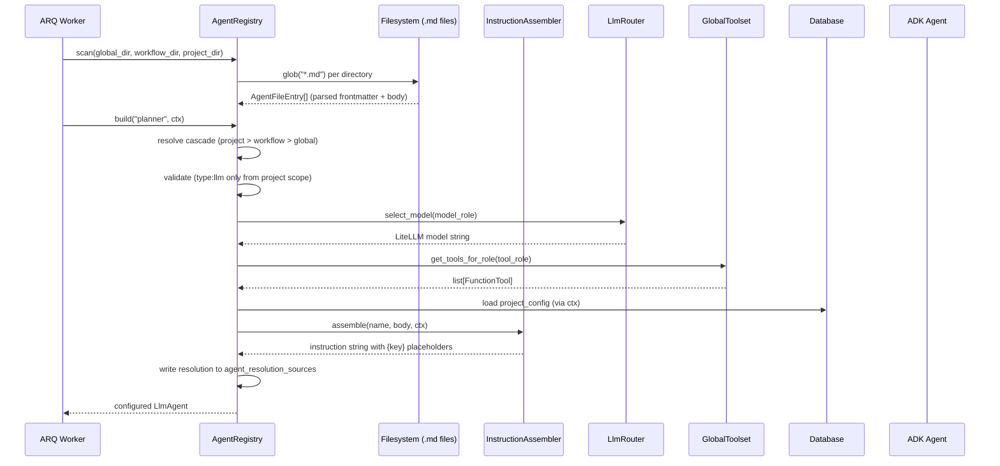
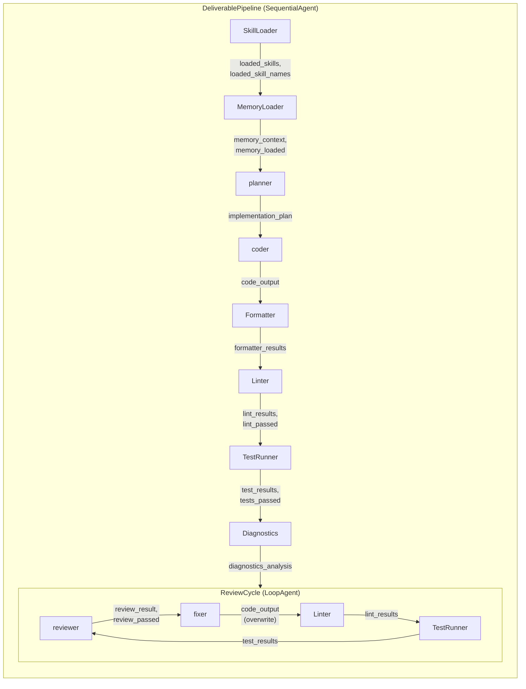
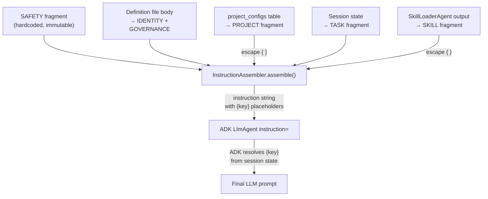
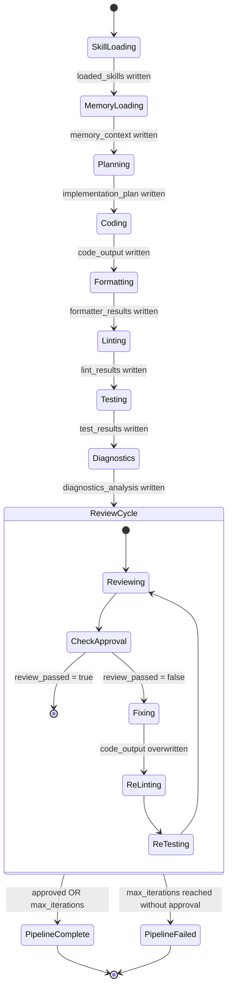
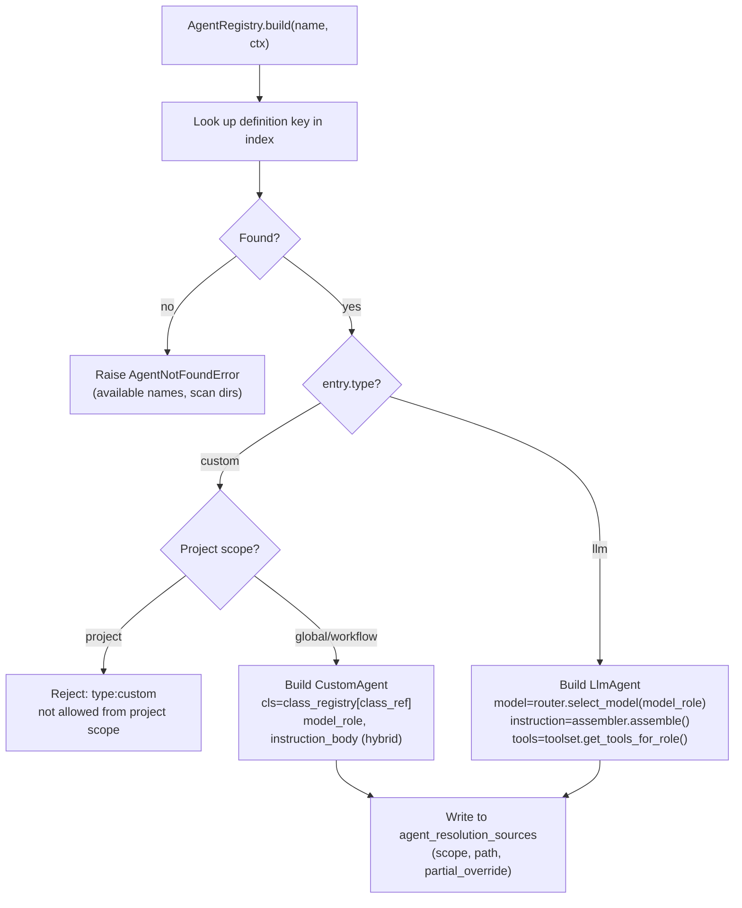

# Phase 5a Model: Agent Definitions & Pipeline
*Generated: 2026-03-11*

## Component Diagram

```mermaid
flowchart TB
    subgraph INFRA["INFRASTRUCTURE LAYER (Phase 5a DB additions)"]
        D05["D05: ceo_queue table"]
        D08["D08: project_configs table"]
        V23["V23: director_queue table"]
        D16["D16: ceo_queue migration"]
        D19["D19: project_configs migration"]
        V24["V24: director_queue migration"]
    end

    subgraph ENGINE["ENGINE LAYER"]
        subgraph REGISTRY["Agent Registry & Composition"]
            A56["A56: AgentRegistry\nscan + build from files"]
            A52["A52: InstructionAssembler\nfragment-based composition"]
            A53["A53: InstructionFragment\ndataclass"]
            A76["A76: InstructionContext\nper-invocation assembly data"]
            A75["A75: SAFETY fragment\nhardcoded, non-overridable"]
            A55["A55: Agent definition files\nmarkdown + YAML frontmatter"]
            A57["A57: Base instruction fragments\n6 types"]
            A77["A77: Partial override\nfrontmatter-only inheritance"]
            A78a["A78a: Project-scope type validation\ntype: llm only"]
            A80["A80: Resolution auditability\nagent_resolution_sources"]
        end

        subgraph AGENTS_LLM["Worker-Tier LLM Agents"]
            A01["A01: Director agent\n(LlmAgent, opus)"]
            A02["A02: PM agent\n(LlmAgent, sonnet)"]
            A03["A03: director.md"]
            A04["A04: pm.md"]
            A20["A20: planner\n(LlmAgent, opus)"]
            A21["A21: coder\n(LlmAgent, sonnet)"]
            A22["A22: reviewer\n(LlmAgent, sonnet)"]
            A23["A23: fixer\n(LlmAgent, sonnet)"]
        end

        subgraph AGENTS_CUSTOM["Worker-Tier Custom Agents"]
            A30["A30: SkillLoaderAgent"]
            A31["A31: LinterAgent"]
            A32["A32: TestRunnerAgent"]
            A33["A33: FormatterAgent"]
            A34["A34: DependencyResolverAgent\n(hybrid)"]
            A35["A35: RegressionTestAgent"]
            A36["A36: DiagnosticsAgent\n(hybrid)"]
            A37["A37: MemoryLoaderAgent"]
        end

        subgraph PIPELINE["Pipeline Composition"]
            A60["A60: DeliverablePipeline\n(SequentialAgent)"]
            A61["A61: ReviewCycle\n(LoopAgent, max=3)"]
        end

        subgraph CONTEXT["Context Budget"]
            CT04["CT04: ContextBudgetMonitor\n(before_model_callback)"]
            CT06["CT06: ContextRecreationRequired\nexception"]
        end

        subgraph COMMUNICATION["Agent Communication"]
            A50["A50: output_key state\ncommunication"]
            A51["A51: {key} state template\ninjection"]
            A54["A54: context_from_state\nhelper"]
            A43["A43: before_model_callback\ncontext injection"]
        end

        subgraph ENUMS_CFG["CEO Queue Enums"]
            V13["V13: CEO queue type enum"]
            V14["V14: CEO queue priority enum"]
            V15["V15: CEO queue status enum"]
        end

        subgraph STATE["State Integration"]
            M05["M05: State template injection"]
            M06["M06: Project config loader"]
            M15["M15: MemoryLoaderAgent\n(State/Memory BOM entry)"]
            E02["E02: Agent tree construction"]
            E03["E03: PM agent construction"]
        end
    end

    %% Relationships
    A56 --> A52
    A56 --> A55
    A52 --> A53
    A52 --> A76
    A52 --> A75
    A52 --> A57
    A56 --> A77
    A56 --> A78a
    A56 --> A80

    A56 -->|builds| A01 & A02 & A20 & A21 & A22 & A23
    A56 -->|builds| A30 & A31 & A32 & A33 & A34 & A35 & A36 & A37

    A60 --> A30 & A37 & A20 & A21 & A33 & A31 & A32 & A36 & A61
    A61 --> A22 & A23

    CT04 -->|raises| CT06
    A43 --> CT04

    E02 --> A56
    E03 --> A56
    M06 --> D08
```



## L2 Architecture Conformance

| Component | BOM ID | L2 Architecture File | Section |
|---|---|---|---|
| AgentRegistry | A56 | `architecture/agents.md` | AgentRegistry |
| InstructionAssembler | A52 | `architecture/agents.md` | Instruction Composition |
| InstructionFragment | A53 | `architecture/agents.md` | Instruction Composition |
| InstructionContext | A76 | `architecture/agents.md` | Agent Definitions |
| SAFETY fragment | A75 | `architecture/agents.md` | Instruction Composition |
| Agent definition files | A55 | `architecture/agents.md` | Agent Definition Files |
| Base instruction fragments (6 types) | A57 | `architecture/agents.md` | Instruction Composition |
| Partial override mechanism | A77 | `architecture/agents.md` | Definition Cascade |
| Project-scope type validation | A78a | `architecture/agents.md` | Project-Scope Restrictions |
| Resolution auditability | A80 | `architecture/agents.md` | AgentRegistry |
| Director agent definition | A01 | `architecture/agents.md` | Director Agent |
| PM agent definition | A02 | `architecture/agents.md` | PM Agent |
| Director definition file | A03 | `architecture/agents.md` | Agent Definition Files |
| PM definition file | A04 | `architecture/agents.md` | Agent Definition Files |
| planner agent | A20 | `architecture/agents.md` | Worker-Tier LLM Agents |
| coder agent | A21 | `architecture/agents.md` | Worker-Tier LLM Agents |
| reviewer agent | A22 | `architecture/agents.md` | Worker-Tier LLM Agents |
| fixer agent | A23 | `architecture/agents.md` | Worker-Tier LLM Agents |
| SkillLoaderAgent | A30 | `architecture/agents.md` | Worker-Tier Custom Agents |
| LinterAgent | A31 | `architecture/agents.md` | Worker-Tier Custom Agents |
| TestRunnerAgent | A32 | `architecture/agents.md` | Worker-Tier Custom Agents |
| FormatterAgent | A33 | `architecture/agents.md` | Worker-Tier Custom Agents |
| DependencyResolverAgent | A34 | `architecture/agents.md` | Worker-Tier Custom Agents |
| RegressionTestAgent | A35 | `architecture/agents.md` | Worker-Tier Custom Agents |
| DiagnosticsAgent | A36 | `architecture/agents.md` | Worker-Tier Custom Agents |
| MemoryLoaderAgent | A37 | `architecture/agents.md` | Worker-Tier Custom Agents |
| before_model_callback context injection | A43 | `architecture/agents.md` | Worker-Tier LLM Agents |
| output_key state communication | A50 | `architecture/agents.md` | Agent Communication via Session State |
| {key} state template injection | A51 | `architecture/agents.md` | Agent Communication via Session State |
| context_from_state helper | A54 | `architecture/agents.md` | Worker-Tier Custom Agents |
| DeliverablePipeline | A60 | `architecture/agents.md` | How Workers Compose |
| ReviewCycle | A61 | `architecture/agents.md` | How Workers Compose |
| Agent tree construction | E02 | `architecture/engine.md` | App Container Configuration |
| PM agent construction | E03 | `architecture/engine.md` | App Container Configuration |
| ContextBudgetMonitor | CT04 | `architecture/context.md` | Context Budget Monitoring |
| ContextRecreationRequired | CT06 | `architecture/context.md` | Trigger Mechanics |
| State template injection | M05 | `architecture/state.md` | State (4-Scope System) |
| Project config loader | M06 | `architecture/state.md` | State (4-Scope System) |
| MemoryLoaderAgent (State/Memory BOM) | M15 | `architecture/state.md`, `architecture/agents.md` | Memory Service, Worker-Tier Custom Agents |
| CEO queue type enum | V13 | `architecture/events.md` | Unified CEO Queue |
| CEO queue priority enum | V14 | `architecture/events.md` | Unified CEO Queue |
| CEO queue status enum | V15 | `architecture/events.md` | Unified CEO Queue |
| `ceo_queue` table | D05 | `architecture/data.md` | Key Tables |
| `project_configs` table | D08 | `architecture/data.md` | Key Tables |
| `director_queue` table | V23 | `architecture/events.md` | Director Queue |
| ceo_queue migration | D16 | `architecture/events.md` | Unified CEO Queue |
| project_configs migration | D19 | `architecture/data.md` | Key Tables |
| director_queue migration | V24 | `architecture/events.md` | Director Queue |

## Major Interfaces

### AgentRegistry

```python
class AgentRegistry:
    """Scans agent definition files, resolves 3-scope cascade, builds ADK agents."""

    def __init__(
        self,
        assembler: InstructionAssembler,
        router: LlmRouter,
        toolset: GlobalToolset,
    ) -> None: ...

    def scan(self, *dirs: Path) -> None:
        """Scan directories for .md agent definition files.
        Later dirs override earlier by filename match.
        Validates frontmatter, rejects duplicates within same scope."""
        ...

    def build(
        self,
        name: str,
        ctx: InstructionContext,
        *,
        definition: str | None = None,
        **overrides: object,
    ) -> BaseAgent:
        """Resolve definition file into configured ADK agent.
        name: ADK agent name (can be dynamic, e.g., 'PM_alpha').
        definition: lookup key (defaults to name).
        overrides: sub_agents, before_model_callback, after_model_callback, etc.
        Raises AgentNotFoundError if definition not found."""
        ...

    def get_resolution_sources(self) -> dict[str, AgentResolutionEntry]:
        """Return resolution audit map: agent name → scope, file path, partial override flag."""
        ...
```

### InstructionAssembler

```python
class InstructionAssembler:
    """Composes typed fragments into agent instructions with source auditability."""

    def assemble(
        self,
        agent_name: str,
        body: str,
        ctx: InstructionContext,
    ) -> str:
        """Assemble full instructions from definition file body + dynamic context.
        Order: SAFETY (hardcoded) → IDENTITY + GOVERNANCE (body) → PROJECT (DB) → TASK (state) → SKILL (loaded).
        Escapes literal curly braces in PROJECT/SKILL fragments.
        Preserves {key} and {key?} template placeholders for ADK runtime resolution."""
        ...

    def get_source_map(self) -> list[InstructionFragment]:
        """Return fragments from the last assemble() call for diagnostic auditability."""
        ...
```

### SkillLibraryProtocol

```python
class SkillLibraryProtocol(Protocol):
    """Interface for skill resolution — satisfied by NullSkillLibrary (Phase 5a) or SkillLibrary (Phase 6)."""

    def match(self, context: SkillMatchContext) -> list[SkillEntry]: ...

    def load(self, entry: SkillEntry) -> SkillContent: ...
```

### NullSkillLibrary

```python
class NullSkillLibrary:
    """Returns empty results. Satisfies SkillLibraryProtocol for Phase 5a."""

    def match(self, context: SkillMatchContext) -> list[SkillEntry]: ...

    def load(self, entry: SkillEntry) -> SkillContent: ...
```

### CustomAgent Base Pattern

```python
class SkillLoaderAgent(BaseAgent):
    """Loads matched skills into session state. First pipeline step."""

    model_config = ConfigDict(arbitrary_types_allowed=True)
    skill_library: SkillLibraryProtocol

    async def _run_async_impl(  # type: ignore[override]
        self, ctx: InvocationContext
    ) -> AsyncGenerator[Event, None]:
        """Query skill_library, write loaded_skills + loaded_skill_names to state via state_delta."""
        ...
```

```python
class MemoryLoaderAgent(BaseAgent):
    """Loads cross-session memory into session state. Second pipeline step."""

    model_config = ConfigDict(arbitrary_types_allowed=True)
    memory_service: BaseMemoryService

    async def _run_async_impl(  # type: ignore[override]
        self, ctx: InvocationContext
    ) -> AsyncGenerator[Event, None]:
        """Query memory_service.search_memory(), write memory_context + memory_loaded to state.
        Degrades gracefully on service failure (empty context, memory_loaded=false)."""
        ...
```

```python
class LinterAgent(BaseAgent):
    """Runs project linter(s), writes structured lint results to state."""

    async def _run_async_impl(  # type: ignore[override]
        self, ctx: InvocationContext
    ) -> AsyncGenerator[Event, None]:
        """Execute configured linter via subprocess, write lint_results + lint_passed to state."""
        ...
```

```python
class TestRunnerAgent(BaseAgent):
    """Runs project test suite, writes structured test results to state."""

    async def _run_async_impl(  # type: ignore[override]
        self, ctx: InvocationContext
    ) -> AsyncGenerator[Event, None]:
        """Execute test suite via subprocess, write test_results + tests_passed to state."""
        ...
```

```python
class FormatterAgent(BaseAgent):
    """Runs code formatter(s), writes summary of changes to state."""

    async def _run_async_impl(  # type: ignore[override]
        self, ctx: InvocationContext
    ) -> AsyncGenerator[Event, None]:
        """Execute formatter via subprocess, write formatter_results to state."""
        ...
```

```python
class DependencyResolverAgent(BaseAgent):
    """Hybrid: topological sort + LiteLLM for ambiguous relationship classification."""

    model_config = ConfigDict(arbitrary_types_allowed=True)
    model_role: str | None = None
    instruction_body: str | None = None

    async def _run_async_impl(  # type: ignore[override]
        self, ctx: InvocationContext
    ) -> AsyncGenerator[Event, None]:
        """Resolve dependencies deterministically. Use internal LiteLLM call (routed via model_role)
        for ambiguous relationships. Write dependency_order to state."""
        ...
```

```python
class DiagnosticsAgent(BaseAgent):
    """Hybrid: aggregates lint/test results + LiteLLM for root-cause analysis."""

    model_config = ConfigDict(arbitrary_types_allowed=True)
    model_role: str | None = None
    instruction_body: str | None = None

    async def _run_async_impl(  # type: ignore[override]
        self, ctx: InvocationContext
    ) -> AsyncGenerator[Event, None]:
        """Read lint_results + test_results from state. Use internal LiteLLM call
        for pattern detection and root-cause analysis. Write diagnostics_analysis to state."""
        ...
```

```python
class RegressionTestAgent(BaseAgent):
    """Runs cross-deliverable regression tests. Batch-level integration deferred to Phase 8a."""

    async def _run_async_impl(  # type: ignore[override]
        self, ctx: InvocationContext
    ) -> AsyncGenerator[Event, None]:
        """Read regression_policy from state. Execute regression suite when policy says to.
        Write regression_results to state. No-op (with skip record) when policy says skip."""
        ...
```

### ContextBudgetMonitor

```python
class ContextBudgetMonitor:
    """before_model_callback that tracks token usage and triggers context recreation."""

    def __init__(self, threshold_pct: float = 80.0) -> None:
        """Raises ConfigurationError if threshold_pct not in 0-100."""
        ...

    def __call__(
        self, callback_context: CallbackContext, request: LlmRequest
    ) -> LlmResponse | None:
        """Estimate token count via litellm.token_counter. Write context_budget_used_pct to state.
        Raise ContextRecreationRequired if over threshold. Return None to proceed normally."""
        ...
```

### Pipeline Factory

```python
def create_deliverable_pipeline(
    registry: AgentRegistry,
    ctx: InstructionContext,
    *,
    skill_library: SkillLibraryProtocol,
    memory_service: BaseMemoryService,
    before_model_callback: Callable[..., LlmResponse | None] | None = None,
    max_review_iterations: int = 3,
) -> SequentialAgent:
    """Construct the full DeliverablePipeline:
    SkillLoader → MemoryLoader → planner → coder → Formatter → Linter → TestRunner → Diagnostics → ReviewCycle.
    ReviewCycle: reviewer → fixer → Linter → TestRunner (up to max_review_iterations)."""
    ...
```

### context_from_state helper

```python
def context_from_state(
    ctx: InvocationContext,
    *required: str,
    **optional: str,
) -> dict[str, object]:
    """Extract typed values from session state.
    Raises ValueError with clear message for missing required keys.
    Returns default values for missing optional keys."""
    ...
```

## Key Type Definitions

### Agent Definition Types

```python
class AgentType(str, enum.Enum):
    """Agent definition type."""
    LLM = "LLM"
    CUSTOM = "CUSTOM"


class DefinitionScope(str, enum.Enum):
    """Agent definition file scope in the 3-scope cascade."""
    GLOBAL = "GLOBAL"
    WORKFLOW = "WORKFLOW"
    PROJECT = "PROJECT"


@dataclass(frozen=True)
class InstructionFragment:
    """A typed piece of agent instruction with audit trail."""
    fragment_type: FragmentType  # SAFETY, IDENTITY, GOVERNANCE, PROJECT, TASK, SKILL
    content: str
    source: str = ""  # "hardcoded", file path, DB entity, state key, skill name


class FragmentType(str, enum.Enum):
    """Instruction fragment categories."""
    SAFETY = "SAFETY"
    IDENTITY = "IDENTITY"
    GOVERNANCE = "GOVERNANCE"
    PROJECT = "PROJECT"
    TASK = "TASK"
    SKILL = "SKILL"


@dataclass
class InstructionContext:
    """Per-invocation data needed for instruction assembly."""
    project_config: dict[str, object] | None = None  # from project_configs table
    task_context: dict[str, str] | None = None  # current_deliverable_spec, plan, review
    loaded_skills: dict[str, str] | None = None  # skill_name → content
    agent_role: str = ""  # for skill filtering via applies_to


@dataclass(frozen=True)
class AgentFileEntry:
    """Parsed agent definition file."""
    name: str
    description: str
    agent_type: AgentType
    tool_role: str | None = None  # LLM only
    model_role: str | None = None  # LLM required, custom optional (hybrid)
    output_key: str | None = None
    class_ref: str | None = None  # custom only — short class name (e.g., "LinterAgent")
    body: str | None = None  # markdown instruction content
    source_path: Path | None = None  # file path for audit
    scope: DefinitionScope | None = None


@dataclass(frozen=True)
class AgentResolutionEntry:
    """Audit record for agent definition resolution."""
    agent_name: str
    scope: DefinitionScope
    file_path: str
    partial_override: bool = False
```

### Queue Enums (V13-V15)

```python
class CeoQueueItemType(str, enum.Enum):
    """CEO queue item types."""
    NOTIFICATION = "NOTIFICATION"
    APPROVAL = "APPROVAL"
    ESCALATION = "ESCALATION"
    TASK = "TASK"


class CeoQueuePriority(str, enum.Enum):
    """CEO queue priority levels."""
    LOW = "LOW"
    NORMAL = "NORMAL"
    HIGH = "HIGH"
    CRITICAL = "CRITICAL"


class CeoQueueStatus(str, enum.Enum):
    """CEO queue item lifecycle status."""
    PENDING = "PENDING"
    SEEN = "SEEN"
    RESOLVED = "RESOLVED"
    DISMISSED = "DISMISSED"
```

> **Note:** Director queue enums (V20-V22: `DirectorQueueItemType`, `DirectorQueuePriority`, `DirectorQueueStatus`) are Phase 4 BOM components. They are referenced here by the `DirectorQueueItem` DB model (V23) but were defined in Phase 4. See Phase 4 model for their type definitions.

### Database Models (D05, D08, V23)

```python
class CeoQueueItem(TimestampMixin, Base):
    """Unified CEO queue — aggregates items requiring CEO attention."""
    __tablename__ = "ceo_queue"

    type: Mapped[CeoQueueItemType]
    priority: Mapped[CeoQueuePriority]
    status: Mapped[CeoQueueStatus]  # default PENDING
    source_project: Mapped[str | None]
    source_agent: Mapped[str | None]
    title: Mapped[str]
    metadata_: Mapped[dict[str, object]]  # JSONB — structured payload
    resolved_at: Mapped[datetime | None]
    resolved_by: Mapped[str | None]


class DirectorQueueItem(TimestampMixin, Base):
    """Director queue — PM-to-Director escalation."""
    __tablename__ = "director_queue"

    type: Mapped[DirectorQueueItemType]
    priority: Mapped[DirectorQueuePriority]
    status: Mapped[DirectorQueueStatus]  # default PENDING
    source_project: Mapped[str | None]
    source_agent: Mapped[str | None]
    title: Mapped[str]
    metadata_: Mapped[dict[str, object]]  # JSONB — structured payload
    resolved_at: Mapped[datetime | None]
    resolved_by: Mapped[str | None]


class ProjectConfig(TimestampMixin, Base):
    """Per-project configuration — conventions, limits, model overrides."""
    __tablename__ = "project_configs"

    project_name: Mapped[str]  # unique
    config: Mapped[dict[str, object]]  # JSONB — coding standards, architecture decisions, limits
    active: Mapped[bool]  # default True
```

### Skill Protocol Types

```python
@dataclass(frozen=True)
class SkillEntry:
    """Skill metadata from frontmatter — protocol boundary type."""
    name: str
    description: str = ""
    applies_to: list[str] | None = None  # agent roles this skill applies to


@dataclass(frozen=True)
class SkillContent:
    """Loaded skill content — protocol boundary type."""
    entry: SkillEntry
    content: str


@dataclass(frozen=True)
class SkillMatchContext:
    """Context for skill matching — protocol boundary type."""
    deliverable_type: str | None = None
    file_patterns: list[str] | None = None
    tags: list[str] | None = None
```

### Context Budget Types

```python
class ContextRecreationRequired(Exception):
    """Raised by ContextBudgetMonitor when token usage exceeds threshold.
    Phase 5a raises this; Phase 5b catches and handles recreation."""
    usage_pct: float
    model: str
    threshold_pct: float
```

## Data Flow

### Agent Build Flow



### Pipeline Data Flow (State Communication)



All arrows represent **session state writes via Event/state_delta**, not direct data passing. Each agent reads upstream state keys and writes its own output_key.

### Instruction Assembly Flow



## Logic / Process Flow

### Pipeline Execution



### Agent Definition Resolution



### Context Budget Monitor

- Before each LLM call, `ContextBudgetMonitor.__call__` fires
- Estimates tokens via `litellm.token_counter(model, text)` from `LlmRequest` content
- Writes `context_budget_used_pct` to session state
- If `context_budget_used_pct > threshold_pct` → raises `ContextRecreationRequired`
- If model context window unknown from LiteLLM registry → uses conservative default (100,000 tokens), logs warning
- Phase 5a: exception propagates up. Phase 5b: worker catches and runs recreation pipeline.

## Integration Points

### Existing System

| Component | Interface | How This Phase Uses It |
|-----------|-----------|----------------------|
| GlobalToolset (`app/tools/_toolset.py`) | `get_tools_for_role(role: str) → list[BaseTool]` | AgentRegistry calls to get per-agent tool sets based on `tool_role` frontmatter |
| LlmRouter (`app/router/router.py`) | `select_model(role: ModelRole) → str` | AgentRegistry calls to resolve `model_role` to LiteLLM model string |
| EventPublisher (`app/events/publisher.py`) | `translate(adk_event, workflow_id) → PipelineEvent` | Pipeline events from all agents flow through existing publisher |
| DatabaseSessionService (ADK) | `BaseSessionService` interface | Session state persistence for all agent state_delta writes |
| ARQ Worker context (`ctx` dict) | `ctx["session_service"]`, `ctx["llm_router"]`, `ctx["redis"]`, `ctx["db_session_factory"]` | Pipeline factory receives dependencies from worker startup context |
| SQLAlchemy models (`app/db/models.py`) | `TimestampMixin`, `Base` | New queue/config tables extend existing model hierarchy |
| Enums (`app/models/enums.py`) | Existing enum module | New CEO queue enums (V13-V15) added to existing file; Director queue enums (V20-V22) already present from Phase 4 |
| Constants (`app/models/constants.py`) | `APP_NAME`, `SYSTEM_USER_ID` | Used by MemoryLoaderAgent for memory_service.search_memory() |
| Settings (`app/config/settings.py`) | `Settings` model | Context budget threshold, agent scan directories |
| Exception hierarchy (`app/lib/exceptions.py`) | `AutoBuilderError` subclasses | `AgentNotFoundError`, `ContextRecreationRequired` extend hierarchy |
| Alembic migration environment (`app/db/migrations/`) | Sequential NNN naming | Three new migrations for ceo_queue, director_queue, project_configs |

### Future Phase Extensions

| Extension Point | Future Phase | Preparation |
|----------------|-------------|-------------|
| SkillLibraryProtocol | Phase 6 (Skills) | Protocol defined; NullSkillLibrary satisfies Phase 5a. Real SkillLibrary implements same interface. |
| BaseMemoryService | Phase 9 (Memory) | InMemoryMemoryService used in Phase 5a. PostgresMemoryService replaces it. |
| ContextRecreationRequired exception | Phase 5b (Supervision) | Exception raised in 5a. Worker-level catch + 4-step recreation pipeline in 5b. |
| Director/PM agent definitions | Phase 5b (Supervision) | Definition files created in 5a. Supervision callbacks, delegation, escalation wired in 5b. |
| AgentRegistry workflow scope | Phase 7a (Workflows) | Scan accepts workflow dir; Phase 5a passes None. Phase 7a passes real workflow agent dirs. |
| Pipeline factory | Phase 7a (Workflows) | `create_deliverable_pipeline()` called directly. Phase 7a's `auto-code/pipeline.py` delegates to it. |
| DeliverablePipeline in ParallelAgent | Phase 8a (Execution) | Single pipeline in 5a. Phase 8a wraps in ParallelAgent for batch execution. |
| RegressionTestAgent batch integration | Phase 8a (Execution) | Agent defined + buildable in 5a. Wired into post-batch pipeline position in Phase 8a. |
| tool_role ceiling validation | Phase 7a (Workflows) | A78a (type validation) enforced in 5a. A78b (tool_role ceiling against WORKFLOW.yaml) in Phase 7a. |
| System reminders (A58) | Phase 5b | before_model_callback infrastructure exists; reminder injection added in 5b. |
| State key authorization (A79) | Phase 5b | State writes via state_delta in 5a. Tier-prefix validation in EventPublisher ACL in 5b. |
| ceo_queue / director_queue tables | Phase 5b (Routes + consumption) | Tables created in 5a; CEO queue enums (V13-V15) in 5a, Director queue enums (V20-V22) in Phase 4. Gateway routes and Director consumption logic in 5b. |

## Notes

- **State writes via Event/state_delta only**: Every CustomAgent must yield `Event(actions=EventActions(state_delta={...}))`. Direct `ctx.session.state["key"] = val` does NOT persist. This is the #1 ADK gotcha.
- **Hybrid agents use `type: custom`**: No separate `hybrid` type. Hybrid behavior is purely implementation-level (internal LiteLLM calls inside `_run_async_impl`). The `model_role` and `instruction_body` fields distinguish hybrid from purely deterministic.
- **Fragment escaping**: InstructionAssembler must escape `{` → `{{` and `}` → `}}` in PROJECT and SKILL fragments. Only declared `{key}` / `{key?}` placeholders remain unescaped. Failure produces cryptic KeyError at LLM call time.
- **Partial override boundary**: A definition file is "frontmatter-only" when no non-whitespace content exists after the closing `---`. Any content (even a single character) triggers full replacement semantics.
- **LoopAgent termination**: Verify ADK LoopAgent API in `.dev/.knowledge/adk/` — if no custom termination function, wrap ReviewCycle in a CustomAgent that reads `review_passed` from state and controls iteration manually (spec DD-6).
- **Class registry is an allowlist**: `_registry.py` maps short class names (`"LinterAgent"`) to imported types. No dynamic `importlib` resolution — this is the security boundary preventing arbitrary code execution from project-scope definition files.
- **AGENT_ROLE_MAP update**: Existing `AGENT_ROLE_MAP` in `app/tools/_toolset.py` uses old names (`plan_agent`, `code_agent`). Must be updated to match new agent names from definition files (`planner`, `coder`, `reviewer`, `fixer`).
- **Migration naming**: Use sequential `NNN_description.py` per standards. Three migrations: ceo_queue, director_queue, project_configs.
