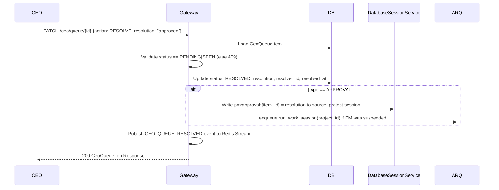
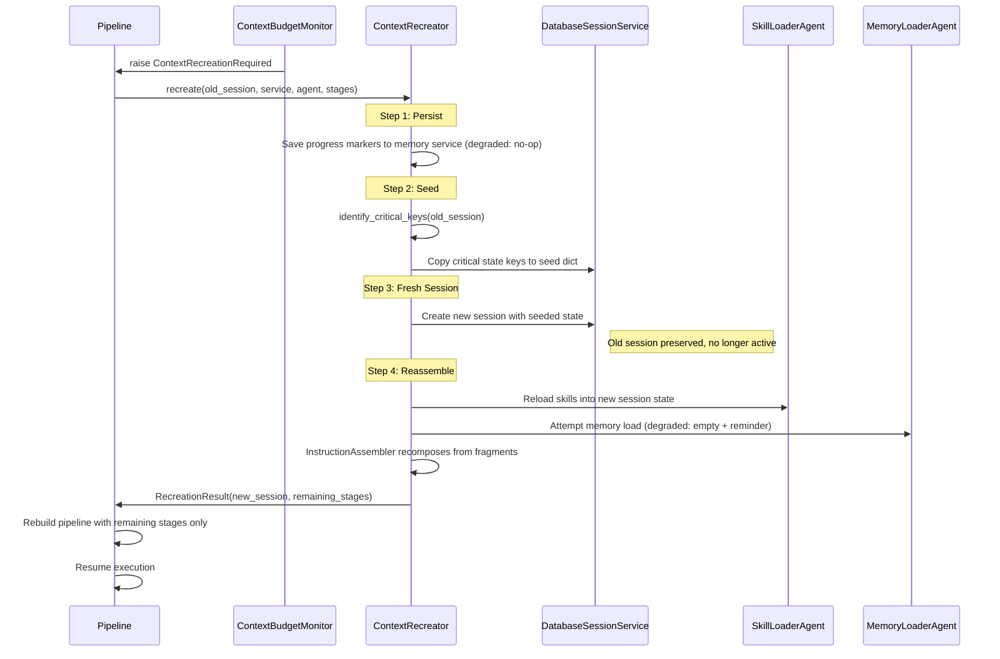
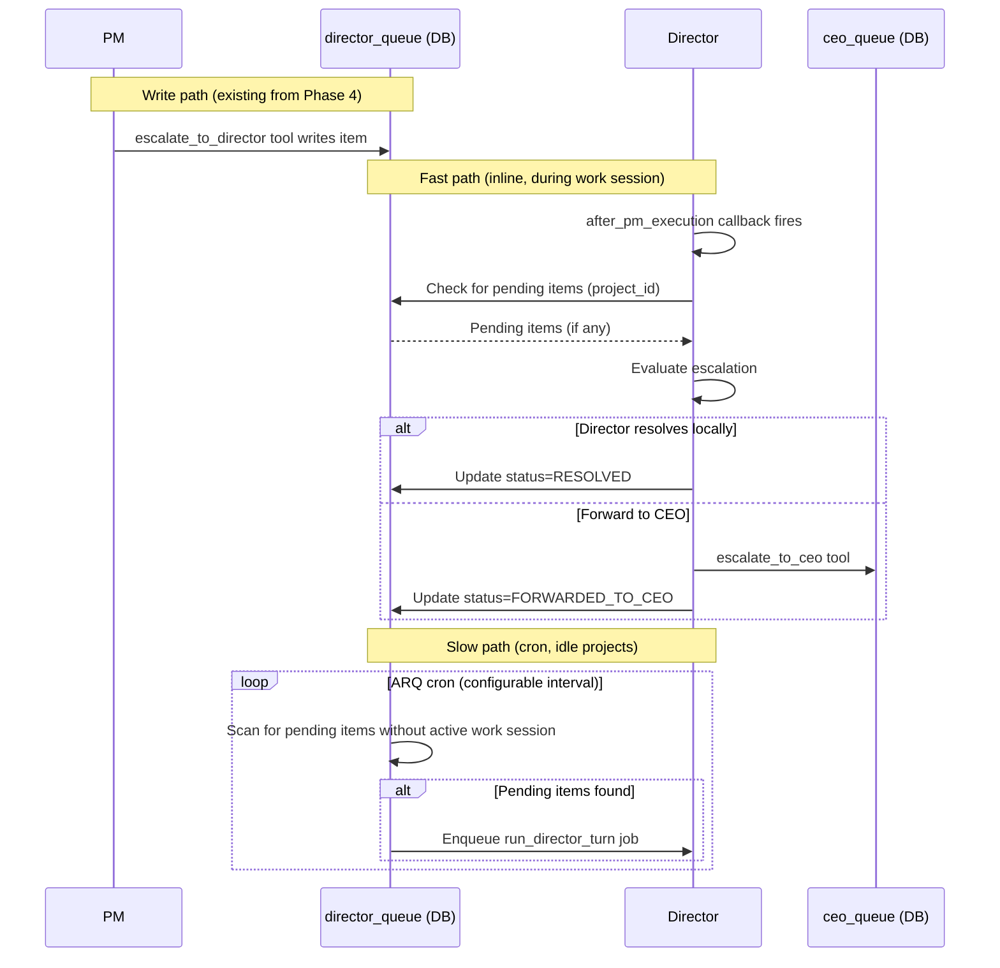
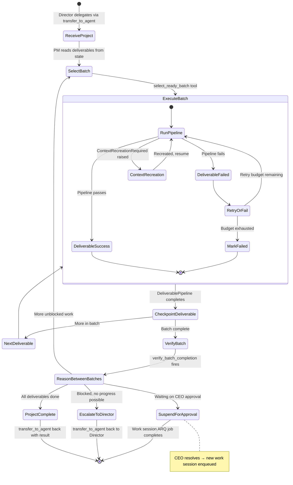
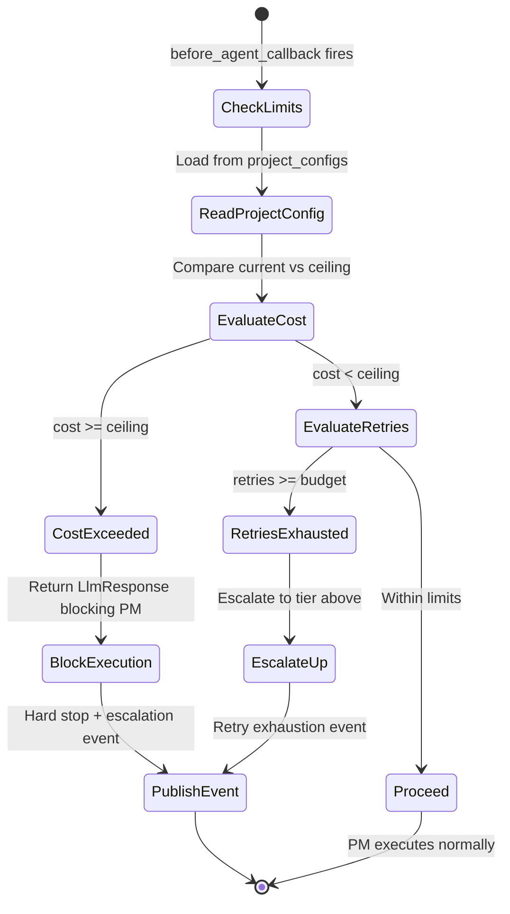

# Phase 5b Model: Supervision & Integration
*Generated: 2026-03-11*

## Component Diagram

```mermaid
flowchart TB
    subgraph GATEWAY["GATEWAY LAYER"]
        CeoQueueRoutes["CEO Queue Routes\nGET /ceo/queue\nPATCH /ceo/queue/{id}"]
        ChatRoutes["Chat Routes (upgrade)\nPOST /chat/{session_id}/messages\nGET /chat/{session_id}/messages"]
        CeoQueueModels["CEO Queue Pydantic Models\nCeoQueueItemResponse\nResolveCeoQueueItemRequest"]
        Writeback["CEO Approval Writeback\nwrite_approval_to_session()"]
    end

    subgraph WORKER["WORKER LAYER"]
        ChatHandler["Chat Session Handler\nrun_director_turn (upgrade)\nPer-message runner.run_async"]
        DirQueueCron["Director Queue Cron\nprocess_director_queue()\nARQ periodic task"]
        AgentTreeBuilder["build_agent_tree() upgrade\nDirector + PM sub_agents"]
    end

    subgraph ENGINE["ENGINE LAYER"]
        subgraph SUPERVISION["Supervision"]
            Delegation["Director-PM Delegation\ntransfer_to_agent"]
            Escalation["PM-Director Escalation\ntransfer_to_agent back"]
            HardLimits["Hard Limits Cascade\nCEO→Director→PM→Worker"]
            SuperCB["Supervision Callbacks\nbefore_agent_callback\nafter_agent_callback"]
            BatchVerify["verify_batch_completion\nafter_agent_callback on PM"]
            Checkpoint["checkpoint_project\nafter_agent_callback on Pipeline"]
            DirQueueConsume["Director Queue Consumption\nRead/resolve pending escalations"]
        end

        subgraph DIRECTOR_CFG["Director Configuration"]
            Formation["Director Formation\nuser: scope artifacts\nSettings conversation"]
            MainSession["Main Chat Session\nPermanent portfolio context"]
            SettingsSession["Settings Session\nFormation & evolution"]
        end

        subgraph CONTEXT["Context Management"]
            SysReminders["System Reminders\nbefore_model_callback injection"]
            Recreation["Context Recreation Pipeline\nPersist→Seed→Fresh→Reassemble"]
        end

        StateKeyAuth["State Key Authorization\nTier-prefix ACL on writes"]
    end

    subgraph INFRA["INFRASTRUCTURE LAYER"]
        DB[(Database\nceo_queue, director_queue\nproject_configs, sessions)]
        Redis[(Redis\nStreams, ARQ queue)]
        SessionSvc["DatabaseSessionService\nState persistence"]
    end

    ChatRoutes -->|enqueue| ChatHandler
    CeoQueueRoutes -->|read/write| DB
    CeoQueueRoutes -->|on resolve| Writeback
    Writeback -->|write state| SessionSvc
    ChatHandler -->|build agent| AgentTreeBuilder
    AgentTreeBuilder -->|construct| Delegation
    Delegation -->|transfer| Escalation
    SuperCB -->|monitor| Delegation
    SuperCB -->|monitor| Escalation
    BatchVerify -->|publish| Redis
    Checkpoint -->|write state| SessionSvc
    DirQueueCron -->|enqueue| ChatHandler
    DirQueueConsume -->|read| DB
    StateKeyAuth -->|publish violation| Redis
    Recreation -->|create session| SessionSvc
    SysReminders -->|before_model_callback| Delegation
    Formation -->|read/write| SessionSvc
    SettingsSession -->|session| SessionSvc
    MainSession -->|session| SessionSvc
    HardLimits -->|read config| DB
```



## L2 Architecture Conformance

| Component | BOM ID | L2 Architecture File | Section |
|---|---|---|---|
| `GET /ceo/queue` | G12 | `architecture/gateway.md` | Route Structure |
| `PATCH /ceo/queue/{id}` | G13 | `architecture/gateway.md` | Route Structure |
| `POST /chat/{session_id}/messages` | G10 | `architecture/gateway.md` | Route Structure |
| `GET /chat/{session_id}/messages` | G11 | `architecture/gateway.md` | Route Structure |
| Director → PM delegation | A05 | `architecture/agents.md` | PM Agent, Agent Communication via Session State |
| PM → Director escalation | A06 | `architecture/agents.md` | PM Agent, Agent Communication via Session State |
| Hard limits cascade | A07 | `architecture/agents.md` | PM Agent |
| Director formation artifacts (user: scope) | A08 | `architecture/agents.md` | Director Agent |
| Director formation logic (Settings conversation) | A09 | `architecture/agents.md` | Director Agent |
| Director "Main" chat session | A13 | `architecture/agents.md` | Director Agent |
| `before_agent_callback` (supervision) | A14 | `architecture/agents.md` | PM Agent |
| `after_agent_callback` (supervision) | A15 | `architecture/agents.md` | PM Agent |
| Director queue consumption | A16 | `architecture/agents.md` | Director Agent |
| `verify_batch_completion` | A40 | `architecture/agents.md` | PM Agent |
| `checkpoint_project` | A41 | `architecture/agents.md` | PM Agent |
| System reminder injection | A58 | `architecture/agents.md` | Context Management; `architecture/context.md` System Reminders |
| Context recreation mechanism | A59 | `architecture/context.md` | Context Recreation |
| Chat session model | A70 | `architecture/execution.md` | Multi-Session Architecture |
| State key authorization | A79 | `architecture/agents.md` | Agent Communication via Session State |
| CEO approval → session writeback | V18 | `architecture/events.md` | Unified CEO Queue |
| Context recreation pipeline | CT05 | `architecture/context.md` | Context Recreation |

## Major Interfaces

### Supervision Callbacks

```python
from google.adk.agents import BaseAgent
from google.adk.agents.callback_context import CallbackContext
from google.adk.models import LlmResponse
from typing import Protocol


class SupervisionCallbacksProtocol(Protocol):
    """Director supervision hooks attached to PM agents."""

    async def before_pm_execution(
        self,
        callback_context: CallbackContext,
    ) -> LlmResponse | None:
        """Check hard limits before PM executes. Return LlmResponse to block, None to proceed.
        Reads project config from session state, compares cost/retry usage against limits.
        Publishes supervision event to Redis Stream."""
        ...

    async def after_pm_execution(
        self,
        callback_context: CallbackContext,
    ) -> LlmResponse | None:
        """Capture PM completion status, detect escalation signals.
        Reads PM output_key and escalation context from session state.
        Checks Director Queue inline for pending items (fast path).
        Publishes status event to Redis Stream. Returns None (observation only)."""
        ...
```

### Pipeline Callbacks

```python
class PipelineCallbacksProtocol(Protocol):
    """Deterministic callbacks on DeliverablePipeline and PM batch loop."""

    async def checkpoint_project(
        self,
        callback_context: CallbackContext,
    ) -> None:
        """after_agent_callback on DeliverablePipeline. Fires after each deliverable.
        Persists deliverable status + pipeline output to durable state via state_delta.
        Non-discretionary — fires regardless of success or failure."""
        ...

    async def verify_batch_completion(
        self,
        callback_context: CallbackContext,
    ) -> None:
        """after_agent_callback on PM. Fires after batch completes.
        Validates all deliverables reached terminal state. Logs batch result.
        Writes batch_result to session state for PM inter-batch reasoning."""
        ...
```

### Context Recreation

```python
from google.adk.sessions import BaseSessionService, Session


class ContextRecreationProtocol(Protocol):
    """Handles the 4-step context recreation process."""

    async def recreate(
        self,
        old_session: Session,
        session_service: BaseSessionService,
        agent_name: str,
        pipeline_stages: list[str],
    ) -> RecreationResult:
        """Execute full 4-step recreation: persist → seed → fresh session → reassemble.
        Returns RecreationResult with new session and remaining pipeline stages.
        Raises RecreationError on failure (session creation, seed, reassembly)."""
        ...

    def identify_critical_keys(self, session: Session) -> list[str]:
        """Identify state keys to seed into fresh session.
        Critical keys: deliverable status, batch position, hard limits,
        loaded_skill_names, agent output_keys from completed stages."""
        ...

    def determine_remaining_stages(
        self, all_stages: list[str], session: Session
    ) -> list[str]:
        """Determine which pipeline stages have not completed.
        Uses persisted deliverable state keys (not ADK events)."""
        ...
```

### State Key Authorization

```python
class StateKeyAuthorizerProtocol(Protocol):
    """Validates state writes against tier-based ACL."""

    def validate_state_delta(
        self,
        state_delta: dict[str, object],
        author_tier: AgentTier,
    ) -> StateValidationResult:
        """Check all keys in delta against author tier.
        Rejects entire delta if any key violates (atomic rejection).
        Returns result with valid flag, and on failure: violating key, required tier."""
        ...
```

### CEO Queue Service

```python
from uuid import UUID


class CeoQueueServiceProtocol(Protocol):
    """Business logic for CEO queue operations."""

    async def list_items(
        self,
        type_filter: CeoItemType | None,
        priority_filter: EscalationPriority | None,
        status_filter: CeoQueueStatus | None,
        limit: int,
        offset: int,
    ) -> list[CeoQueueItemResponse]:
        """Query CEO queue with optional filters.
        Ordered by priority DESC, created_at ASC."""
        ...

    async def resolve_item(
        self,
        item_id: UUID,
        resolution: str,
        resolver_id: str,
    ) -> CeoQueueItemResponse:
        """Resolve a queue item. Rejects if already resolved/dismissed.
        For APPROVAL type: triggers session state writeback."""
        ...

    async def dismiss_item(
        self, item_id: UUID, resolver_id: str
    ) -> CeoQueueItemResponse:
        """Dismiss a queue item. No writeback triggered."""
        ...
```

### Director Formation

```python
class DirectorFormationProtocol(Protocol):
    """Manages Director formation artifacts and Settings session."""

    async def ensure_formation_state(
        self,
        session_service: BaseSessionService,
        user_id: str,
    ) -> FormationStatus:
        """Check formation status. If missing, set to PENDING.
        Returns current formation status."""
        ...

    async def write_artifact(
        self,
        session_service: BaseSessionService,
        user_id: str,
        key: str,  # one of DIRECTOR_IDENTITY_KEY, CEO_PROFILE_KEY, OPERATING_CONTRACT_KEY
        value: str,
    ) -> None:
        """Write a formation artifact to user: scope.
        Updates formation_status to COMPLETE when all three artifacts exist."""
        ...

    async def reset_formation(
        self,
        session_service: BaseSessionService,
        user_id: str,
    ) -> None:
        """Clear all three artifact keys and reset formation_status to PENDING."""
        ...
```

### System Reminders

```python
from google.adk.models import LlmRequest


class SystemReminderInjectorProtocol(Protocol):
    """Injects ephemeral governance nudges before LLM calls."""

    def collect_reminders(
        self,
        callback_context: CallbackContext,
    ) -> list[str]:
        """Gather relevant reminders: context budget %, state changes, progress.
        Returns empty list when nothing to inject."""
        ...

    def inject_reminders(
        self,
        llm_request: LlmRequest,
        reminders: list[str],
    ) -> None:
        """Add reminders to LlmRequest. Mutates request in-place.
        No-op if reminders list is empty."""
        ...
```

## Key Type Definitions

### Enums

```python
import enum


class AgentTier(str, enum.Enum):
    """Tier for state key authorization."""
    DIRECTOR = "DIRECTOR"
    PM = "PM"
    WORKER = "WORKER"


class FormationStatus(str, enum.Enum):
    """Director formation conversation state."""
    PENDING = "PENDING"
    IN_PROGRESS = "IN_PROGRESS"
    COMPLETE = "COMPLETE"


class SupervisionEventType(str, enum.Enum):
    """Types of supervision events published to Redis Streams."""
    PM_INVOCATION = "PM_INVOCATION"
    PM_COMPLETION = "PM_COMPLETION"
    ESCALATION_DETECTED = "ESCALATION_DETECTED"
    LIMIT_EXCEEDED = "LIMIT_EXCEEDED"
    STATE_AUTH_VIOLATION = "STATE_AUTH_VIOLATION"
```

Note: `CeoItemType`, `EscalationPriority`, `CeoQueueStatus`, `DirectorQueueStatus`, and `DeliverableStatus` already exist in `app/models/enums.py` from Phase 0/4/5a.

### Gateway Models

```python
from datetime import datetime
from uuid import UUID
from pydantic import BaseModel


class CeoQueueAction(str, enum.Enum):
    """Actions on CEO queue items."""
    RESOLVE = "RESOLVE"
    DISMISS = "DISMISS"


class CeoQueueItemResponse(BaseModel):
    """CEO queue item returned from API."""
    id: UUID
    type: CeoItemType
    priority: EscalationPriority
    status: CeoQueueStatus
    source_project: str
    source_agent: str
    title: str
    metadata: dict[str, object]
    resolution: str | None
    resolver_id: str | None
    resolved_at: datetime | None
    created_at: datetime
    updated_at: datetime


class ResolveCeoQueueItemRequest(BaseModel):
    """Request to resolve or dismiss a CEO queue item."""
    action: CeoQueueAction  # RESOLVE or DISMISS
    resolution: str | None  # Required for RESOLVE, ignored for DISMISS


class CeoQueueListParams(BaseModel):
    """Query parameters for CEO queue list."""
    type: CeoItemType | None = None
    priority: EscalationPriority | None = None
    status: CeoQueueStatus | None = None
    limit: int = 50
    offset: int = 0
```

### Internal DTOs

```python
from dataclasses import dataclass


@dataclass(frozen=True)
class RecreationResult:
    """Result of context recreation process."""
    new_session: Session
    remaining_stages: list[str]
    seeded_keys: list[str]
    memory_available: bool  # False in degraded mode (Phase 5b)


@dataclass(frozen=True)
class StateValidationResult:
    """Result of state key authorization check."""
    valid: bool
    violating_key: str | None = None
    author_tier: AgentTier | None = None
    required_tier: AgentTier | None = None
    all_keys: list[str] | None = None  # Full key list for error event


@dataclass(frozen=True)
class SupervisionEvent:
    """Published to Redis Streams for supervision audit."""
    event_type: SupervisionEventType
    project_id: str
    agent_name: str
    details: dict[str, object]


@dataclass(frozen=True)
class BatchResult:
    """Batch completion summary written to session state."""
    batch_id: str
    total: int
    completed: int
    failed: int
    deliverable_statuses: dict[str, DeliverableStatus]  # deliverable_id → terminal status


@dataclass(frozen=True)
class DirectorFormationArtifacts:
    """Structured formation artifacts from Director-CEO Settings conversation."""
    director_identity: str | None   # user:director_identity
    ceo_profile: str | None         # user:ceo_profile
    operating_contract: str | None  # user:operating_contract
    formation_status: FormationStatus
```

### State Key Constants

```python
# State key patterns used across Phase 5b components.
# Tier-prefixed keys enforce authorization via StateKeyAuthorizer.

# Director-tier keys (writable by Director only via tier-prefix ACL)
DIRECTOR_GOVERNANCE_KEY = "director:governance_override"     # director: prefix
DIRECTOR_QUEUE_PROCESSED_KEY = "director:last_queue_check"   # director: prefix

# ADK user: scope keys — formation artifacts
# Scoped by ADK's session service, not tier-prefix ACL
DIRECTOR_IDENTITY_KEY = "user:director_identity"             # user: scope — Director personality
CEO_PROFILE_KEY = "user:ceo_profile"                         # user: scope — CEO working style/preferences
OPERATING_CONTRACT_KEY = "user:operating_contract"           # user: scope — Autonomy/escalation/feedback norms
FORMATION_STATUS_KEY = "user:formation_status"               # user: scope — PENDING | IN_PROGRESS | COMPLETE

# PM-tier keys (writable by PM + Director)
PM_BATCH_POSITION_KEY = "pm:batch_position"                  # pm: prefix
PM_ESCALATION_CONTEXT_KEY = "pm:escalation_context"          # pm: prefix

# Approval resolution key pattern (writable by system/gateway)
APPROVAL_RESOLUTION_KEY = "pm:approval:{item_id}"            # pm: prefix, well-known pattern

# Shared workspace keys (writable by all tiers)
DELIVERABLE_STATUS_PREFIX = "deliverable_status:"            # no prefix
BATCH_RESULT_KEY = "batch_result"                            # no prefix
```

## Data Flow

### Chat Message Flow

```mermaid
sequenceDiagram
    participant CEO
    participant Gateway
    participant ARQ
    participant Worker
    participant SessionSvc as DatabaseSessionService
    participant Director as Director Agent

    CEO->>Gateway: POST /chat/{session_id}/messages
    Gateway->>Gateway: Validate + persist ChatMessage(USER)
    Gateway->>ARQ: enqueue run_director_turn(session_id, message)
    Gateway-->>CEO: 202 Accepted

    ARQ->>Worker: dequeue job
    Worker->>Worker: ensure_formation_state(user_id)
    Worker->>Worker: build_agent_tree(registry, project_ids, ctx)
    Worker->>SessionSvc: get_or_create session
    Worker->>Director: runner.run_async(user_message)
    Director-->>Worker: response text
    Worker->>Gateway: persist ChatMessage(DIRECTOR, response)
    Worker->>Worker: publish supervision event to Redis Stream

    CEO->>Gateway: GET /chat/{session_id}/messages
    Gateway-->>CEO: [ChatMessage(USER), ChatMessage(DIRECTOR)]
```



### CEO Queue Resolution + Writeback Flow



### Context Recreation Flow



### Director Queue Processing Flow



## Logic / Process Flow

### PM Autonomous Loop (Sequential Mode)



### Hard Limits Enforcement



### State Key Authorization

- On every `Event` yielded with `state_delta`:
  1. Extract all keys from `state_delta`
  2. For each key, check tier prefix: `director:` → DIRECTOR only, `pm:` → PM + DIRECTOR, `worker:` → all tiers, `app:` → PM + DIRECTOR, no prefix → all tiers
  3. Compare author tier against required tier
  4. If ANY key violates: reject entire delta, publish error event with details, return error to agent
  5. If all keys pass: apply delta normally

This is a synchronous check (~1ms), not a database lookup. The prefix→tier mapping is a constant dict.

## Integration Points

### Existing System

| Component | Interface | How This Phase Uses It |
|-----------|-----------|----------------------|
| `DatabaseSessionService` (Phase 3) | ADK session API | All state persistence: formation artifacts, deliverable status, batch position, approval writeback |
| `EventPublisher` (Phase 3) | `publish()`, `publish_lifecycle()` | Supervision events, state authorization violations, CEO queue lifecycle events |
| `AgentRegistry` (Phase 5a) | `build()`, `scan()` | Build Director + PM agents from definition files with callbacks attached |
| `InstructionAssembler` (Phase 5a) | `assemble()` | Reassemble instructions during context recreation |
| `ContextBudgetMonitor` (Phase 5a) | `before_model_callback` | Raises `ContextRecreationRequired` — Phase 5b catches and handles |
| `ContextRecreationRequired` (Phase 5a) | Exception class | Signal caught by pipeline runner to initiate 4-step recreation |
| `DeliverablePipeline` (Phase 5a) | `SequentialAgent` | Checkpoint callback attached; recreation rebuilds reduced pipeline |
| `NullSkillLibrary` (Phase 5a) | `SkillLibraryProtocol` | Skills return empty in degraded mode; recreation reloads via SkillLoaderAgent |
| `GlobalToolset` (Phase 4) | `get_tools_for_role()` | PM and Director tool vending for delegation/escalation |
| `LlmRouter` (Phase 3) | `select_model()` | Model selection for Director (opus) and PM (sonnet) |
| `ARQ WorkerSettings` (Phase 3) | Cron jobs, task functions | Add `process_director_queue` cron, upgrade `run_director_turn` |
| `Chat` / `ChatMessage` ORM (Phase 3) | SQLAlchemy models | Chat session persistence for Director interaction |
| `ceo_queue` table (Phase 5a) | SQLAlchemy model | CEO queue CRUD operations |
| `director_queue` table (Phase 5a) | SQLAlchemy model | Director reads/resolves pending PM escalations |
| `project_configs` table (Phase 5a) | SQLAlchemy model | Hard limits read by supervision callbacks |
| Chat gateway routes (pre-Phase 5) | `POST /chat/{id}/messages`, `GET /chat/{id}/messages` | Upgrade: wire to real Director agent instead of stub |

### Future Phase Extensions

| Extension Point | Future Phase | Preparation |
|----------------|-------------|-------------|
| `verify_batch_completion` callback | Phase 8a | Batch failure threshold counter (X11) plugs into this callback |
| `checkpoint_project` callback | Phase 8a | Parallel execution adds per-worktree checkpoint via same callback shape |
| Context recreation `memory_available` flag | Phase 9 | PostgresMemoryService replaces InMemoryMemoryService; recreation uses real memory |
| State key authorization ACL | Phase 11 | Adaptive router and token tracking write `app:` scoped keys; ACL already supports this |
| Director Queue cron interval | Phase 8a+ | Configurable via `AUTOBUILDER_DIRECTOR_QUEUE_INTERVAL` setting |
| System reminders | Phase 11 | Token tracking plugin provides actual cost data for budget reminders |
| CEO queue SSE stream | Phase 10 | `GET /ceo/queue/stream` (G14) adds real-time push; polling infrastructure from 5b remains |
| Supervision callbacks | Phase 8a | Parallel batch execution uses same before/after callback shape |
| `build_agent_tree()` | Phase 8a | Multi-project concurrent PM agents; same tree construction pattern |

## Notes

- **ADK `transfer_to_agent` semantics**: Delegation relies on ADK's native agent transfer. Test early — verify it preserves session state across LlmAgent→LlmAgent transfers. The FRD Rabbit Holes section flags this as critical path.

- **Approval writeback concurrency**: Gateway writes `pm:approval:{item_id}` to session state while PM may be mid-execution. The well-known key pattern avoids mutating arbitrary state. PM discovers resolutions via `select_ready_batch` tool (poll, not push). If `DatabaseSessionService` caches state, the writeback must bypass the cache.

- **Context recreation is the critical complexity**: The 4-step process (persist→seed→fresh→reassemble) with pipeline stage reconstruction is the hardest component. Degraded mode (no memory) simplifies Phase 5b but the interface must support full mode for Phase 9.

- **Supervision callback overhead**: FR-5b.47 before_agent_callback and FR-5b.49 after_agent_callback must add <5ms. They read project config from session state (already in memory) and publish a Redis Stream event. No DB queries, no LLM calls.

- **Director formation idempotency**: `ensure_formation_state()` checks `user:formation_status` in session state. If present, returns it. If missing, sets to `PENDING`. Formation artifacts are written only through the Settings conversation. `write_artifact()` checks if all three exist and transitions to `COMPLETE` automatically (FR-5b.05, FR-5b.06).

- **Main session auto-creation**: When CEO chats without specifying a project, the system routes to the "Main" session. If it doesn't exist, it's created with a well-known session ID pattern (e.g., `main_{user_id}`).

---

*Document Version: 1.0*
*Phase: 5b -- Supervision & Integration*
*Last Updated: 2026-03-11*
