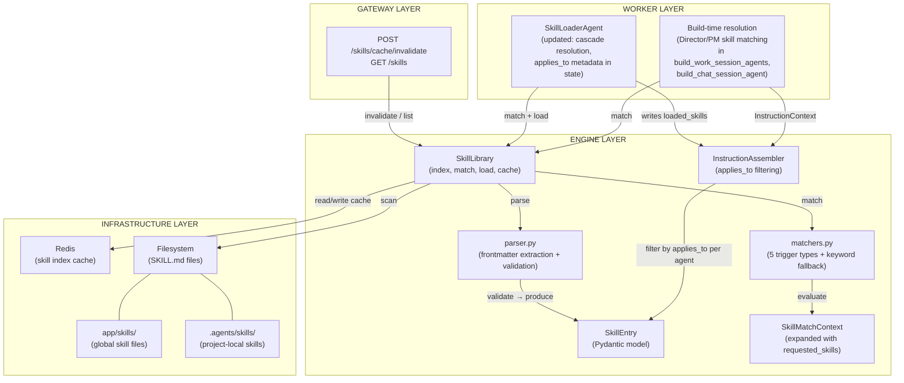
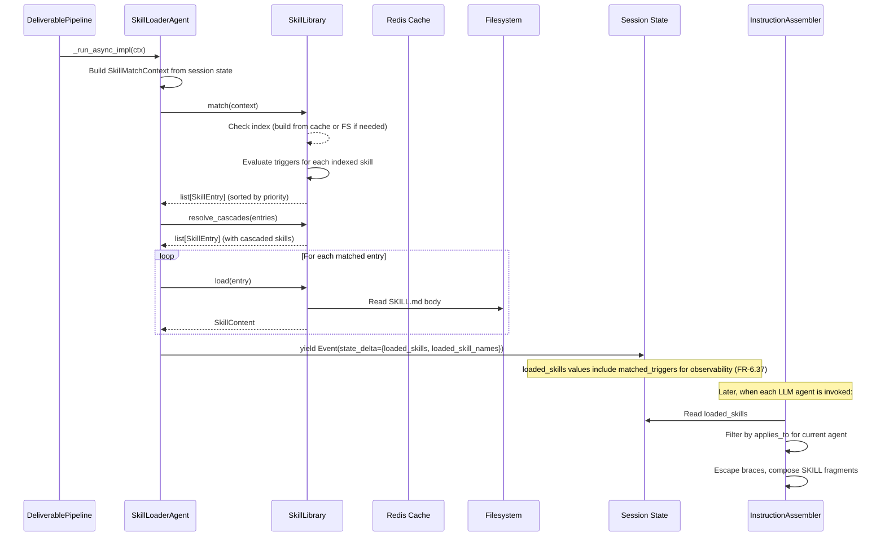
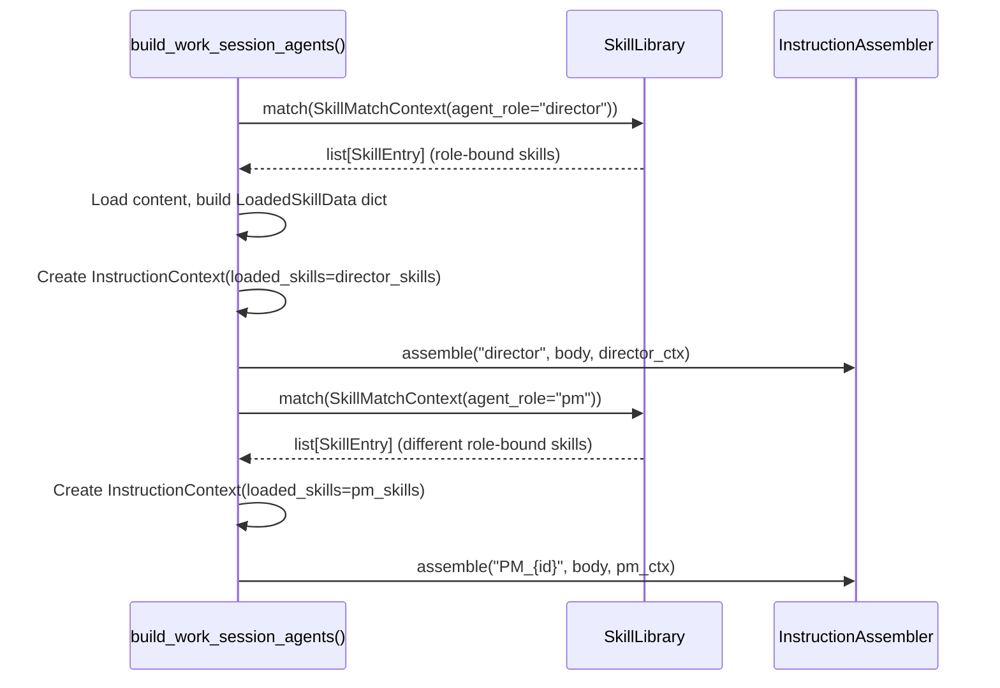
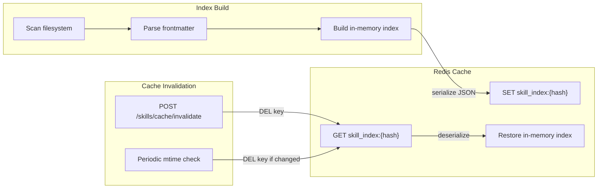
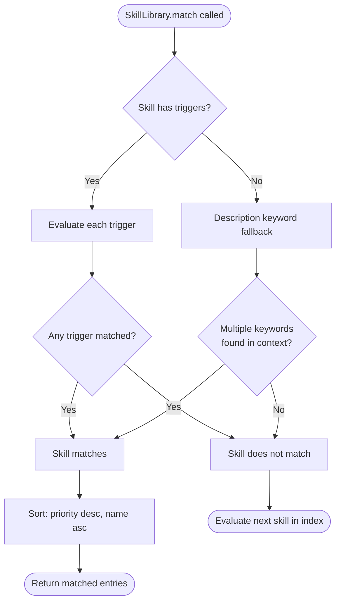
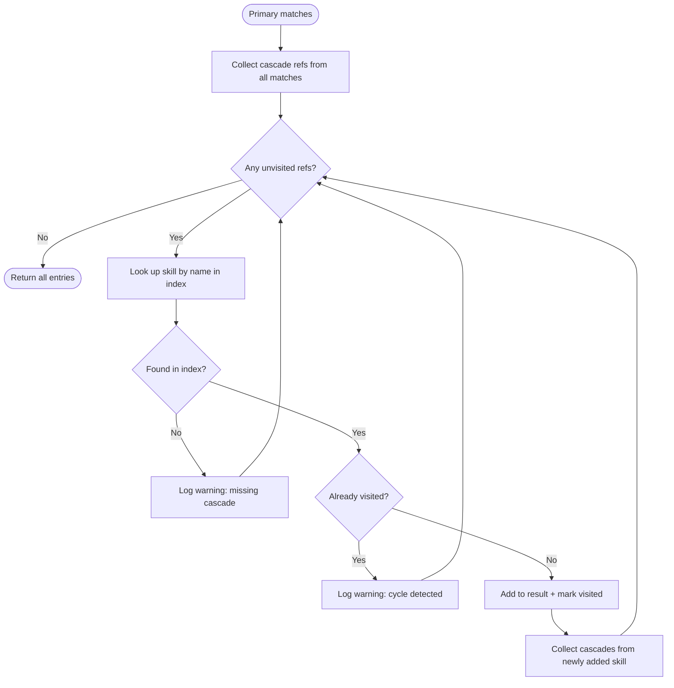
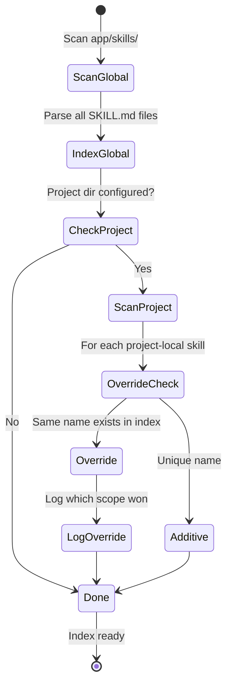

# Phase 6 Model: Skills System
*Generated: 2026-03-11*

## Component Diagram



## L2 Architecture Conformance

| Component | L2 Architecture File | Section |
|---|---|---|
| `SkillEntry` Pydantic model (S01) | `architecture/skills.md` | Skill File Format |
| `SkillLibrary` class (S02) | `architecture/skills.md` | Two-Tier Library |
| Frontmatter parser (S03) | `architecture/skills.md` | Skill File Format |
| `deliverable_type` trigger matcher (S04) | `architecture/skills.md` | Trigger Matching |
| `file_pattern` trigger matcher (S05) | `architecture/skills.md` | Trigger Matching |
| `tag_match` trigger matcher (S06) | `architecture/skills.md` | Trigger Matching |
| `explicit` trigger matcher (S07) | `architecture/skills.md` | Trigger Matching |
| `always` trigger matcher (S08) | `architecture/skills.md` | Trigger Matching |
| Description keyword fallback (S09) | `architecture/skills.md` | Trigger Matching — Interoperability |
| Two-tier scan (S10) | `architecture/skills.md` | Two-Tier Library |
| `InstructionAssembler` applies_to filtering (S12) | `architecture/skills.md` | ADK Integration |
| Skill index Redis cache (S13) | `architecture/skills.md` | Two-Tier Library — Caching |
| Skill cache invalidation (S14) | `architecture/skills.md` | Two-Tier Library — Caching |
| Skill cascade resolution (S15) | `architecture/skills.md` | Skill Cascading |
| Supervision-tier skill resolution (S16) | `architecture/skills.md` | Supervision-Tier Skill Resolution |
| Skill validation function (S17) | `architecture/skills.md` | Autonomous Skill Creation |
| `app/skills/` directory structure (S20) | `architecture/skills.md` | Directory Layout |
| `.agents/skills/` project-local directory (S21) | `architecture/skills.md` | Directory Layout |
| Skill: `code/api-endpoint` (S22) | `architecture/skills.md` | Directory Layout |
| Skill: `code/data-model` (S23) | `architecture/skills.md` | Directory Layout |
| Skill: `code/database-migration` (S24) | `architecture/skills.md` | Directory Layout |
| Skill: `review/security-review` (S25) | `architecture/skills.md` | Directory Layout |
| Skill: `review/performance-review` (S26) | `architecture/skills.md` | Directory Layout |
| Skill: `test/unit-test-patterns` (S27) | `architecture/skills.md` | Directory Layout |
| Skill: `planning/task-decomposition` (S28) | `architecture/skills.md` | Directory Layout |
| Director/PM role-bound skills (S32) | `architecture/skills.md` | Supervision-Tier Skill Resolution |
| Skill: `authoring/skill-authoring` (S33) | `architecture/skills.md` | Autonomous Skill Creation |
| Skill: `authoring/agent-definition` (S34) | `architecture/skills.md` | Directory Layout |
| Skill: `authoring/workflow-authoring` (S35) | `architecture/skills.md` | Directory Layout |
| Skill: `authoring/project-conventions` (S36) | `architecture/skills.md` | Directory Layout |
| Skill index cache — long TTL (M21) | `architecture/state.md` | §9.5 Redis Cache |

**Cross-cutting integration** (not BOM components; existing components updated by this phase):

| Component | L2 Architecture File | Section |
|---|---|---|
| SkillLoaderAgent updates | `architecture/agents.md` | Worker-Tier Custom Agents |
| Build-time resolution (adk.py) | `architecture/agents.md` | Agent Definitions — How Definitions Resolve |

## Major Interfaces

### SkillLibraryProtocol (expanded)

The existing protocol in `app/agents/protocols.py` is the contract. Phase 6 replaces `NullSkillLibrary` with a real implementation. The protocol itself gains no new methods — `match()` and `load()` remain the two operations. The types they operate on expand.

```python
class SkillLibraryProtocol(Protocol):
    """Interface for skill resolution — unchanged from Phase 5a."""

    def match(self, context: SkillMatchContext) -> list[SkillEntry]: ...
    def load(self, entry: SkillEntry) -> SkillContent: ...
```

### SkillLibrary (concrete class)

```python
class SkillLibrary:
    """Production skill library: filesystem scan, trigger matching, Redis caching."""

    def __init__(
        self,
        global_dir: Path,
        project_dir: Path | None = None,
        redis: ArqRedis | None = None,
    ) -> None: ...

    def scan(self) -> None:
        """Recursively scan configured directories, parse frontmatter, build index.
        Global first, project-local second (overrides by name)."""
        ...

    def match(self, context: SkillMatchContext) -> list[SkillEntry]:
        """Deterministic trigger matching. Returns sorted by priority desc, name asc."""
        ...

    def load(self, entry: SkillEntry) -> SkillContent:
        """Load full markdown body for a matched entry."""
        ...

    def resolve_cascades(self, entries: list[SkillEntry]) -> list[SkillEntry]:
        """Transitively resolve cascade dependencies. Cycle-safe."""
        ...

    def get_index(self) -> dict[str, SkillEntry]:
        """Return the full index (name → entry). For inspection/catalog."""
        ...

    async def save_to_cache(self) -> None:
        """Serialize index to Redis. Atomic: old index serves until new is ready."""
        ...

    async def load_from_cache(self) -> bool:
        """Load index from Redis cache. Returns True if cache hit."""
        ...

    async def invalidate_cache(self) -> None:
        """Delete cached index. Next access triggers filesystem rescan."""
        ...
```

### Frontmatter Parser

```python
def parse_skill_frontmatter(file_path: Path) -> SkillEntry | None:
    """Parse YAML frontmatter from SKILL.md. Returns None on parse failure (logs warning).
    Lenient: unknown fields ignored. Strict on required fields (name, description)."""
    ...

def validate_skill_frontmatter(frontmatter: dict[str, object]) -> list[str]:
    """Validate frontmatter dict against schema. Returns list of error strings.
    Empty list = valid. Callable by agents before writing skill files."""
    ...
```

### Trigger Matchers

```python
class TriggerMatcher(Protocol):
    """Interface for a single trigger type evaluator."""

    def matches(self, trigger: TriggerSpec, context: SkillMatchContext) -> bool: ...


class DeliverableTypeMatcher:
    """Exact string match: trigger value == context.deliverable_type."""
    def matches(self, trigger: TriggerSpec, context: SkillMatchContext) -> bool: ...

class FilePatternMatcher:
    """Glob match: any file in context.file_patterns matches trigger pattern."""
    def matches(self, trigger: TriggerSpec, context: SkillMatchContext) -> bool: ...

class TagMatchMatcher:
    """Set intersection: any of context.tags overlaps with trigger tags."""
    def matches(self, trigger: TriggerSpec, context: SkillMatchContext) -> bool: ...

class ExplicitMatcher:
    """Named request: skill name in context.requested_skills."""
    def matches(self, trigger: TriggerSpec, context: SkillMatchContext) -> bool: ...

class AlwaysMatcher:
    """Unconditional match."""
    def matches(self, trigger: TriggerSpec, context: SkillMatchContext) -> bool: ...

class DescriptionKeywordMatcher:
    """Fallback for third-party skills without triggers.
    Multiple keywords from description must appear in context strings."""
    def matches_description(
        self, description: str, context: SkillMatchContext
    ) -> bool: ...
```

### InstructionAssembler (updated SKILL fragment)

No new interface — the existing `assemble()` signature is unchanged. The internal SKILL fragment logic changes to filter `loaded_skills` by `applies_to` per agent.

```python
class InstructionAssembler:
    def assemble(self, agent_name: str, body: str, ctx: InstructionContext) -> str:
        """Unchanged signature. SKILL fragment now filters ctx.loaded_skills
        by applies_to metadata — only skills where applies_to is empty
        or contains agent_name are included."""
        ...
```

### Gateway Skill Endpoints

```python
# In app/gateway/routes/ — thin route definitions
async def invalidate_skill_cache(
    skill_library: SkillLibrary = Depends(get_skill_library),
) -> dict[str, str]:
    """POST /skills/cache/invalidate — triggers cache invalidation and rescan."""
    ...

async def list_skills(
    skill_library: SkillLibrary = Depends(get_skill_library),
) -> list[SkillCatalogEntry]:
    """GET /skills — returns lightweight catalog (name + description)."""
    ...
```

## Key Type Definitions

### SkillEntry (expanded from dataclass to Pydantic)

```python
class TriggerSpec(BaseModel):
    """Single trigger condition in skill frontmatter."""
    trigger_type: TriggerType  # discriminator
    value: str = ""            # trigger-type-specific value (glob pattern, type name, etc.)

class CascadeRef(BaseModel):
    """Reference to a cascaded skill."""
    reference: str  # skill name

class SkillEntry(BaseModel):
    """Skill metadata from frontmatter. Replaces Phase 5a frozen dataclass."""
    model_config = ConfigDict(frozen=True)

    name: str
    description: str = ""
    triggers: list[TriggerSpec] = Field(default_factory=list)
    tags: list[str] = Field(default_factory=list)
    applies_to: list[str] = Field(default_factory=list)  # empty = all agents
    priority: int = 0  # higher loads first
    cascades: list[CascadeRef] = Field(default_factory=list)
    has_references: bool = False  # True if references/ subdir exists (FR-6.05)
    has_assets: bool = False      # True if assets/ subdir exists (FR-6.05)
    path: Path | None = None  # filesystem path to SKILL.md
```

### TriggerType Enum

```python
class TriggerType(enum.StrEnum):
    """Trigger types for skill matching."""
    DELIVERABLE_TYPE = "DELIVERABLE_TYPE"  # exact match on deliverable type
    FILE_PATTERN = "FILE_PATTERN"          # glob match on target files
    TAG_MATCH = "TAG_MATCH"               # set intersection on tags
    EXPLICIT = "EXPLICIT"                 # named request via requested_skills
    ALWAYS = "ALWAYS"                     # unconditional match
```

### SkillMatchContext (expanded)

```python
@dataclass(frozen=True)
class SkillMatchContext:
    """Context for skill matching — expanded from Phase 5a."""
    deliverable_type: str | None = None
    file_patterns: list[str] = field(default_factory=list)
    tags: list[str] = field(default_factory=list)
    agent_role: str | None = None
    requested_skills: list[str] = field(default_factory=list)  # NEW: for explicit trigger
```

### SkillContent (unchanged)

```python
@dataclass(frozen=True)
class SkillContent:
    """Loaded skill content — entry + full markdown body."""
    entry: SkillEntry
    content: str
```

### InstructionContext (updated loaded_skills type)

```python
@dataclass(frozen=True)
class InstructionContext:
    """Per-invocation data for instruction assembly."""
    project_config: str | None = None
    task_context: str | None = None
    loaded_skills: dict[str, LoadedSkillData] = field(default_factory=dict)  # CHANGED type
    agent_name: str = ""

class LoadedSkillData(TypedDict):
    """Skill content + metadata for per-agent filtering and observability."""
    content: str
    applies_to: list[str]  # empty = all agents
    matched_triggers: list[str]  # trigger types that caused match (FR-6.37 observability)
```

### Gateway Models

```python
class SkillCatalogEntry(BaseModel):
    """Lightweight skill entry for catalog API."""
    name: str
    description: str
    triggers: list[TriggerSpec]
    tags: list[str]
    applies_to: list[str]
    priority: int
    has_references: bool
    has_assets: bool
```

### SKILL.md Frontmatter Schema (YAML)

AutoBuilder extension fields live at the **top level** of frontmatter (not under `metadata`). This keeps the standard `metadata` field spec-compliant (string-to-string map) while other parsers simply ignore unknown top-level keys.

```yaml
---
name: api-endpoint                        # REQUIRED (Agent Skills standard)
description: REST API endpoint conventions  # REQUIRED (Agent Skills standard)
triggers:                                  # AutoBuilder extension (top-level)
  - deliverable_type: api_endpoint
  - file_pattern: "*/routes/*.py"
tags: [api, http, routing]                 # AutoBuilder extension
applies_to: [coder, reviewer]             # AutoBuilder extension
priority: 10                              # AutoBuilder extension (default: 0)
cascades:                                  # AutoBuilder extension
  - reference: error-handling
---

## Body content here (L2 — loaded on match)
```

## Data Flow

### Skill Loading: Pipeline Runtime (Workers)



### Skill Loading: Build Time (Director/PM)



### Skill Index Caching



## Logic / Process Flow

### Trigger Matching



### Cascade Resolution



### Two-Tier Override Resolution



### InstructionAssembler SKILL Filtering

When assembling instructions for agent `X`:
1. Read `loaded_skills` from `InstructionContext`
2. For each skill entry in `loaded_skills`:
   - If `applies_to` is empty → include for all agents
   - If `applies_to` contains `X` → include
   - Otherwise → skip
3. Sort included skills by priority desc, name asc
4. Escape braces, compose `## Skill: {name}` sections
5. Emit as single SKILL fragment

## Integration Points

### Existing System

| Component | Interface | How This Phase Uses It |
|-----------|-----------|----------------------|
| `SkillLibraryProtocol` (`app/agents/protocols.py`) | `match()`, `load()` | SkillLibrary implements this protocol, replacing NullSkillLibrary |
| `SkillLoaderAgent` (`app/agents/custom/skill_loader.py`) | `_run_async_impl` | Updated to call `resolve_cascades()` and write `LoadedSkillData` (with `applies_to`) to state |
| `InstructionAssembler` (`app/agents/assembler.py`) | `assemble()` | SKILL fragment logic updated to filter by `applies_to` per agent |
| `InstructionContext` (`app/agents/assembler.py`) | `loaded_skills` field | Type changed from `dict[str, str]` to `dict[str, LoadedSkillData]` |
| `SkillMatchContext` (`app/agents/protocols.py`) | dataclass fields | Add `requested_skills` field for explicit trigger |
| `build_work_session_agents()` (`app/workers/adk.py`) | function body | Add Director/PM skill resolution via `SkillLibrary.match()` — separate `InstructionContext` per tier |
| `build_chat_session_agent()` (`app/workers/adk.py`) | function body | Add Director skill resolution for chat sessions |
| `run_director_turn()` (`app/workers/adk.py`) | function body | Add Director skill resolution for Director queue processing turns |
| `EventPublisher` (`app/events/publisher.py`) | `translate()` | Existing — skill loading events flow through STATE_UPDATED events naturally |
| Redis (`app/gateway/deps.py`) | `ArqRedis` connection | Used for skill index caching (new key prefix `skill_index:`) |
| `context_recreation.py` | `_CRITICAL_KEY_PREFIXES` | `loaded_skill_names` already preserved — no changes needed |
| `FragmentType.SKILL` (`app/models/enums.py`) | enum member | Already exists — used by assembler |
| `app/skills/` directory | filesystem | Currently scaffold with `.gitkeep` — populated with actual skill files |

### Future Phase Extensions

| Extension Point | Future Phase | Preparation |
|----------------|-------------|-------------|
| Three-tier merge (workflow-specific skills) | Phase 7 | `SkillLibrary.__init__` accepts `project_dir` — Phase 7 adds `workflow_dir` parameter. `scan()` gains a third scan pass. |
| Workflow trigger matching | Phase 7 | `SkillLibrary.match()` already returns sorted entries — workflow matching adds to the trigger evaluation, not the interface. |
| `auto-code/skills/` directory | Phase 7 | Directory structure follows same pattern. `SkillLibrary` scans it as workflow tier between global and project. |
| `MemoryService` integration (real) | Phase 9 | `MemoryLoaderAgent` already in pipeline. Skills and memory are independent subsystems. |
| Skill effectiveness metrics | Phase 11+ | `loaded_skill_names` in session state and event stream provide the raw data. |
| Skill marketplace / registry | Phase 13+ | File format is the interop layer. Drop SKILL.md files in project directory. |
| L3 automatic loading | Future | `SkillEntry.path` records filesystem location. Agents can already read `references/` via file tools. |

## Notes

- **Frontmatter placement decision**: AutoBuilder extension fields (`triggers`, `tags`, `applies_to`, `priority`, `cascades`) go at YAML top level alongside `name`/`description`. This keeps the standard `metadata` field spec-compliant and other parsers ignore unknown top-level keys. Resolved per FRD rabbit hole.

- **SkillEntry migration**: `SkillEntry` changes from frozen dataclass (in `protocols.py`) to Pydantic `BaseModel` (in `app/skills/library.py` or a shared location). The `SkillLibraryProtocol` return type annotation references the expanded type. `SkillContent` stays as a frozen dataclass wrapping `SkillEntry` + `str`.

- **`loaded_skills` type change**: Session state `loaded_skills` changes from `dict[str, str]` to `dict[str, LoadedSkillData]` where `LoadedSkillData` is `{"content": str, "applies_to": list[str]}`. This is a breaking change to the `InstructionContext` type. All consumers (assembler, context recreation) must be updated. Since we're early-phase (zero backwards-compat shims), this is a clean replacement.

- **Description keyword fallback**: Conservative matching — extract significant words from `description` (>4 chars, not stopwords), require ≥2 keywords to appear across `{deliverable_type, tags, file_patterns}` context strings. This prevents false positives from single common words like "API".

- **Redis cache format**: JSON serialization of the index (`dict[str, serialized SkillEntry]`). `Path` objects → string. Atomic via SET-then-DEL-old pattern. Cache key: `autobuilder:skill_index:{scope_hash}` where scope_hash encodes global+project dir combination.

- **Gateway endpoint**: Minimal — `POST /skills/cache/invalidate` (triggers invalidation) and `GET /skills` (returns catalog). No CRUD for individual skills — filesystem is the source of truth. These are operator-facing endpoints, not pipeline-critical.

- **~390 LOC estimate for core library code** (per architecture doc). Skill file content and tests are additional.
