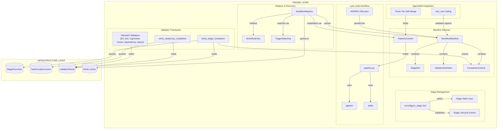

# Phase 7a Architecture Model
*Generated: 2026-04-11*

> L1/L2 architecture docs remain the source of truth. References point to
> authoritative sections. Builders should read referenced sections for full
> design contracts.

## Overview

Phase 7a transforms AutoBuilder from a single-pipeline system into a multi-workflow platform. It builds the WorkflowRegistry (discovery, caching, trigger matching, pipeline instantiation), the manifest schema with progressive disclosure, stage schema with PM-driven transitions, a validator framework producing machine-generated evidence, deterministic completion gates, three-layer verification reports, the auto-code workflow as reference implementation, and three-tier skill/agent merge. 50 BOM components across engine and infrastructure layers.

## Components

```yaml
components:
  # --- Engine Layer: Registry & Discovery ---
  - { id: F01, name: WorkflowRegistry, layer: engine, type: deterministic, location: app/workflows/registry.py, architecture_ref: "workflows.md §WorkflowRegistry", satisfies: [CAP-1, CAP-8, CAP-11], responsibility: "Discovers, indexes, caches, and instantiates workflow definitions from two-tier directory scan" }
  - { id: F06, name: WorkflowEntry, layer: engine, type: deterministic, location: app/workflows/registry.py, architecture_ref: "workflows.md §WorkflowRegistry", satisfies: [CAP-1], responsibility: "Lightweight index entry — name, description, pipeline_type, directory path, parsed triggers" }
  - { id: F02, name: WorkflowRegistry.match, layer: engine, type: deterministic, location: app/workflows/registry.py, architecture_ref: "workflows.md §WorkflowRegistry", satisfies: [CAP-11], responsibility: "Deterministic keyword/explicit trigger matching against indexed workflows" }
  - { id: F03, name: WorkflowRegistry.get, layer: engine, type: deterministic, location: app/workflows/registry.py, architecture_ref: "workflows.md §WorkflowRegistry", satisfies: [CAP-1], responsibility: "Explicit name lookup returning WorkflowEntry or raising NotFoundError" }
  - { id: F04, name: WorkflowRegistry.list_available, layer: engine, type: deterministic, location: app/workflows/registry.py, architecture_ref: "workflows.md §WorkflowRegistry", satisfies: [CAP-1], responsibility: "Returns all discovered workflows with name, description, pipeline_type" }
  - { id: F05, name: WorkflowRegistry.create_pipeline, layer: engine, type: deterministic, location: app/workflows/registry.py, architecture_ref: "workflows.md §WorkflowRegistry", satisfies: [CAP-8], responsibility: "Dynamic-imports workflow pipeline.py, invokes with PipelineContext, returns composed agent tree" }
  - { id: F20, name: WorkflowRegistry.get_manifest, layer: engine, type: deterministic, location: app/workflows/registry.py, architecture_ref: "workflows.md §WorkflowRegistry", satisfies: [CAP-1, CAP-2], responsibility: "Returns fully parsed WorkflowManifest for PM/Director reasoning" }
  - { id: F21, name: ManifestValidation, layer: engine, type: deterministic, location: app/workflows/registry.py, architecture_ref: "workflows.md §WorkflowRegistry", satisfies: [CAP-2], responsibility: "Schema validation at scan time — required fields, cross-references, non-blocking warnings" }
  - { id: F08, name: WorkflowTriggerKeyword, layer: engine, type: deterministic, location: app/workflows/registry.py, architecture_ref: "workflows.md §WorkflowRegistry", satisfies: [CAP-11], responsibility: "Keyword trigger matching — user request contains any declared keyword" }
  - { id: F09, name: WorkflowTriggerExplicit, layer: engine, type: deterministic, location: app/workflows/registry.py, architecture_ref: "workflows.md §WorkflowRegistry", satisfies: [CAP-11], responsibility: "Explicit trigger matching — user names workflow directly, takes precedence" }
  - { id: F10, name: WorkflowAmbiguityResolution, layer: engine, type: deterministic, location: app/workflows/registry.py, architecture_ref: "workflows.md §WorkflowRegistry", satisfies: [CAP-11], responsibility: "Returns all matches when multiple workflows match; caller resolves" }
  - { id: F12, name: UserLevelWorkflowDir, layer: engine, type: deterministic, location: app/workflows/registry.py, architecture_ref: "workflows.md §Architecture", satisfies: [CAP-1], responsibility: "Configurable user-level directory (~/.autobuilder/workflows/) overrides built-in by name" }

  # --- Engine Layer: Manifest Schema ---
  - { id: F07, name: WorkflowManifestSchema, layer: engine, type: deterministic, location: app/workflows/manifest.py, architecture_ref: "workflows.md §Workflow Manifest", satisfies: [CAP-2], responsibility: "YAML manifest format with progressive disclosure — 2-field minimum to full operating manual" }
  - { id: F19, name: WorkflowManifest, layer: engine, type: deterministic, location: app/workflows/manifest.py, architecture_ref: "workflows.md §Workflow Manifest", satisfies: [CAP-2], responsibility: "Pydantic model for all manifest fields — root fields, stages, validators, resources, etc." }
  - { id: F22, name: StageDef, layer: engine, type: deterministic, location: app/workflows/manifest.py, architecture_ref: "workflows.md §Stage Schema", satisfies: [CAP-3], responsibility: "Pydantic model for stage definition — agents, tools, skills, validators, completion, approval" }
  - { id: F24, name: ValidatorDefinition, layer: engine, type: deterministic, location: app/workflows/manifest.py, architecture_ref: "workflows.md §Validators & Quality Gates", satisfies: [CAP-6], responsibility: "Pydantic model for validator declaration — name, type, agent, schedule, config, required flag" }
  - { id: F23, name: CompletionCriteria, layer: engine, type: deterministic, location: app/workflows/manifest.py, architecture_ref: "workflows.md §Completion Criteria & Reports", satisfies: [CAP-5], responsibility: "Pydantic model for AND-composed completion dimensions (deliverables + validators + approval)" }
  - { id: F38, name: CompletionReport, layer: engine, type: deterministic, location: app/workflows/manifest.py, architecture_ref: "workflows.md §Completion Criteria & Reports", satisfies: [CAP-7], responsibility: "Pydantic model for stage/TaskGroup completion report — scope, layers, evidence, timestamp" }
  - { id: F11, name: RunConfig, layer: engine, type: deterministic, location: app/workflows/manifest.py, architecture_ref: "workflows.md §WorkflowRegistry", satisfies: [CAP-1], responsibility: "Configuration model for workflow execution request — workflow name, params, session overrides" }
  - { id: F43, name: ResourcesDef, layer: engine, type: deterministic, location: app/workflows/manifest.py, architecture_ref: "workflows.md §Workflow Manifest", satisfies: [CAP-2], responsibility: "Pydantic model for pre-execution resource validation — credentials, services, knowledge" }
  - { id: F59, name: McpServerDef, layer: engine, type: deterministic, location: app/workflows/manifest.py, architecture_ref: "workflows.md §Workflow Manifest", satisfies: [CAP-2], responsibility: "Pydantic model for MCP server metadata — name and required flag" }
  - { id: F58, name: PipelineContext, layer: engine, type: deterministic, location: app/workflows/context.py, architecture_ref: "workflows.md §Workflow Manifest", satisfies: [CAP-8], responsibility: "Frozen dataclass bundling shared infrastructure — registry, instruction_ctx, manifest, skill_library, toolset, callback" }
  - { id: F18, name: PipelineFactory, layer: engine, type: deterministic, location: app/workflows/context.py, architecture_ref: "workflows.md §WorkflowRegistry", satisfies: [CAP-8], responsibility: "Protocol for pipeline.py interface contract — async callable receiving PipelineContext, returning BaseAgent" }

  # --- Engine Layer: Enums ---
  - { id: F39, name: StageStatus, layer: engine, type: deterministic, location: app/models/enums.py, architecture_ref: "workflows.md §Stage Schema", satisfies: [CAP-3], responsibility: "Enum for stage lifecycle — PENDING, ACTIVE, COMPLETED, FAILED" }
  - { id: F40, name: ValidatorType, layer: engine, type: deterministic, location: app/models/enums.py, architecture_ref: "workflows.md §Validators & Quality Gates", satisfies: [CAP-6], responsibility: "Enum for validator execution model — DETERMINISTIC, LLM, APPROVAL" }
  - { id: F41, name: ValidatorSchedule, layer: engine, type: deterministic, location: app/models/enums.py, architecture_ref: "workflows.md §Validators & Quality Gates", satisfies: [CAP-6], responsibility: "Enum for validator scheduling — PER_DELIVERABLE, PER_BATCH, PER_TASKGROUP, PER_STAGE" }

  # --- Engine Layer: Stage Management ---
  - { id: F25, name: StageStateKeys, layer: engine, type: deterministic, location: app/models/constants.py, architecture_ref: "workflows.md §Stage Schema", satisfies: [CAP-3], responsibility: "PM-prefixed session state keys for stage tracking — pm:current_stage, pm:stage_index, etc." }
  - { id: F26, name: reconfigure_stage, layer: engine, type: deterministic, location: app/tools/management.py, architecture_ref: "workflows.md §Stage Schema", satisfies: [CAP-3], responsibility: "FunctionTool for PM to advance stages — validates sequential progression, updates state, publishes events" }
  - { id: F42, name: StageLifecycleEvents, layer: engine, type: deterministic, location: app/models/enums.py, architecture_ref: "workflows.md §Stage Schema", satisfies: [CAP-3], responsibility: "Event types for stage transitions — STAGE_STARTED, STAGE_COMPLETED published to Redis Streams" }

  # --- Engine Layer: Validators ---
  - { id: F27, name: verify_stage_completion, layer: engine, type: deterministic, location: app/workflows/validators.py, architecture_ref: "workflows.md §Completion Criteria & Reports", satisfies: [CAP-5], responsibility: "AND-composed gate checking deliverable status + validator results + approval status for a stage" }
  - { id: F28, name: verify_taskgroup_completion, layer: engine, type: deterministic, location: app/workflows/validators.py, architecture_ref: "workflows.md §Completion Criteria & Reports", satisfies: [CAP-4, CAP-5], responsibility: "Hard gate for TaskGroup close — all deliverables done, validators passing, no unresolved escalations" }
  - { id: F32, name: lint_check, layer: engine, type: deterministic, location: app/workflows/validators.py, architecture_ref: "workflows.md §Validators & Quality Gates", satisfies: [CAP-6], responsibility: "Reads lint results from pipeline output state; passes if zero errors" }
  - { id: F33, name: test_suite, layer: engine, type: deterministic, location: app/workflows/validators.py, architecture_ref: "workflows.md §Validators & Quality Gates", satisfies: [CAP-6], responsibility: "Reads test results from pipeline output state; passes if all tests pass" }
  - { id: F34, name: regression_tests, layer: engine, type: deterministic, location: app/workflows/validators.py, architecture_ref: "workflows.md §Validators & Quality Gates", satisfies: [CAP-6], responsibility: "Reads regression results from pipeline output state; per-test evidence" }
  - { id: F35, name: code_review, layer: engine, type: deterministic, location: app/workflows/validators.py, architecture_ref: "workflows.md §Validators & Quality Gates", satisfies: [CAP-6], responsibility: "Reads review-passed indicator from pipeline state; deterministic check, not LLM call" }
  - { id: F36, name: dependency_validation, layer: engine, type: deterministic, location: app/workflows/validators.py, architecture_ref: "workflows.md §Validators & Quality Gates", satisfies: [CAP-6], responsibility: "Checks deliverable dependency graph for cycles and validity" }
  - { id: F37, name: deliverable_status_check, layer: engine, type: deterministic, location: app/workflows/validators.py, architecture_ref: "workflows.md §Validators & Quality Gates", satisfies: [CAP-6], responsibility: "Queries deliverables at scope; passes if all at required status" }

  # --- Engine Layer: Agent Integration ---
  - { id: A78b, name: ProjectScopeToolRoleCeiling, layer: engine, type: deterministic, location: app/agents/_registry.py, architecture_ref: "agents.md §Project-Scope Restrictions", satisfies: [CAP-10], responsibility: "Validates project-scope agent tool_role against workflow manifest's declared tool set ceiling" }

  # --- Engine Layer: auto-code Workflow ---
  - { id: F13, name: AutoCodeManifest, layer: engine, type: deterministic, location: app/workflows/auto-code/WORKFLOW.yaml, architecture_ref: "workflows.md §auto-code: The First Workflow", satisfies: [CAP-9], responsibility: "auto-code WORKFLOW.yaml — 5-stage schema, batch_parallel pipeline, validators, completion config" }
  - { id: F14, name: AutoCodePipeline, layer: engine, type: deterministic, location: app/workflows/auto-code/pipeline.py, architecture_ref: "workflows.md §auto-code: The First Workflow", satisfies: [CAP-8, CAP-9], responsibility: "auto-code pipeline.py — composes agent tree using PipelineContext and batch_parallel pattern" }
  - { id: F15, name: AutoCodeAgents, layer: engine, type: deterministic, location: app/workflows/auto-code/agents/, architecture_ref: "workflows.md §auto-code: The First Workflow", satisfies: [CAP-9, CAP-10], responsibility: "Workflow-scope agent definitions (planner, coder, reviewer) overriding global definitions" }
  - { id: F16, name: AutoCodeSkills, layer: engine, type: deterministic, location: app/workflows/auto-code/skills/, architecture_ref: "workflows.md §auto-code: The First Workflow", satisfies: [CAP-9, CAP-12], responsibility: "Workflow-specific skills directory for auto-code domain skills" }

  # --- Engine Layer: Skills ---
  - { id: S11, name: ThreeTierSkillMerge, layer: engine, type: deterministic, location: app/skills/library.py, architecture_ref: "workflows.md §auto-code: The First Workflow", satisfies: [CAP-10], responsibility: "Extends SkillLibrary scan to three tiers — global, workflow, project; each overriding by name" }
  - { id: S31, name: SkillTestGeneration, layer: engine, type: deterministic, location: app/workflows/auto-code/skills/code/test-generation/SKILL.md, architecture_ref: "workflows.md §auto-code: The First Workflow", satisfies: [CAP-12], responsibility: "Auto-code workflow skill for test creation patterns" }
  - { id: S37, name: SkillWorkflowQuality, layer: engine, type: deterministic, location: app/skills/authoring/workflow-quality/SKILL.md, architecture_ref: "workflows.md §Validators & Quality Gates", satisfies: [CAP-12], responsibility: "Skill for validator types, scheduling, evidence requirements, completion criteria" }
  - { id: S38, name: SkillWorkflowTesting, layer: engine, type: deterministic, location: app/skills/authoring/workflow-testing/SKILL.md, architecture_ref: "workflows.md §Validators & Quality Gates", satisfies: [CAP-12], responsibility: "Skill for workflow validation, stage transition testing, manifest verification" }

  # --- Infrastructure Layer ---
  - { id: F29, name: StageExecution, layer: infrastructure, type: deterministic, location: app/db/models.py, architecture_ref: "workflows.md §Stage Schema", satisfies: [CAP-3], responsibility: "DB table tracking stage lifecycle — workflow FK, stage name, status, timestamps, completion report" }
  - { id: F30, name: TaskGroupExecution, layer: infrastructure, type: deterministic, location: app/db/models.py, architecture_ref: "workflows.md §Stage Schema", satisfies: [CAP-4], responsibility: "DB table tracking TaskGroup lifecycle — stage FK, sequence number, status, completion report" }
  - { id: F31, name: ValidatorResult, layer: infrastructure, type: deterministic, location: app/db/models.py, architecture_ref: "workflows.md §Validators & Quality Gates", satisfies: [CAP-6], responsibility: "DB table storing validator evidence — name, type, pass/fail, structured evidence, timestamp" }
  - { id: M24, name: WorkflowRegistryCache, layer: infrastructure, type: deterministic, location: app/workflows/registry.py, architecture_ref: "state.md §9.5", satisfies: [CAP-1], responsibility: "Redis cache for workflow index — long TTL, atomic invalidation, fallback to filesystem scan" }
```

## Component Diagram



## L2 Architecture Conformance

| Component | Architecture Source |
|---|---|
| WorkflowRegistry (F01-F05, F20, F21) | `workflows.md` §WorkflowRegistry |
| WorkflowEntry (F06) | `workflows.md` §WorkflowRegistry |
| Trigger matching (F08-F10) | `workflows.md` §WorkflowRegistry |
| Manifest types (F07, F19, F22-F24, F38, F43, F59) | `workflows.md` §Workflow Manifest, §Stage Schema, §Validators & Quality Gates, §Completion Criteria & Reports |
| RunConfig (F11), PipelineContext/Factory (F58, F18) | `workflows.md` §WorkflowRegistry, §Workflow Manifest |
| Stage state/events (F25, F26, F42), Enums (F39-F41) | `workflows.md` §Stage Schema, §Validators & Quality Gates |
| Completion gates (F27, F28) | `workflows.md` §Completion Criteria & Reports |
| Standard validators (F32-F37) | `workflows.md` §Validators & Quality Gates |
| auto-code (F13-F16) | `workflows.md` §auto-code: The First Workflow |
| User-level directory (F12) | `workflows.md` §Architecture |
| tool_role ceiling (A78b) | `agents.md` §Project-Scope Restrictions |
| Three-tier skill merge (S11), skills (S31, S37, S38) | `workflows.md` §auto-code, §Validators & Quality Gates |
| DB tables (F29-F31) | `workflows.md` §Stage Schema, §Validators & Quality Gates |
| Registry cache (M24) | `state.md` §9.5 |

## Interfaces

```yaml
interfaces:
  - from: WorkflowRegistry
    to: Filesystem
    sends: "directory paths (built-in + user-level)"
    returns: "list[WorkflowEntry]"
    notes: "Built-in first, then user-level. User overrides by name. Invalid manifests excluded with logged error."

  - from: WorkflowRegistry
    to: Redis
    sends: "serialized workflow index"
    returns: "cached index or None"
    notes: "Long TTL. Atomic swap on rebuild. Cache miss falls through to scan."

  - from: WorkflowRegistry.create_pipeline
    to: "PipelineFactory (pipeline.py)"
    sends: PipelineContext
    returns: BaseAgent
    notes: "Dynamic import. Signature validated at import time. ConfigurationError on mismatch."

  - from: PipelineContext
    to: AgentRegistry
    sends: "agent name + InstructionContext + optional definition key"
    returns: "configured ADK agent"
    notes: "3-scope cascade: global -> workflow -> project."

  - from: PipelineContext
    to: SkillLibrary
    sends: SkillMatchContext
    returns: "list[SkillEntry]"
    notes: "Three-tier merge: global -> workflow -> project."

  - from: reconfigure_stage
    to: Session State
    sends: "next stage name"
    returns: "success/failure message"
    notes: "Validates sequential progression, rejects skip/revisit. Updates pm:* keys. Publishes STAGE_COMPLETED + STAGE_STARTED."

  - from: verify_stage_completion
    to: "Database + Session State"
    sends: "stage name + workflow_id"
    returns: "CompletionCheckResult"
    notes: "Three-dimension AND: deliverable status + validator results + approval status. Missing evidence = failing."

  - from: verify_taskgroup_completion
    to: "Database + Session State"
    sends: taskgroup_id
    returns: "CompletionCheckResult"
    notes: "Hard gate. PM cannot override."

  - from: StandardValidators
    to: "Session State + Database"
    sends: "validator name + scope context"
    returns: ValidatorResultData
    notes: "Reads agent output from state keys. Writes structured result to ValidatorResult table."

  - from: AgentRegistry
    to: WorkflowManifest
    sends: "project-scope agent's tool_role"
    returns: "validation pass/fail"
    notes: "A78b: project-scope tool_role must be within workflow's declared tool ceiling."
```

## Key Types

```yaml
types:
  - name: WorkflowManifest
    kind: model
    fields: [name, description, version, triggers, pipeline_type, required_tools, optional_tools, default_models, stages, validators, resources, deliverable, outputs, completion_report, brief_template, conventions, director_guidance, mcp_servers, edit_operations, config]
    used_by: [WorkflowRegistry, PipelineContext, AgentRegistry]
    note: "See workflows.md §Root Fields for full field definitions. edit_operations added per PRD v7.3 back-propagation."

  - name: StageDef
    kind: model
    fields: [name, description, agents, skills, tools, models, validators, completion_criteria, approval]
    used_by: [WorkflowManifest, reconfigure_stage, verify_stage_completion]

  - name: ValidatorDefinition
    kind: model
    fields: [name, type(ValidatorType), agent, schedule(ValidatorSchedule), config, required]
    used_by: [WorkflowManifest, StageDef, ValidatorRunner]

  - name: ValidatorResultData
    kind: typed_dict
    fields: [validator_name, passed, evidence, message, timestamp]
    used_by: [StandardValidators, verify_stage_completion, CompletionReport]

  - name: CompletionCheckResult
    kind: typed_dict
    fields: [passed, "failures: list[str]"]
    used_by: [verify_stage_completion, verify_taskgroup_completion, reconfigure_stage]

  - name: PipelineContext
    kind: dataclass(frozen)
    fields: [registry(AgentRegistry), instruction_ctx, manifest(WorkflowManifest), skill_library, toolset(GlobalToolset), before_model_callback]
    used_by: [WorkflowRegistry.create_pipeline, "auto-code pipeline.py"]

  - name: WorkflowEntry
    kind: model
    fields: [name, description, pipeline_type(PipelineType), directory(Path), triggers]
    used_by: [WorkflowRegistry]

  - name: EditOperationDef
    kind: model
    fields: [name, description, entry_stage, requires_approval]
    used_by: [WorkflowManifest]
    note: "Added per PRD v7.3 back-propagation. Schema-only in Phase 7a; runtime consumer is Phase 8a (X27)."

  - name: PipelineType
    kind: enum
    fields: [SINGLE_PASS, SEQUENTIAL, BATCH_PARALLEL]
    used_by: [WorkflowManifest, WorkflowEntry]
```

## Data Flows

```yaml
flows:
  - name: workflow_discovery
    description: "System startup discovers and indexes all available workflows"
    path:
      - { step: WorkflowRegistry.scan, receives: "built-in + user-level dir paths", emits: "list[WorkflowEntry]", note: "Built-in first, user overrides by name" }
      - { step: ManifestValidation, receives: "raw YAML dict per directory", emits: "WorkflowManifest | exclusion" }
      - { step: WorkflowRegistryCache, receives: "dict[str, WorkflowEntry]", emits: "cached index in Redis", note: "Atomic swap" }

  - name: pipeline_instantiation
    description: "Workflow resolved and pipeline agent tree constructed"
    path:
      - { step: WorkflowRegistry.get, receives: "workflow name", emits: WorkflowEntry }
      - { step: WorkflowRegistry.get_manifest, receives: "workflow name", emits: WorkflowManifest }
      - { step: PipelineContext.build, receives: "WorkflowManifest + registries + toolset + callback", emits: PipelineContext }
      - { step: WorkflowRegistry.create_pipeline, receives: PipelineContext, emits: "BaseAgent (composed tree)", note: "Dynamic import of pipeline.py" }

  - name: stage_transition
    description: "PM advances from one stage to the next"
    path:
      - { step: verify_stage_completion, receives: "stage name + workflow_id", emits: CompletionCheckResult, note: "AND of deliverables + validators + approval" }
      - { step: reconfigure_stage, receives: "next stage name", emits: "updated state keys + lifecycle events" }
      - { step: EventPublisher, receives: "STAGE_COMPLETED + STAGE_STARTED", emits: "events to Redis Stream" }

  - name: validator_evaluation
    description: "Standard validators assess agent output and record evidence"
    path:
      - { step: ValidatorRunner, receives: "ValidatorDefinition + scope", emits: ValidatorResultData, note: "Dispatches by validator name" }
      - { step: "ValidatorResult (DB)", receives: ValidatorResultData, emits: "persisted record" }
      - { step: CompletionReport, receives: "aggregated ValidatorResultData per scope", emits: "structured report with verification layers" }
```

## Design Decisions

| ID | Decision | Alternatives Considered | Rationale |
|----|----------|------------------------|-----------|
| DD-1 | WorkflowRegistry follows SkillLibrary scan pattern — directory walk, parse, dict index, Redis cache with atomic swap | Custom file watcher; DB-backed registry | Established codebase pattern. Filesystem-native, no new deps. Cache provides perf; scan provides fallback. |
| DD-2 | SkillLibrary.scan() extended with optional `workflow_dir` for three-tier merge | Separate WorkflowSkillLibrary; runtime merge outside library | Minimal API change. Same override-by-name semantics. Adding middle tier is additive. |
| DD-3 | Validators as dispatched functions via ValidatorRunner, not CustomAgent classes | CustomAgent per validator; standalone classes | Validators read existing state, don't execute pipelines. Function dispatch is simpler. Aligns with spec DD-2. |
| DD-4 | Manifest models in `manifest.py`, registry in `registry.py`, validators in `validators.py` | All in one module; scattered across app/models/ | Follows `03-STRUCTURE.md`. Cohesive per concern. |
| DD-5 | Stage reconfiguration is a FunctionTool writing state keys, not a CustomAgent | CustomAgent; direct state mutation | PM drives transitions via tool invocation. State-only update, no tree rebuild. |
| DD-6 | Three new enums in `app/models/enums.py` alongside existing enums | Inline enums in manifest module | Codebase convention: all enums in `enums.py`. Values MUST match names. |

## Integration Points

```yaml
integrations:
  existing:
    - { component: WorkflowRegistry, connects_to: "SkillLibrary (Phase 6)", interface: "Three-tier merge — workflow_dir parameter added to scan()" }
    - { component: WorkflowRegistry, connects_to: "AgentRegistry (Phase 5a)", interface: "3-scope cascade — workflow scope scanned from workflow directory" }
    - { component: "A78b (tool_role ceiling)", connects_to: "AgentRegistry.build (Phase 5a)", interface: "Validation at build time against manifest's declared tools" }
    - { component: reconfigure_stage, connects_to: "PM management tools (Phase 5b)", interface: "Added as PM-tier FunctionTool in management.py" }
    - { component: StageLifecycleEvents, connects_to: "EventPublisher (Phase 3)", interface: "New PipelineEventType values: STAGE_STARTED, STAGE_COMPLETED" }
    - { component: "DB tables (F29-F31)", connects_to: "Existing DB models (Phase 3)", interface: "New mapped classes, TimestampMixin, FK to workflows table" }
    - { component: WorkflowRegistryCache, connects_to: "Redis cache helpers (Phase 3, M25)", interface: "Same write-through pattern as skill index cache" }
    - { component: StandardValidators, connects_to: "CustomAgent output state keys (Phase 5a)", interface: "Reads worker:lint_result, worker:test_result, worker:review_passed, etc." }
  future:
    - { extension_point: "Registry directory scan", target_phase: "Phase 7b", preparation: ".staging/ excluded from scan. Director authoring writes there." }
    - { extension_point: "Compound workflow composition", target_phase: "Phase 11", preparation: "Registry can instantiate multiple workflows. Independent units sharing state." }
    - { extension_point: "Parallel batch execution", target_phase: "Phase 8a", preparation: "batch_parallel pattern and PipelineContext established. Phase 8a adds ParallelAgent + git worktrees." }
    - { extension_point: "Gateway workflow routes", target_phase: "Phase 10", preparation: "Registry provides get/match/list_available/create_pipeline. Gateway routes = thin wrappers." }
    - { extension_point: "Stub validators (integration_tests, architecture_conformance)", target_phase: "Phase 7b", preparation: "Phase 7a stubs return passing with explicit stub evidence markers." }
```

## Notes

- **Stage != TaskGroup**: Stages are manifest-declared (SHAPE, BUILD). TaskGroups are PM-created runtime units within a stage. Don't mix their completion gate scope.
- **Validator reads, not writes**: Validators evaluate existing agent output. They never invoke agents or perform work.
- **code_review validator is deterministic**: Reads a boolean state key. The review itself is LLM (ReviewCycleAgent); the validator checks the result.
- **Stage transitions are state-only**: No agent tree rebuilds, no new sessions. `reconfigure_stage` updates `pm:*` state keys.
- **Stub validators in INTEGRATE**: `integration_tests` and `architecture_conformance` return passing with explicit stub evidence markers (Phase 7b implements real evaluation).
- **Dynamic import security**: Phase 7a trusts user-placed pipeline.py files. Import sandboxing is Phase 7b.
- **YAML edge cases**: Parser must handle anchors/aliases and boolean coercion. Use `yaml.safe_load`.
- **All stage state keys use `pm:` prefix**: Per Decision #58 tier-based authorization.
