# Phase 8a Architecture Model
*Generated: 2026-04-12*

> This document assembles the architectural context for Phase 8a. The L1/L2
> architecture docs remain the source of truth — references throughout point
> to authoritative sections. Builders should read referenced sections for
> full design contracts.

## Overview

Phase 8a connects all prior infrastructure into a working autonomous execution engine. For the first time, a CEO can express project intent to the Director and receive verified deliverables without manual intervention. This phase wires placeholder management tools to real DB persistence, adds the `projects` table as a first-order entity, implements the Director and PM execution loops, and adds Director queue API routes, deliverable query routes, pause/resume lifecycle, artifact storage, and context recreation at TaskGroup boundaries. The primary architectural concern is ensuring all management operations are durable, all state transitions produce events, and the execution hierarchy (CEO → Director → PM → Workers) operates autonomously with correct escalation paths.

## Components

```yaml
components:
  # --- Gateway Layer ---
  - { id: G02, name: BriefSubmissionRoute, layer: gateway, type: deterministic, responsibility: "Accept brief submission and route to Director for validation", architecture_ref: "gateway.md §Route Structure", location: "app/gateway/routes/workflows.py", satisfies: [CAP-1, CAP-2] }
  - { id: G03, name: WorkflowRunRoute, layer: gateway, type: deterministic, responsibility: "Enqueue workflow execution via ARQ", architecture_ref: "gateway.md §Route Structure", location: "app/gateway/routes/workflows.py", satisfies: [CAP-11] }
  - { id: G04, name: WorkflowStatusRoute, layer: gateway, type: deterministic, responsibility: "Return workflow execution status from DB", architecture_ref: "gateway.md §Route Structure", location: "app/gateway/routes/workflows.py", satisfies: [CAP-11] }
  - { id: G07, name: DeliverablesListRoute, layer: gateway, type: deterministic, responsibility: "List deliverables with status/project/stage filtering", architecture_ref: "gateway.md §Route Structure", location: "app/gateway/routes/deliverables.py", satisfies: [CAP-11] }
  - { id: G08, name: DeliverableDetailRoute, layer: gateway, type: deterministic, responsibility: "Return full deliverable record with deps, validators, artifacts", architecture_ref: "gateway.md §Route Structure", location: "app/gateway/routes/deliverables.py", satisfies: [CAP-11] }
  - { id: G28, name: DirectorQueueListRoute, layer: gateway, type: deterministic, responsibility: "List DirectorQueueItem records filtered by status, sorted by priority", architecture_ref: "events.md §Director Queue", location: "app/gateway/routes/director_queue.py", satisfies: [CAP-4] }
  - { id: G29, name: DirectorQueueResolveRoute, layer: gateway, type: deterministic, responsibility: "Resolve or forward DirectorQueueItem (RESOLVED or FORWARDED_TO_CEO)", architecture_ref: "events.md §Director Queue", location: "app/gateway/routes/director_queue.py", satisfies: [CAP-4] }
  - { id: G30, name: ProjectPauseRoute, layer: gateway, type: deterministic, responsibility: "Initiate project-level pause", architecture_ref: "execution.md §Pause/Resume Lifecycle", location: "app/gateway/routes/projects.py", satisfies: [CAP-15] }
  - { id: G31, name: ProjectResumeRoute, layer: gateway, type: deterministic, responsibility: "Resume paused project from checkpoint", architecture_ref: "execution.md §Pause/Resume Lifecycle", location: "app/gateway/routes/projects.py", satisfies: [CAP-15] }
  - { id: G32, name: DirectorPauseRoute, layer: gateway, type: deterministic, responsibility: "Pause Director backlog processing and cascade to active PMs", architecture_ref: "execution.md §Pause/Resume Lifecycle", location: "app/gateway/routes/director.py", satisfies: [CAP-15] }
  - { id: G33, name: DirectorResumeRoute, layer: gateway, type: deterministic, responsibility: "Resume Director backlog processing and resume paused projects", architecture_ref: "execution.md §Pause/Resume Lifecycle", location: "app/gateway/routes/director.py", satisfies: [CAP-15] }

  # --- Infrastructure Layer (Events) ---
  - { id: V19, name: BatchCompletionEventPublishing, layer: infrastructure, type: deterministic, responsibility: "Publish batch completion events with deliverable statuses and validator results to Redis Streams", architecture_ref: "events.md §Redis Streams", location: "app/events/publisher.py", satisfies: [CAP-6, CAP-11] }

  # --- Engine Layer (Execution) ---
  - { id: X01, name: DirectorMediatedEntry, layer: engine, type: probabilistic, responsibility: "Handle seven entry modes through Director chat — shape brief, validate, create project, delegate to PM", architecture_ref: "execution.md §Director-Mediated Entry", location: "app/agents/director.md + app/tools/management.py", satisfies: [CAP-1] }
  - { id: X02, name: DeliverableStatusTracking, layer: engine, type: deterministic, responsibility: "Manage deliverable lifecycle (PENDING→IN_PROGRESS→COMPLETED/FAILED/SKIPPED) via management tools against DB", architecture_ref: "execution.md §PM-Level Loop", location: "app/tools/management.py", satisfies: [CAP-3, CAP-6] }
  - { id: X03, name: DirectorExecutionTurn, layer: engine, type: probabilistic, responsibility: "Process Director queue backlog — resolve within authority, forward beyond authority, detect cross-project patterns", architecture_ref: "execution.md §Director Execution Turn", location: "app/workers/tasks.py", satisfies: [CAP-5] }
  - { id: X04, name: PMBatchLoop, layer: engine, type: probabilistic, responsibility: "Drive Stage→TaskGroup→Batch→Deliverable hierarchy with sequential execution, validator scheduling, and checkpointing", architecture_ref: "execution.md §PM-Level Loop", location: "app/workers/tasks.py", satisfies: [CAP-6] }
  - { id: X08, name: AutonomousFailureHandling, layer: engine, type: probabilistic, responsibility: "Retry failed deliverables, reorder around blocked paths, skip blocked work, escalate when budget exhausted", architecture_ref: "execution.md §PM-Level Loop", location: "app/workers/tasks.py", satisfies: [CAP-7] }
  - { id: X11, name: BatchFailureThreshold, layer: engine, type: deterministic, responsibility: "Track consecutive batch failures per project; suspend and escalate when threshold exceeded", architecture_ref: "execution.md §PM-Level Loop", location: "app/workers/tasks.py", satisfies: [CAP-8] }
  - { id: X12, name: ManagementToolDBWiring, layer: engine, type: deterministic, responsibility: "Replace placeholder management tool implementations with real DB persistence", architecture_ref: "tools.md §3.7, §3.8", location: "app/tools/management.py", satisfies: [CAP-3] }
  - { id: X13, name: EscalateToDirectorImpl, layer: engine, type: deterministic, responsibility: "Write DirectorQueueItem to DB with priority, context, and source", architecture_ref: "tools.md §3.7", location: "app/tools/management.py", satisfies: [CAP-3, CAP-4] }
  - { id: X14, name: CompletionReportWiring, layer: engine, type: deterministic, responsibility: "Wire three-layer completion reports into INTEGRATE stage validators", architecture_ref: "workflows.md §Completion Criteria & Reports", location: "app/workflows/auto-code/pipeline.py", satisfies: [CAP-9] }
  - { id: X18, name: BriefValidation, layer: engine, type: deterministic, responsibility: "Validate brief content against workflow brief_template definition", architecture_ref: "workflows.md §Workflow Manifest", location: "app/tools/management.py", satisfies: [CAP-2] }
  - { id: X19, name: ResourceValidation, layer: engine, type: deterministic, responsibility: "Verify credentials, services, and knowledge files declared in workflow manifest resources field", architecture_ref: "workflows.md §Workflow Manifest (Resources)", location: "app/tools/management.py", satisfies: [CAP-2] }
  - { id: X20, name: ProjectsTable, layer: infrastructure, type: deterministic, responsibility: "First-order project entity: workflow_type, status, stage, brief, cost, timestamps", architecture_ref: "data.md §Data Layer, Key Tables", location: "app/db/models.py + migrations", satisfies: [CAP-10] }
  - { id: X21, name: CreateProjectTool, layer: engine, type: deterministic, responsibility: "Create project record in DB with workflow type, brief content, and SHAPING status", architecture_ref: "execution.md §Director Execution Turn", location: "app/tools/management.py", satisfies: [CAP-1, CAP-3, CAP-10] }
  - { id: X22, name: ValidateBriefTool, layer: engine, type: deterministic, responsibility: "Validate brief against resolved workflow's brief_template, return per-field pass/fail", architecture_ref: "workflows.md §Workflow Manifest", location: "app/tools/management.py", satisfies: [CAP-1, CAP-2] }
  - { id: X23, name: CheckResourcesTool, layer: engine, type: deterministic, responsibility: "Verify all resource requirements from workflow manifest, return structured pass/fail", architecture_ref: "workflows.md §Workflow Manifest (Resources)", location: "app/tools/management.py", satisfies: [CAP-1, CAP-2] }
  - { id: X24, name: DelegateToPMTool, layer: engine, type: deterministic, responsibility: "Enqueue PM work session (ARQ job) for the project and transition status SHAPING→ACTIVE", architecture_ref: "execution.md §Director Execution Turn", location: "app/tools/management.py", satisfies: [CAP-1, CAP-3] }
  - { id: X25, name: CheckpointProject, layer: engine, type: deterministic, responsibility: "Two-tier: (1) after_agent_callback persists per-deliverable state to DB after each deliverable; (2) PM-triggered full CriticalStateSnapshot at TaskGroup boundary for context recreation. NOT a FunctionTool — must not be skippable by LLM judgment", architecture_ref: "tools.md §3.7, execution.md §PM-Level Loop", location: "app/agents/supervision.py + app/workers/tasks.py", satisfies: [CAP-3, CAP-6, CAP-12] }
  - { id: X26, name: EditOperationsManifest, layer: engine, type: deterministic, responsibility: "Define permitted edit operations in WORKFLOW.yaml (add, remove, fix, refactor for auto-code)", architecture_ref: "workflows.md §Workflow Manifest", location: "app/workflows/auto-code/WORKFLOW.yaml", satisfies: [CAP-14] }
  - { id: X27, name: ProjectEditRequestFlow, layer: engine, type: probabilistic, responsibility: "Director receives edit request, creates new TaskGroup in existing project for PM execution", architecture_ref: "workflows.md §Living Projects & Edit Operations", location: "app/workers/tasks.py", satisfies: [CAP-14] }
  - { id: X28, name: ProjectPauseResume, layer: engine, type: deterministic, responsibility: "Project-level pause (finish deliverable, checkpoint, stop) and resume (load state, rebuild context, continue)", architecture_ref: "execution.md §Pause/Resume Lifecycle", location: "app/workers/tasks.py", satisfies: [CAP-15] }
  - { id: X29, name: DirectorPauseResume, layer: engine, type: deterministic, responsibility: "Stop/resume Director backlog processing, cascade pause/resume to active PMs", architecture_ref: "execution.md §Pause/Resume Lifecycle", location: "app/workers/tasks.py", satisfies: [CAP-15] }
  - { id: X30, name: SystemWidePauseResume, layer: engine, type: deterministic, responsibility: "Iterate project-level pause/resume for all active projects", architecture_ref: "execution.md §Pause/Resume Lifecycle", location: "app/workers/tasks.py", satisfies: [CAP-15] }
  - { id: X31, name: DeliverableArtifactAssociation, layer: engine, type: deterministic, responsibility: "Store and retrieve output artifacts per deliverable record", architecture_ref: "context.md §Knowledge Loading Layers", location: "app/db/models.py + filesystem", satisfies: [CAP-13] }
  - { id: X32, name: CompletionReportArtifactAssociation, layer: engine, type: deterministic, responsibility: "Store completion reports as artifacts per TaskGroup/Stage execution record", architecture_ref: "context.md §Knowledge Loading Layers", location: "app/db/models.py + filesystem", satisfies: [CAP-9, CAP-13] }

  # --- Engine Layer (Agents) ---
  - { id: A63, name: PMOuterLoop, layer: engine, type: probabilistic, responsibility: "PM sequential batch management — select batch, execute, validate, checkpoint, advance stage", architecture_ref: "execution.md §PM-Level Loop", location: "app/workers/adk.py", satisfies: [CAP-6] }

  # --- Engine Layer (Context) ---
  - { id: CT03, name: ArtifactStorage, layer: engine, type: deterministic, responsibility: "Persistent artifact storage: content on filesystem, metadata in artifacts DB table (polymorphic entity association). Post-pipeline callback copies ADK session artifacts to persistent store", architecture_ref: "execution.md §Artifact Storage, context.md §Knowledge Loading Layers", location: "app/agents/artifacts.py", satisfies: [CAP-12, CAP-13] }
  - { id: CT04b, name: ContextRecreationResume, layer: engine, type: deterministic, responsibility: "Save state at TaskGroup boundary, create fresh session, resume without re-executing verified work", architecture_ref: "context.md §Context Recreation", location: "app/agents/context_recreation.py", satisfies: [CAP-12] }
```

## Component Diagram

```mermaid
flowchart TD
    subgraph GATEWAY["Gateway Layer"]
        G02["G02: Brief Submission"]
        G03["G03: Workflow Run"]
        G04["G04: Workflow Status"]
        G07["G07: Deliverables List"]
        G08["G08: Deliverable Detail"]
        G28["G28: Director Queue List"]
        G29["G29: Director Queue Resolve"]
        G30["G30: Project Pause"]
        G31["G31: Project Resume"]
        G32["G32: Director Pause"]
        G33["G33: Director Resume"]
    end

    subgraph ENGINE["Engine Layer"]
        subgraph EXECUTION["Execution Loops"]
            X01["X01: Director Entry"]
            X03["X03: Director Turn"]
            X04["X04: PM Batch Loop"]
            A63["A63: PM Outer Loop"]
        end
        subgraph TOOLS["Management Tools"]
            X12["X12: DB Wiring"]
            X13["X13: escalate_to_director"]
            X18["X18: Brief Validation"]
            X19["X19: Resource Validation"]
            X21["X21: create_project"]
            X22["X22: validate_brief"]
            X23["X23: check_resources"]
            X24["X24: delegate_to_pm"]
            X25["X25: checkpoint_project (two-tier)"]
        end
        subgraph LIFECYCLE["Lifecycle & Failure"]
            X02["X02: Deliverable Tracking"]
            X08["X08: Failure Handling"]
            X11["X11: Batch Failure Threshold"]
            X28["X28: Project Pause/Resume"]
            X29["X29: Director Pause/Resume"]
            X30["X30: System Pause/Resume"]
        end
        subgraph ARTIFACTS["Artifacts & Reports"]
            X14["X14: Completion Reports"]
            X26["X26: Edit Operations"]
            X27["X27: Edit Request Flow"]
            X31["X31: Deliverable Artifacts"]
            X32["X32: Report Artifacts"]
            CT03["CT03: Artifact Storage"]
        end
        CT04b["CT04b: Context Recreation Resume"]
    end

    subgraph INFRA["Infrastructure Layer"]
        X20["X20: projects table"]
        V19["V19: Batch Completion Events"]
    end

    G02 -->|enqueue| X01
    G03 -->|enqueue| X04
    G28 -->|query| X03
    G29 -->|resolve| X03
    G30 -->|trigger| X28
    G31 -->|trigger| X28
    G32 -->|trigger| X29
    G33 -->|trigger| X29
    X01 -->|create| X20
    X01 -->|tools| X21 & X22 & X23 & X24
    X03 -->|delegate| X04
    X04 -->|drive| A63
    A63 -->|tools| X02 & X25
    A63 -->|publish| V19
    X04 -->|on failure| X08
    X08 -->|threshold| X11
    X11 -->|escalate| X13
    X25 -->|checkpoint| CT04b
    X04 -->|reports| X14
    X14 -->|store| X32
    A63 -->|store| X31
    X31 & X32 -->|via| CT03
    X29 -->|cascade| X28
    X30 -->|iterate| X28
    X12 -.->|wires all| TOOLS
    X27 -->|new TaskGroup| X04
```



## L2 Architecture Conformance

| Component | Architecture Source |
|---|---|
| G02, G03, G04, G07, G08 | `gateway.md` §Route Structure |
| G28, G29 | `events.md` §Director Queue |
| G30, G31 | `execution.md` §Pause/Resume Lifecycle |
| G32, G33 | `execution.md` §Pause/Resume Lifecycle |
| V19 | `events.md` §Redis Streams |
| X01 | `execution.md` §Director-Mediated Entry |
| X02, X04, X08, X11, A63 | `execution.md` §PM-Level Loop |
| X25 | `tools.md` §3.7 + `execution.md` §PM-Level Loop |
| X03 | `execution.md` §Director Execution Turn |
| X12, X13 | `tools.md` §3.7, §3.8 |
| X18, X22 | `workflows.md` §Workflow Manifest |
| X19, X23 | `workflows.md` §Workflow Manifest (Resources) |
| X20 | `data.md` §Data Layer, Key Tables (new table; lifecycle in `execution.md` §Director Execution Turn) |
| X21, X24 | `execution.md` §Director Execution Turn |
| X26 | `workflows.md` §Workflow Manifest |
| X27 | `workflows.md` §Living Projects & Edit Operations |
| X28, X29, X30 | `execution.md` §Pause/Resume Lifecycle |
| X31, X32 | `context.md` §Knowledge Loading Layers |
| X14 | `workflows.md` §Completion Criteria & Reports |
| CT03 | `context.md` §Knowledge Loading Layers |
| CT04b | `context.md` §Context Recreation |

## Interfaces

```yaml
interfaces:
  - { from: GatewayRoutes, to: ARQQueue, sends: "WorkflowRunRequest | LifecycleRequest", returns: "JobId (202 Accepted)", notes: "All execution is out-of-process — gateway enqueues, never executes" }
  - { from: ManagementTools, to: Database, sends: "SQLAlchemy queries via async session", returns: "ORM model instances", notes: "All tools access DB through ToolContext-injected session. Uniform pattern: no alternative persistence paths (FR-8a.26)" }
  - { from: DirectorTurn, to: DirectorQueueTable, sends: "query(status=PENDING, order_by=[priority.desc, created_at.asc])", returns: "list[DirectorQueueItem]", notes: "Reads and resolves/forwards items autonomously" }
  - { from: PMBatchLoop, to: DeliverablePipeline, sends: "DeliverableSpec (from select_ready_batch)", returns: "DeliverableResult (status + artifacts + validator results)", notes: "Sequential in 8a; parallel in 8b" }
  - { from: PMBatchLoop, to: ValidatorPipeline, sends: "ValidatorSchedule + deliverable/batch/taskgroup context", returns: "list[ValidatorResult]", notes: "Mandatory — PM cannot skip validators (FR-8a.47)" }
  - { from: CheckpointProject, to: ContextRecreation, sends: "CriticalStateSnapshot (deliverable statuses, stage progress, cost, skill names)", returns: "new session_id", notes: "Triggered at TaskGroup boundary or on context budget exceeded" }
  - { from: DirectorTools, to: WorkflowRegistry, sends: "workflow_name or brief text", returns: "ResolvedWorkflow (manifest + pipeline factory)", notes: "validate_brief and check_resources both resolve workflow first" }
  - { from: GatewayRoutes, to: Database, sends: "filtered queries (status, project, priority)", returns: "Pydantic response models", notes: "Direct DB query for read routes (G04, G07, G08, G28)" }
  - { from: PauseResumeRoutes, to: ARQQueue, sends: "pause_project | resume_project task", returns: "202 Accepted", notes: "Pause/resume is async — actual state change happens in worker" }
```

## Key Types

```yaml
types:
  - name: Project
    kind: model
    fields:
      - id: uuid
      - name: str
      - workflow_type: str
      - brief: str  # JSON or text
      - status: ProjectStatus  # SHAPING, ACTIVE, PAUSED, SUSPENDED, COMPLETED, ABORTED
      - current_stage: str | None
      - active_taskgroup_id: uuid | None
      - accumulated_cost: Decimal
      - created_at: datetime
      - started_at: datetime | None
      - completed_at: datetime | None
    used_by: [X20, X21, G04, G07]

  - name: ProjectStatus
    kind: enum
    fields:
      - SHAPING: "Director shaping brief"
      - ACTIVE: "PM executing"
      - PAUSED: "User-initiated pause at checkpoint"
      - SUSPENDED: "Blocked on external dependency or escalation (e.g., batch failure threshold)"
      - COMPLETED: "All stages passed"
      - ABORTED: "Terminated with reason"
    used_by: [Project, X28, X29]

  - name: DirectorQueueItemStatus
    kind: enum
    fields:
      - PENDING: "Awaiting Director processing"
      - IN_PROGRESS: "Director is working on it"
      - RESOLVED: "Director resolved autonomously"
      - FORWARDED_TO_CEO: "Beyond Director authority"
    used_by: [G28, G29, X03, X13]

  - name: CriticalStateSnapshot
    kind: typed_dict
    fields:
      - deliverable_statuses: "dict[str, DeliverableStatus]"
      - batch_position: "dict[str, str]"  # current batch ID and position within TaskGroup
      - stage_progress: "dict[str, str]"  # stage_name → completion status
      - accumulated_cost: Decimal
      - hard_limits: "dict[str, object]"  # cost ceiling, time limit, concurrency cap
      - loaded_skill_names: list[str]
      - project_config: dict  # from ProjectConfig entity
      - workflow_id: str
      - completed_stages: list[str]
    used_by: [X25, CT04b]

  - name: EditOperationDef
    kind: model
    fields:
      - name: str  # e.g. "add_endpoint", "refactor_module"
      - description: str
      - entry_stage: str  # which stage the edit begins at (e.g. "plan" or "build")
      - requires_approval: bool  # whether CEO/Director approval is needed before execution
    used_by: [X26, X27]

  # --- New types referenced in interfaces (not yet in codebase) ---

  - name: LifecycleRequest
    kind: model
    fields:
      - project_id: uuid | None  # None for system-wide or Director-level
      - scope: str  # "project" | "all_projects" | "director"
      - action: str  # "pause" | "resume"
      - reason: str | None
    used_by: [G30, G31, G32, G33, X28, X29, X30]
    notes: "Unified request for pause and resume operations at any lifecycle layer"

  - name: DeliverableSpec
    kind: typed_dict
    fields:
      - deliverable_id: uuid
      - name: str
      - type: str
      - dependencies: list[uuid]
      - metadata: dict  # workflow-specific context
    used_by: [X04, A63]
    notes: "Returned by select_ready_batch; consumed by DeliverablePipeline"

  - name: DeliverableResult
    kind: typed_dict
    fields:
      - deliverable_id: uuid
      - status: DeliverableStatus  # COMPLETED | FAILED
      - artifacts: list[str]  # artifact references
      - validator_results: list[ValidatorResult]
      - error: str | None
    used_by: [X04, A63, X08]
    notes: "Returned by DeliverablePipeline after execution + validation"

  - name: ResolvedWorkflow
    kind: typed_dict
    fields:
      - manifest: WorkflowManifest  # existing type from Phase 7a
      - pipeline_factory: Callable  # builds pipeline agents for a stage
      - validators: dict  # schedule → list[ValidatorDef]
    used_by: [X22, X23, X01]
    notes: "Returned by WorkflowRegistry.resolve(); existing WorkflowManifest type from Phase 7a"
```

## Data Flows

```yaml
flows:
  - name: brief_to_execution
    description: "CEO brief becomes an active project with PM executing deliverables"
    path:
      - { step: "CEO (chat)", receives: "user intent", emits: "chat message" }
      - { step: "Director (X01)", receives: "chat message", emits: "validated Brief", note: "Shapes via intake conversation, validates against workflow brief_template (X22)" }
      - { step: "Director (X21)", receives: "validated Brief", emits: "Project record (SHAPING)", note: "Creates DB entity with workflow binding" }
      - { step: "Director (X23)", receives: "workflow manifest resources", emits: "ResourceCheckResult", note: "Verifies credentials, services, knowledge" }
      - { step: "Director (X24)", receives: "project_id", emits: "ARQ job (run_work_session)", note: "Project status → ACTIVE; work session starts Director+PM agent tree" }
      - { step: "PM (X04/A63)", receives: "project delegation", emits: "completed deliverables + events", note: "Autonomous Stage→TaskGroup→Batch→Deliverable loop" }

  - name: failure_escalation_chain
    description: "Failed deliverable escalates through hierarchy until resolved"
    path:
      - { step: "PM (X08)", receives: "failed deliverable", emits: "retry or reorder", note: "Up to per-deliverable retry limit" }
      - { step: "PM (X11)", receives: "consecutive batch failures > threshold", emits: "DirectorQueueItem via X13" }
      - { step: "Director (X03)", receives: "DirectorQueueItem", emits: "resolution or CeoQueueItem", note: "Resolves within authority or forwards" }
      - { step: "CEO", receives: "CeoQueueItem", emits: "resolution", note: "Applied back to work queue (FR-8a.60)" }

  - name: context_recreation_at_taskgroup
    description: "Context budget exceeded triggers checkpoint and fresh session"
    path:
      - { step: "ContextBudgetMonitor", receives: "LlmRequest", emits: "ContextRecreationRequired exception" }
      - { step: "X25 (checkpoint)", receives: "current state", emits: "CriticalStateSnapshot to DB" }
      - { step: "CT04b (recreation)", receives: "CriticalStateSnapshot", emits: "fresh session_id with seeded state" }
      - { step: "PM (X04)", receives: "resumed session", emits: "continues from next unfinished TaskGroup" }
```

## Design Decisions

| ID | Decision | Alternatives Considered | Rationale |
|----|----------|------------------------|-----------|
| D1 | Management tools get DB sessions via ToolContext injection, not a service layer | Dedicated service class per tool group; repository pattern | ToolContext already provides the execution context. Adding a service layer for simple CRUD operations adds indirection without value. Tools are thin wrappers around queries — the DB model IS the contract. Aligns with standards ("direct function calls over indirection"). |
| D2 | Director queue gets HTTP routes (G28, G29) for CEO override access | Cron-only processing (existing pattern); WebSocket | CEO needs direct visibility into and control over Director queue items. Cron handles autonomous processing; HTTP routes handle human oversight. Same pattern as existing CEO queue routes. |
| D3 | Two-tier checkpointing: per-deliverable state via `after_agent_callback`, full TaskGroup checkpoint via explicit PM call | Single mechanism for both | L2 tools.md §3.7 specifies `checkpoint_project` as `after_agent_callback`. FR-8a.48 requires per-deliverable crash safety; FR-8a.32 requires full snapshot at TaskGroup boundaries for context recreation. Resolution: callback fires per-deliverable (lightweight DB write); PM triggers full `checkpoint_project` at TaskGroup boundaries for `CriticalStateSnapshot`. **L2 update needed**: tools.md §3.7 should document both tiers. |

**Already decided in L2 (see authoritative source, not repeated here):**
- All work enters through Director (execution.md Decision D1)
- `projects` table as first-order entity alongside `workflows` (data.md Decision D3)
- TaskGroup as checkpoint/resume boundary (execution.md Decision D4)
- Edit operations are workflow-defined (workflows.md Decision D5)
- Four-level PM hierarchy: Stage→TaskGroup→Batch→Deliverable (execution.md Decision D7)
- Three-layer pause/resume lifecycle (execution.md Decision D11)

## Integration Points

```yaml
integrations:
  existing:
    - { component: ManagementTools (X12), connects_to: "DB models (Phase 3/5b)", interface: "SQLAlchemy async queries against existing Deliverable, CeoQueueItem, DirectorQueueItem, ProjectConfig models" }
    - { component: DirectorTurn (X03), connects_to: "process_director_queue cron (Phase 5b)", interface: "Cron enqueues run_director_turn; Director processes queue items during turn" }
    - { component: PMBatchLoop (X04), connects_to: "DeliverablePipeline (Phase 5a)", interface: "Pipeline factory from WorkflowRegistry builds SequentialAgent + ReviewCycle" }
    - { component: PMBatchLoop (X04), connects_to: "Validator pipeline (Phase 7a)", interface: "WorkflowRegistry.get_validators(schedule) returns configured validators per schedule" }
    - { component: ContextRecreationResume (CT04b), connects_to: "Context recreation pipeline (Phase 5b)", interface: "Extends 4-step pipeline with TaskGroup-aware resume logic" }
    - { component: BatchCompletionEvents (V19), connects_to: "EventPublisher (Phase 3)", interface: "publish_event() to Redis Streams with batch completion payload" }
    - { component: BriefValidation (X18/X22), connects_to: "WorkflowRegistry (Phase 7a)", interface: "registry.resolve(name) → WorkflowManifest with brief_template" }
    - { component: CompletionReports (X14/X32), connects_to: "StageExecution + TaskGroupExecution tables (Phase 7a)", interface: "Reports stored as artifacts associated with F29/F30 execution records" }
    - { component: GatewayRoutes, connects_to: "Existing CEO queue routes (Phase 5b)", interface: "Director queue follows same pattern: list + resolve/forward" }

  future:
    - { extension_point: "Parallel batch execution in PMBatchLoop", target_phase: "Phase 8b", preparation: "Sequential loop with clear batch boundary; swap to parallel dispatch in 8b" }
    - { extension_point: "Git worktree isolation per deliverable", target_phase: "Phase 8b", preparation: "Deliverable artifacts stored by ID; worktree association added in 8b" }
    - { extension_point: "Memory service integration in context recreation", target_phase: "Phase 9", preparation: "persist_to_memory() stub in context recreation pipeline; real MemoryService in Phase 9" }
    - { extension_point: "Webhook dispatch for project status changes", target_phase: "Phase 10", preparation: "All status changes publish to Redis Streams; webhook consumer subscribes in Phase 10" }
```

## Notes

- **Existing placeholder tools**: `select_ready_batch`, `escalate_to_director`, `update_deliverable`, `query_deliverables`, `reorder_deliverables`, `manage_dependencies`, `escalate_to_ceo`, `list_projects`, `query_project_status`, `override_pm`, `query_dependency_graph` all exist as stubs. X12 replaces them with real DB-backed implementations. `reconfigure_stage` and `get_project_context` are already real (Phase 7a).
- **Rabbit hole: over-engineering pause/resume** — Pause is "finish current deliverable, checkpoint, stop." Resume is "load state, rebuild context, continue." Don't build a state machine framework for three states.
- **Rabbit hole: edit operation validation** — Edit operations are workflow-defined strings. Don't build a plugin system for edit types. The Director interprets the operation and creates TaskGroups — the PM executes them like any other work.
- **ADK state persistence**: Direct `session.state["key"] = val` does NOT persist with DatabaseSessionService. All state writes must go through `Event(actions=EventActions(state_delta={...}))` from agents, or delete-then-recreate session for out-of-band writes. Management tools write to DB directly, not through session state.
- **No `projects` table migration yet**: X20 requires a new Alembic migration. Existing entities (Deliverable, CeoQueueItem, DirectorQueueItem, ProjectConfig, StageExecution, TaskGroupExecution) need FK relationships to the new Project model. Migration must be non-destructive (NFR-8a.09).
